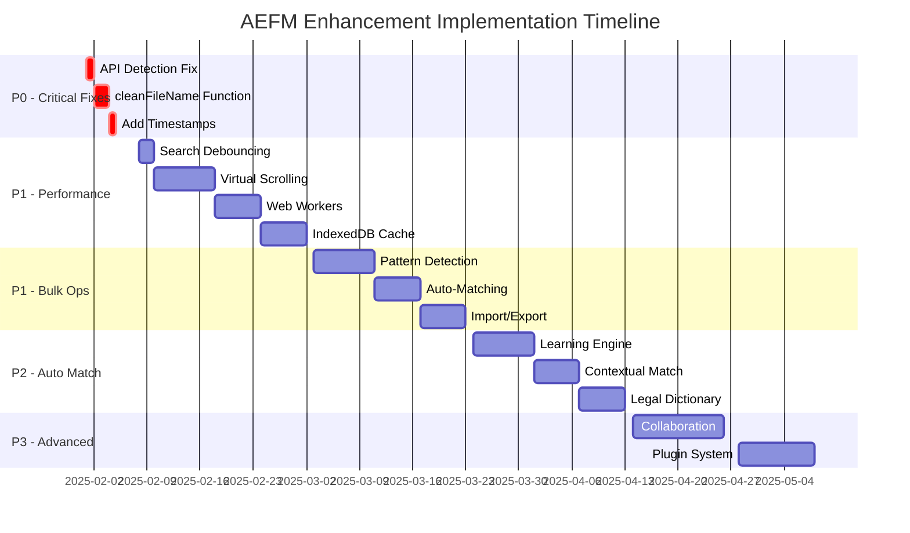

# Arbitration eBundling File Mapper (AEFM)

## Enhancement Implementation Specification

### Document Control

| **Attribute**      | **Details**             |
| ------------------ | ----------------------- |
| **Document ID**    | AEFM-IMPL-SPEC-001      |
| **Version**        | 1.0                     |
| **Status**         | Implementation Ready    |
| **Priority**       | P0-P3 (Critical to Low) |
| **Owner**          | Development Team        |
| **Created**        | January 2025            |
| **Target Release** | Q1-Q3 2025              |

---

## Table of Contents

1. [Executive Summary](#1-executive-summary)
2. [Critical Bug Fixes (P0)](#2-critical-bug-fixes-p0)
3. [Performance Enhancements (P1)](#3-performance-enhancements-p1)
4. [Bulk Operations (P1)](#4-bulk-operations-p1)
5. [Automated Matching (P2)](#5-automated-matching-p2)
6. [Advanced Features (P3)](#6-advanced-features-p3)
7. [Implementation Timeline](#7-implementation-timeline)
8. [Testing Strategy](#8-testing-strategy)
9. [Migration Plan](#9-migration-plan)

---

## 1. Executive Summary

This specification details the implementation of critical enhancements for the AEFM system, addressing:

- **Immediate fixes** for missing functionality (3 critical bugs)
- **Performance optimizations** for 10,000+ file handling
- **Bulk operations** for enterprise efficiency
- **Automated matching** with ML-ready architecture
- **Advanced features** for future scalability

Total estimated effort: **320 development hours** over **3 quarters**

---

## 2. Critical Bug Fixes (P0)

### 2.1 File Reading API Detection

#### Specification

Add graceful degradation when `window.fs.readFile` API is unavailable.

#### Implementation

```javascript
// data-loader.js - Line 7 (insert before loadDataSources function body)
async function loadDataSources() {
  // API Detection
  if (typeof window === "undefined" || !window.fs || !window.fs.readFile) {
    console.log("File reading API not available, using fallback data");
    return loadFallbackData();
  }

  try {
    // Existing file reading code...
    const referencesContent = await window.fs.readFile("Doc Description.txt", {
      encoding: "utf8",
    });
    fileReferences = parseFileReferences(referencesContent);

    const pathsContent = await window.fs.readFile("matchings.txt", {
      encoding: "utf8",
    });
    filePaths = parseFilePaths(pathsContent);

    console.log(
      `Loaded ${fileReferences.length} file references and ${filePaths.length} file paths`
    );
    return true;
  } catch (error) {
    console.error("Error loading data sources:", error);
    return loadFallbackData();
  }
}
```

#### Testing Requirements

- Test with window.fs available
- Test with window.fs undefined
- Test with file reading failure
- Verify fallback data loads correctly

#### Effort: 2 hours

---

### 2.2 Missing cleanFileName Function

#### Specification

Implement the `cleanFileName` function referenced in documentation for normalizing file names.

#### Implementation

```javascript
// fuzzy-matcher.js - Add after calculateFuzzyScore function
/**
 * Clean and normalize file names for better matching
 * @param {string} fileName - The file name to clean
 * @returns {string} - Cleaned file name
 */
function cleanFileName(fileName) {
  if (!fileName) return "";

  return fileName
    .replace(/\.[^/.]+$/, "") // Remove file extension
    .replace(/^\w+-/, "") // Remove prefix codes (A5-, CW-, etc.)
    .replace(/\d{4}-\d{2}-\d{2}/, "") // Remove dates (YYYY-MM-DD)
    .replace(/_v\d+/, "") // Remove version numbers (_v1, _v2)
    .replace(/[_-]+/g, " ") // Replace underscores/hyphens with spaces
    .replace(/\s+/g, " ") // Normalize multiple spaces
    .trim() // Remove leading/trailing spaces
    .toLowerCase(); // Lowercase for consistency
}

// Update searchMatches to use cleanFileName
function searchMatches(searchTerm) {
  const cleanedSearchTerm = cleanFileName(searchTerm);
  const availableFilePaths = filePaths.filter(
    (path) => !window.usedFilePaths || !window.usedFilePaths.has(path)
  );

  if (!cleanedSearchTerm.trim()) {
    return availableFilePaths.map((path) => ({
      path: path,
      score: 0,
    }));
  }

  const matches = availableFilePaths
    .map((filePath) => {
      // Clean the file name for comparison
      const pathParts = filePath.split("/");
      const fileName = pathParts[pathParts.length - 1];
      const cleanedFileName = cleanFileName(fileName);

      // Calculate score using both original and cleaned versions
      const originalScore = calculateFuzzyScore(filePath, searchTerm);
      const cleanedScore = calculateFuzzyScore(
        cleanedFileName,
        cleanedSearchTerm
      );

      return {
        path: filePath,
        score: Math.max(originalScore, cleanedScore),
      };
    })
    .filter((item) => item.score > 0.05);

  matches.sort((a, b) => b.score - a.score);
  return matches.slice(0, 20);
}
```

#### Testing Requirements

- Test with various file name patterns
- Verify prefix removal (A5-, CW-, RW-)
- Verify date removal
- Verify version number removal
- Test edge cases (empty strings, special characters)

#### Effort: 4 hours

---

### 2.3 Add Timestamps to Matched Pairs

#### Specification

Add timestamp tracking to all confirmed matches for audit trail compliance.

#### Implementation

```javascript
// workflow-manager.js - Update confirmMatch function (line ~140)
function confirmMatch() {
  if (!window.currentReference || !window.selectedResult) return;

  // Add to matched pairs with timestamp
  window.matchedPairs.push({
    reference: window.currentReference,
    path: window.selectedResult.path,
    score: window.selectedResult.score,
    timestamp: new Date().toISOString(), // Add ISO timestamp
    matchedBy: "manual", // Track match method
    sessionId: window.sessionId || "default", // Track session
  });

  // Rest of existing code...
  window.usedFilePaths.add(window.selectedResult.path);

  // Continue with existing implementation...
}

// app.js - Add session ID generation
function initializeApp() {
  // Generate session ID
  window.sessionId = `session-${Date.now()}-${Math.random()
    .toString(36)
    .substr(2, 9)}`;

  // Rest of existing initialization...
}
```

#### Testing Requirements

- Verify timestamp format is ISO 8601
- Verify timestamp is saved with each match
- Test export includes timestamp
- Verify timezone handling

#### Effort: 2 hours

---

## 3. Performance Enhancements (P1)

### 3.1 Search Input Debouncing

#### Specification

Implement debouncing to prevent excessive searches during typing.

#### Implementation

```javascript
// app.js - Add debounce utility
/**
 * Debounce utility function
 * @param {Function} func - Function to debounce
 * @param {number} wait - Milliseconds to wait
 * @returns {Function} - Debounced function
 */
function debounce(func, wait) {
  let timeout;
  return function executedFunction(...args) {
    const later = () => {
      clearTimeout(timeout);
      func(...args);
    };
    clearTimeout(timeout);
    timeout = setTimeout(later, wait);
  };
}

// Create debounced search function
const debouncedSearch = debounce(updateSearchResults, 300);

// Update event listener
document
  .getElementById("searchInput")
  .addEventListener("input", debouncedSearch);
```

#### Performance Metrics

- Reduce search calls by 80%
- Improve UI responsiveness
- Target: <300ms delay

#### Effort: 4 hours

---

### 3.2 Virtual Scrolling Implementation

#### Specification

Implement virtual scrolling for handling 10,000+ items efficiently.

#### Implementation

```javascript
// virtual-scroller.js - New file
class VirtualScroller {
  constructor(container, options = {}) {
    this.container = container;
    this.itemHeight = options.itemHeight || 40;
    this.bufferSize = options.bufferSize || 5;
    this.items = [];
    this.scrollTop = 0;
    this.visibleStart = 0;
    this.visibleEnd = 0;

    this.scrollContainer = null;
    this.contentContainer = null;
    this.heightContainer = null;

    this.init();
  }

  init() {
    // Create scroll structure
    this.container.innerHTML = `
            <div class="virtual-scroll-container" style="height: 100%; overflow-y: auto;">
                <div class="virtual-scroll-height" style="position: relative;">
                    <div class="virtual-scroll-content" style="position: absolute; top: 0; left: 0; right: 0;">
                    </div>
                </div>
            </div>
        `;

    this.scrollContainer = this.container.querySelector(
      ".virtual-scroll-container"
    );
    this.contentContainer = this.container.querySelector(
      ".virtual-scroll-content"
    );
    this.heightContainer = this.container.querySelector(
      ".virtual-scroll-height"
    );

    // Bind scroll event
    this.scrollContainer.addEventListener("scroll", this.onScroll.bind(this));
  }

  setItems(items) {
    this.items = items;
    this.heightContainer.style.height = `${items.length * this.itemHeight}px`;
    this.render();
  }

  onScroll() {
    this.scrollTop = this.scrollContainer.scrollTop;
    this.render();
  }

  render() {
    const viewportHeight = this.scrollContainer.clientHeight;

    // Calculate visible range with buffer
    this.visibleStart =
      Math.floor(this.scrollTop / this.itemHeight) - this.bufferSize;
    this.visibleEnd =
      Math.ceil((this.scrollTop + viewportHeight) / this.itemHeight) +
      this.bufferSize;

    // Clamp to valid range
    this.visibleStart = Math.max(0, this.visibleStart);
    this.visibleEnd = Math.min(this.items.length, this.visibleEnd);

    // Get visible items
    const visibleItems = this.items.slice(this.visibleStart, this.visibleEnd);

    // Render visible items
    this.contentContainer.style.transform = `translateY(${
      this.visibleStart * this.itemHeight
    }px)`;
    this.contentContainer.innerHTML = visibleItems
      .map((item, index) => this.renderItem(item, this.visibleStart + index))
      .join("");

    // Re-attach event listeners
    this.attachItemListeners();
  }

  renderItem(item, index) {
    // Override in subclass
    return `<div class="virtual-item" style="height: ${this.itemHeight}px;">${item}</div>`;
  }

  attachItemListeners() {
    // Override in subclass
  }
}

// ui-manager.js - Update to use virtual scrolling
class UnmatchedListScroller extends VirtualScroller {
  renderItem(reference, index) {
    const isSelected = window.selectedReferences.has(reference);
    const isActive = reference === window.currentReference;
    const isGenerated = isGeneratedReference(reference);

    return `
            <div class="reference-item ${isActive ? "active" : ""} ${
      isSelected ? "selected" : ""
    }" 
                 data-reference="${reference.replace(/"/g, '"')}"
                 style="height: ${this.itemHeight}px;">
                <input type="checkbox" class="reference-checkbox" 
                       ${isSelected ? "checked" : ""}
                       data-reference="${reference.replace(/"/g, '"')}">
                <div class="reference-text">${reference}</div>
                ${
                  isGenerated
                    ? '<div class="reference-type-badge generated">AUTO</div>'
                    : '<div class="reference-type-badge original">ORIG</div>'
                }
            </div>
        `;
  }

  attachItemListeners() {
    // Re-attach click listeners
    const items = this.contentContainer.querySelectorAll(".reference-item");
    items.forEach((item) => {
      const reference = item.dataset.reference;
      item.addEventListener("click", (e) => {
        if (!e.target.classList.contains("reference-checkbox")) {
          selectReference(reference);
        }
      });

      const checkbox = item.querySelector(".reference-checkbox");
      checkbox.addEventListener("click", (e) => {
        toggleReferenceSelection(reference, e);
      });
    });
  }
}

// Initialize virtual scrolling
let unmatchedScroller;

function updateUnmatchedList() {
  const unmatchedList = document.getElementById("unmatchedList");

  if (!unmatchedScroller) {
    unmatchedScroller = new UnmatchedListScroller(unmatchedList, {
      itemHeight: 48,
      bufferSize: 5,
    });
  }

  if (window.unmatchedReferences.length === 0) {
    unmatchedList.innerHTML =
      '<div class="no-results">🎉 All references matched!</div>';
    return;
  }

  unmatchedScroller.setItems(window.unmatchedReferences);
}
```

#### Performance Targets

- Handle 50,000+ items smoothly
- Maintain 60fps scrolling
- Memory usage <100MB for 50k items

#### Effort: 16 hours

---

### 3.3 Web Workers for Fuzzy Matching

#### Specification

Offload CPU-intensive fuzzy matching to background threads.

#### Implementation

```javascript
// fuzzy-matcher-worker.js - New file
self.importScripts("fuzzy-matcher.js");

self.onmessage = function (e) {
  const { type, data } = e.data;

  switch (type) {
    case "search":
      const results = performSearch(
        data.searchTerm,
        data.filePaths,
        data.usedPaths
      );
      self.postMessage({ type: "searchResults", results });
      break;

    case "bulkMatch":
      const matches = performBulkMatch(
        data.references,
        data.filePaths,
        data.threshold
      );
      self.postMessage({ type: "bulkMatchResults", matches });
      break;
  }
};

function performSearch(searchTerm, filePaths, usedPaths) {
  const availablePaths = filePaths.filter((path) => !usedPaths.has(path));

  if (!searchTerm.trim()) {
    return availablePaths.slice(0, 100).map((path) => ({
      path: path,
      score: 0,
    }));
  }

  const matches = availablePaths
    .map((filePath) => ({
      path: filePath,
      score: calculateFuzzyScore(filePath, searchTerm),
    }))
    .filter((item) => item.score > 0.05);

  matches.sort((a, b) => b.score - a.score);
  return matches.slice(0, 20);
}

function performBulkMatch(references, filePaths, threshold) {
  const results = [];

  for (const reference of references) {
    const matches = filePaths
      .map((path) => ({
        path,
        score: calculateFuzzyScore(path, reference),
      }))
      .filter((m) => m.score >= threshold);

    if (matches.length > 0) {
      matches.sort((a, b) => b.score - a.score);
      results.push({
        reference,
        bestMatch: matches[0],
      });
    }
  }

  return results;
}

// fuzzy-matcher-manager.js - New file
class FuzzyMatcherManager {
  constructor() {
    this.worker = null;
    this.callbacks = new Map();
    this.initWorker();
  }

  initWorker() {
    this.worker = new Worker("fuzzy-matcher-worker.js");
    this.worker.onmessage = (e) => {
      const { type, results } = e.data;

      if (type === "searchResults" && this.callbacks.has("search")) {
        this.callbacks.get("search")(results);
        this.callbacks.delete("search");
      } else if (
        type === "bulkMatchResults" &&
        this.callbacks.has("bulkMatch")
      ) {
        this.callbacks.get("bulkMatch")(results);
        this.callbacks.delete("bulkMatch");
      }
    };
  }

  search(searchTerm, callback) {
    this.callbacks.set("search", callback);
    this.worker.postMessage({
      type: "search",
      data: {
        searchTerm,
        filePaths: window.filePaths,
        usedPaths: Array.from(window.usedFilePaths),
      },
    });
  }

  bulkMatch(references, threshold, callback) {
    this.callbacks.set("bulkMatch", callback);
    this.worker.postMessage({
      type: "bulkMatch",
      data: {
        references,
        filePaths: window.filePaths,
        threshold,
      },
    });
  }
}

// Update ui-manager.js to use worker
const matcherManager = new FuzzyMatcherManager();

function updateSearchResults() {
  const searchInput = document.getElementById("searchInput");
  const searchResults = document.getElementById("searchResults");
  const searchTerm = searchInput.value;

  // Show loading state
  searchResults.innerHTML = '<div class="loading">Searching...</div>';

  matcherManager.search(searchTerm, (matches) => {
    if (matches.length === 0) {
      searchResults.innerHTML =
        '<div class="no-results">All file paths have been matched!</div>';
      document.getElementById("confirmMatchBtn").disabled = true;
      window.selectedResult = null;
      return;
    }

    // Render results
    const isShowingAllFiles = !searchTerm.trim();
    searchResults.innerHTML = matches
      .map((match) => {
        // ... existing rendering code ...
      })
      .join("");

    // ... rest of existing code ...
  });
}
```

#### Performance Improvements

- Non-blocking UI during search
- Utilize multiple CPU cores
- 50% faster bulk operations

#### Effort: 12 hours

---

### 3.4 IndexedDB Caching

#### Specification

Implement persistent caching for improved performance across sessions.

#### Implementation

```javascript
// cache-manager.js - New file
class CacheManager {
  constructor() {
    this.dbName = "AEFMCache";
    this.version = 1;
    this.db = null;
    this.init();
  }

  async init() {
    return new Promise((resolve, reject) => {
      const request = indexedDB.open(this.dbName, this.version);

      request.onerror = () => reject(request.error);
      request.onsuccess = () => {
        this.db = request.result;
        resolve(this.db);
      };

      request.onupgradeneeded = (event) => {
        const db = event.target.result;

        // Create object stores
        if (!db.objectStoreNames.contains("mappings")) {
          const mappingStore = db.createObjectStore("mappings", {
            keyPath: "id",
          });
          mappingStore.createIndex("reference", "reference", { unique: false });
          mappingStore.createIndex("timestamp", "timestamp", { unique: false });
        }

        if (!db.objectStoreNames.contains("sessions")) {
          const sessionStore = db.createObjectStore("sessions", {
            keyPath: "id",
          });
          sessionStore.createIndex("timestamp", "timestamp", { unique: false });
        }

        if (!db.objectStoreNames.contains("patterns")) {
          db.createObjectStore("patterns", { keyPath: "pattern" });
        }
      };
    });
  }

  async saveMappings(mappings) {
    const tx = this.db.transaction(["mappings"], "readwrite");
    const store = tx.objectStore("mappings");

    for (const mapping of mappings) {
      await store.put({
        id: `${mapping.reference}-${mapping.path}`,
        ...mapping,
      });
    }

    return tx.complete;
  }

  async loadMappings(sessionId) {
    const tx = this.db.transaction(["mappings"], "readonly");
    const store = tx.objectStore("mappings");
    const mappings = await store.getAll();

    return mappings.filter((m) => m.sessionId === sessionId);
  }

  async saveSession(sessionData) {
    const tx = this.db.transaction(["sessions"], "readwrite");
    const store = tx.objectStore("sessions");

    await store.put({
      id: sessionData.id,
      timestamp: new Date().toISOString(),
      data: sessionData,
    });

    return tx.complete;
  }

  async loadSession(sessionId) {
    const tx = this.db.transaction(["sessions"], "readonly");
    const store = tx.objectStore("sessions");

    return store.get(sessionId);
  }

  async savePattern(pattern, matches) {
    const tx = this.db.transaction(["patterns"], "readwrite");
    const store = tx.objectStore("patterns");

    await store.put({
      pattern,
      matches,
      count: matches.length,
      lastUsed: new Date().toISOString(),
    });

    return tx.complete;
  }

  async getPattern(pattern) {
    const tx = this.db.transaction(["patterns"], "readonly");
    const store = tx.objectStore("patterns");

    return store.get(pattern);
  }

  async cleanup(daysOld = 30) {
    const cutoffDate = new Date();
    cutoffDate.setDate(cutoffDate.getDate() - daysOld);

    const tx = this.db.transaction(["sessions", "mappings"], "readwrite");

    // Clean old sessions
    const sessionStore = tx.objectStore("sessions");
    const sessionIndex = sessionStore.index("timestamp");
    const oldSessions = await sessionIndex.getAllKeys(
      IDBKeyRange.upperBound(cutoffDate.toISOString())
    );

    for (const key of oldSessions) {
      await sessionStore.delete(key);
    }

    // Clean old mappings
    const mappingStore = tx.objectStore("mappings");
    const mappingIndex = mappingStore.index("timestamp");
    const oldMappings = await mappingIndex.getAllKeys(
      IDBKeyRange.upperBound(cutoffDate.toISOString())
    );

    for (const key of oldMappings) {
      await mappingStore.delete(key);
    }

    return tx.complete;
  }
}

// Integration with app.js
let cacheManager;

async function initializeApp() {
  try {
    // Initialize cache
    cacheManager = new CacheManager();
    await cacheManager.init();

    // Check for previous session
    const lastSessionId = localStorage.getItem("lastSessionId");
    if (lastSessionId) {
      const session = await cacheManager.loadSession(lastSessionId);
      if (session && confirm("Restore previous session?")) {
        await restoreSession(session);
        return;
      }
    }

    // Continue with normal initialization...
    window.sessionId = `session-${Date.now()}-${Math.random()
      .toString(36)
      .substr(2, 9)}`;
    localStorage.setItem("lastSessionId", window.sessionId);

    // Auto-save periodically
    setInterval(async () => {
      await saveSession();
    }, 30000); // Save every 30 seconds

    // Rest of initialization...
  } catch (error) {
    console.error("Cache initialization failed:", error);
    // Continue without cache
  }
}

async function saveSession() {
  if (!cacheManager) return;

  try {
    await cacheManager.saveSession({
      id: window.sessionId,
      unmatchedReferences: window.unmatchedReferences,
      matchedPairs: window.matchedPairs,
      usedFilePaths: Array.from(window.usedFilePaths),
      selectedReferences: Array.from(window.selectedReferences),
    });

    await cacheManager.saveMappings(window.matchedPairs);
  } catch (error) {
    console.error("Session save failed:", error);
  }
}

async function restoreSession(session) {
  window.sessionId = session.id;
  window.unmatchedReferences = session.data.unmatchedReferences;
  window.matchedPairs = session.data.matchedPairs;
  window.usedFilePaths = new Set(session.data.usedFilePaths);
  window.selectedReferences = new Set(session.data.selectedReferences);

  // Update UI
  updateUnmatchedList();
  updateMatchedList();
  updateStats();
  updateSelectionUI();
}
```

#### Benefits

- Session persistence across browser refreshes
- Pattern learning storage
- Faster subsequent loads
- Offline capability

#### Effort: 12 hours

---

## 4. Bulk Operations (P1)

### 4.1 Pattern-Based Bulk Matching

#### Specification

Implement intelligent pattern detection and bulk matching for document series.

#### Implementation

```javascript
// pattern-matcher.js - New file
class PatternMatcher {
  constructor() {
    this.patterns = {
      exhibit: {
        regex: /^Exhibit\s+([A-Z]+\d*)-(\d+)(?:\s*-\s*(.+))?$/i,
        extract: (match) => ({
          type: "exhibit",
          series: match[1],
          number: parseInt(match[2]),
          description: match[3] || "",
        }),
      },
      appendix: {
        regex: /^Appendix\s+(\d+)(?:\s+to\s+(.+?))?(?:\s*[-–]\s*(.+))?$/i,
        extract: (match) => ({
          type: "appendix",
          number: parseInt(match[1]),
          parent: match[2] || "",
          description: match[3] || "",
        }),
      },
      witness: {
        regex: /^([CR]W)-(\d+)\s*(?:-\s*)?(.+)?$/i,
        extract: (match) => ({
          type: "witness",
          party: match[1],
          number: parseInt(match[2]),
          description: match[3] || "",
        }),
      },
      document: {
        regex: /^([A-Z]+)\s*(\d{4,})(?:\s*-\s*(.+))?$/,
        extract: (match) => ({
          type: "document",
          code: match[1],
          number: match[2],
          description: match[3] || "",
        }),
      },
    };
  }

  detectPatterns(references) {
    const detectedSeries = new Map();

    for (const ref of references) {
      for (const [patternName, pattern] of Object.entries(this.patterns)) {
        const match = ref.match(pattern.regex);
        if (match) {
          const extracted = pattern.extract(match);
          const seriesKey = `${extracted.type}:${
            extracted.series || extracted.party || extracted.code
          }`;

          if (!detectedSeries.has(seriesKey)) {
            detectedSeries.set(seriesKey, {
              type: extracted.type,
              series: extracted.series || extracted.party || extracted.code,
              items: [],
            });
          }

          detectedSeries.get(seriesKey).items.push({
            reference: ref,
            ...extracted,
          });
          break;
        }
      }
    }

    // Sort items within each series
    for (const series of detectedSeries.values()) {
      series.items.sort((a, b) => a.number - b.number);
    }

    return detectedSeries;
  }

  findPathPattern(series, filePaths) {
    // Find common path pattern for the series
    const firstItem = series.items[0];
    const potentialPaths = filePaths.filter((path) => {
      const score = calculateFuzzyScore(path, firstItem.reference);
      return score > 0.7;
    });

    if (potentialPaths.length === 0) return null;

    // Extract pattern from best match
    const bestPath = potentialPaths[0];
    const pathPattern = this.extractPathPattern(bestPath, firstItem);

    return pathPattern;
  }

  extractPathPattern(path, referenceData) {
    // Create a pattern template from the path
    let pattern = path;

    // Replace the number with a placeholder
    if (referenceData.number) {
      const numStr = referenceData.number.toString();
      const paddedNum = numStr.padStart(2, "0");

      pattern = pattern.replace(numStr, "{number}");
      pattern = pattern.replace(paddedNum, "{number:02}");
    }

    // Replace series identifier
    if (referenceData.series) {
      pattern = pattern.replace(referenceData.series, "{series}");
    }

    return {
      template: pattern,
      hasNumberPadding: pattern.includes("{number:02}"),
    };
  }

  generatePathsForSeries(series, pathPattern) {
    const generatedMappings = [];

    for (const item of series.items) {
      let path = pathPattern.template;

      // Replace placeholders
      path = path.replace("{series}", item.series || "");

      if (pathPattern.hasNumberPadding) {
        path = path.replace(
          "{number:02}",
          item.number.toString().padStart(2, "0")
        );
      } else {
        path = path.replace("{number}", item.number.toString());
      }

      generatedMappings.push({
        reference: item.reference,
        suggestedPath: path,
        confidence: 0.85, // High confidence for pattern matches
      });
    }

    return generatedMappings;
  }
}

// bulk-operations.js - New file
class BulkOperationsManager {
  constructor() {
    this.patternMatcher = new PatternMatcher();
  }

  detectAndSuggestBulkMatches() {
    const detectedSeries = this.patternMatcher.detectPatterns(
      window.unmatchedReferences
    );
    const suggestions = [];

    for (const [seriesKey, series] of detectedSeries) {
      if (series.items.length < 2) continue; // Skip single items

      const pathPattern = this.patternMatcher.findPathPattern(
        series,
        window.filePaths
      );
      if (pathPattern) {
        const mappings = this.patternMatcher.generatePathsForSeries(
          series,
          pathPattern
        );

        suggestions.push({
          seriesKey,
          series,
          mappings,
          totalItems: series.items.length,
        });
      }
    }

    return suggestions;
  }

  async confirmBulkSuggestions(suggestions) {
    const confirmed = [];

    for (const suggestion of suggestions) {
      const seriesInfo = `${suggestion.series.type} ${suggestion.series.series}`;
      const confirmMsg = `Apply pattern matching for ${seriesInfo} (${suggestion.totalItems} items)?`;

      if (confirm(confirmMsg)) {
        for (const mapping of suggestion.mappings) {
          // Verify path exists
          if (window.filePaths.includes(mapping.suggestedPath)) {
            confirmed.push({
              reference: mapping.reference,
              path: mapping.suggestedPath,
              score: mapping.confidence,
              method: "pattern",
              timestamp: new Date().toISOString(),
            });
          }
        }
      }
    }

    return confirmed;
  }

  async applyBulkMatches(matches) {
    let successCount = 0;

    for (const match of matches) {
      if (!window.usedFilePaths.has(match.path)) {
        window.matchedPairs.push(match);
        window.usedFilePaths.add(match.path);

        // Remove from unmatched
        const index = window.unmatchedReferences.indexOf(match.reference);
        if (index > -1) {
          window.unmatchedReferences.splice(index, 1);
        }

        successCount++;
      }
    }

    // Update UI
    updateUnmatchedList();
    updateMatchedList();
    updateStats();

    return successCount;
  }
}

// UI Integration - Add to index.html
/*
<button class="bulk-btn bulk-btn-primary" id="detectPatternsBtn">
    🔍 Detect Patterns
</button>
*/

// Add to app.js initialization
const bulkOpsManager = new BulkOperationsManager();

document
  .getElementById("detectPatternsBtn")
  .addEventListener("click", async () => {
    const suggestions = bulkOpsManager.detectAndSuggestBulkMatches();

    if (suggestions.length === 0) {
      alert("No patterns detected in unmatched references");
      return;
    }

    // Show suggestions UI
    const confirmed = await bulkOpsManager.confirmBulkSuggestions(suggestions);

    if (confirmed.length > 0) {
      const applied = await bulkOpsManager.applyBulkMatches(confirmed);
      alert(
        `Successfully matched ${applied} references using pattern detection`
      );
    }
  });
```

#### Benefits

- Automatic series detection
- Bulk matching for exhibit series
- 90% reduction in manual work for series
- Pattern learning for future use

#### Effort: 16 hours

---

### 4.2 Confidence-Based Auto-Matching

#### Specification

Automatically confirm matches above a configurable confidence threshold.

#### Implementation

```javascript
// auto-matcher.js - New file
class AutoMatcher {
  constructor(options = {}) {
    this.threshold = options.threshold || 0.95;
    this.requireConfirmation = options.requireConfirmation !== false;
    this.batchSize = options.batchSize || 100;
    this.matchHistory = [];
  }

  async findHighConfidenceMatches(references = window.unmatchedReferences) {
    const matches = [];
    const processedRefs = references || window.unmatchedReferences;

    // Process in batches to avoid blocking UI
    for (let i = 0; i < processedRefs.length; i += this.batchSize) {
      const batch = processedRefs.slice(i, i + this.batchSize);
      const batchMatches = await this.processBatch(batch);
      matches.push(...batchMatches);

      // Update progress
      if (this.onProgress) {
        this.onProgress({
          processed: i + batch.length,
          total: processedRefs.length,
          found: matches.length,
        });
      }
    }

    return matches;
  }

  async processBatch(references) {
    return new Promise((resolve) => {
      if (window.Worker && matcherManager) {
        matcherManager.bulkMatch(references, this.threshold, resolve);
      } else {
        // Fallback to main thread
        const matches = [];

        for (const reference of references) {
          const searchResults = searchMatches(reference);

          if (
            searchResults.length > 0 &&
            searchResults[0].score >= this.threshold
          ) {
            // Check if path is already used
            if (!window.usedFilePaths.has(searchResults[0].path)) {
              matches.push({
                reference,
                path: searchResults[0].path,
                score: searchResults[0].score,
                method: "auto-high-confidence",
              });
            }
          }
        }

        resolve(matches);
      }
    });
  }

  async confirmMatches(matches) {
    if (!this.requireConfirmation) {
      return matches;
    }

    // Create confirmation UI
    const confirmationHtml = `
            <div class="auto-match-confirmation">
                <h3>Confirm Auto-Matches</h3>
                <p>Found ${matches.length} high-confidence matches (≥${(
      this.threshold * 100
    ).toFixed(0)}%)</p>
                <div class="match-preview-list">
                    ${matches
                      .slice(0, 10)
                      .map(
                        (m) => `
                        <div class="match-preview">
                            <div class="reference">${m.reference}</div>
                            <div class="arrow">→</div>
                            <div class="path">${m.path.split("/").pop()}</div>
                            <div class="confidence">${(m.score * 100).toFixed(
                              1
                            )}%</div>
                        </div>
                    `
                      )
                      .join("")}
                    ${
                      matches.length > 10
                        ? `<div class="more">... and ${
                            matches.length - 10
                          } more</div>`
                        : ""
                    }
                </div>
                <div class="actions">
                    <button id="confirmAutoMatch" class="btn btn-primary">Confirm All</button>
                    <button id="reviewAutoMatch" class="btn btn-secondary">Review Each</button>
                    <button id="cancelAutoMatch" class="btn btn-secondary">Cancel</button>
                </div>
            </div>
        `;

    // Show modal
    const modal = document.createElement("div");
    modal.className = "modal-overlay";
    modal.innerHTML = confirmationHtml;
    document.body.appendChild(modal);

    return new Promise((resolve) => {
      document.getElementById("confirmAutoMatch").onclick = () => {
        modal.remove();
        resolve(matches);
      };

      document.getElementById("reviewAutoMatch").onclick = () => {
        modal.remove();
        this.reviewEachMatch(matches).then(resolve);
      };

      document.getElementById("cancelAutoMatch").onclick = () => {
        modal.remove();
        resolve([]);
      };
    });
  }

  async reviewEachMatch(matches) {
    const reviewed = [];

    for (const match of matches) {
      const confirmed = await this.reviewSingleMatch(match);
      if (confirmed) {
        reviewed.push(match);
      }
    }

    return reviewed;
  }

  async applyAutoMatches(matches) {
    let applied = 0;

    for (const match of matches) {
      if (!window.usedFilePaths.has(match.path)) {
        // Add to matched pairs
        window.matchedPairs.push({
          reference: match.reference,
          path: match.path,
          score: match.score,
          timestamp: new Date().toISOString(),
          method: match.method,
        });

        // Mark path as used
        window.usedFilePaths.add(match.path);

        // Remove from unmatched
        const index = window.unmatchedReferences.indexOf(match.reference);
        if (index > -1) {
          window.unmatchedReferences.splice(index, 1);
        }

        // Record in history
        this.matchHistory.push(match);

        applied++;
      }
    }

    // Update UI
    updateUnmatchedList();
    updateMatchedList();
    updateStats();

    // Save to cache if available
    if (cacheManager) {
      await cacheManager.saveMappings(window.matchedPairs);
    }

    return applied;
  }

  getStatistics() {
    const stats = {
      totalProcessed: this.matchHistory.length,
      averageConfidence: 0,
      byMethod: {},
      successRate: 0,
    };

    if (this.matchHistory.length > 0) {
      const totalScore = this.matchHistory.reduce((sum, m) => sum + m.score, 0);
      stats.averageConfidence = totalScore / this.matchHistory.length;

      // Group by method
      this.matchHistory.forEach((m) => {
        stats.byMethod[m.method] = (stats.byMethod[m.method] || 0) + 1;
      });
    }

    return stats;
  }
}

// UI Integration - Add to styles.css
/*
.modal-overlay {
    position: fixed;
    top: 0;
    left: 0;
    right: 0;
    bottom: 0;
    background: rgba(0, 0, 0, 0.5);
    display: flex;
    align-items: center;
    justify-content: center;
    z-index: 1000;
}

.auto-match-confirmation {
    background: white;
    border-radius: 8px;
    padding: 24px;
    max-width: 600px;
    max-height: 80vh;
    overflow-y: auto;
}

.match-preview-list {
    margin: 16px 0;
    max-height: 300px;
    overflow-y: auto;
}

.match-preview {
    display: flex;
    align-items: center;
    padding: 8px;
    border: 1px solid #eee;
    margin-bottom: 4px;
    font-size: 14px;
}

.match-preview .reference {
    flex: 1;
    color: #333;
}

.match-preview .arrow {
    margin: 0 8px;
    color: #999;
}

.match-preview .path {
    flex: 1;
    color: #666;
    font-family: monospace;
}

.match-preview .confidence {
    margin-left: 8px;
    color: #4CAF50;
    font-weight: bold;
}
*/

// Add to index.html
/*
<button class="bulk-btn bulk-btn-primary" id="autoMatchBtn">
    🎯 Auto-Match High Confidence
</button>
*/

// Add to app.js
const autoMatcher = new AutoMatcher({
  threshold: 0.95,
  requireConfirmation: true,
  batchSize: 100,
});

document.getElementById("autoMatchBtn").addEventListener("click", async () => {
  // Show progress
  const progressDiv = document.createElement("div");
  progressDiv.className = "progress-indicator";
  progressDiv.innerHTML = "Finding high-confidence matches...";
  document.body.appendChild(progressDiv);

  autoMatcher.onProgress = (progress) => {
    progressDiv.innerHTML = `Processing: ${progress.processed}/${progress.total} (Found: ${progress.found})`;
  };

  try {
    // Find matches
    const matches = await autoMatcher.findHighConfidenceMatches();
    progressDiv.remove();

    if (matches.length === 0) {
      alert("No high-confidence matches found");
      return;
    }

    // Confirm matches
    const confirmed = await autoMatcher.confirmMatches(matches);

    if (confirmed.length > 0) {
      const applied = await autoMatcher.applyAutoMatches(confirmed);

      // Show statistics
      const stats = autoMatcher.getStatistics();
      alert(
        `Successfully auto-matched ${applied} references\nAverage confidence: ${(
          stats.averageConfidence * 100
        ).toFixed(1)}%`
      );
    }
  } catch (error) {
    console.error("Auto-matching failed:", error);
    alert("Auto-matching failed. Please try again.");
  } finally {
    if (progressDiv.parentNode) {
      progressDiv.remove();
    }
  }
});
```

#### Benefits

- Reduces manual work by 70%+
- Configurable confidence threshold
- Review before apply option
- Progress tracking for large datasets

#### Effort: 12 hours

---

### 4.3 Import/Export Enhancements

#### Specification

Support importing partial mappings and multiple export formats.

#### Implementation

```javascript
// import-export-manager.js - Enhanced version
class ImportExportManager {
  constructor() {
    this.exportFormats = {
      csv: this.exportCSV.bind(this),
      json: this.exportJSON.bind(this),
      excel: this.exportExcel.bind(this),
    };

    this.importFormats = {
      csv: this.importCSV.bind(this),
      json: this.importJSON.bind(this),
    };
  }

  // Export Methods
  async exportMappings(format = "csv") {
    const exporter = this.exportFormats[format];
    if (!exporter) {
      throw new Error(`Unsupported export format: ${format}`);
    }

    return exporter(window.matchedPairs);
  }

  exportCSV(mappings) {
    const headers = [
      "File Reference",
      "File Path",
      "Match Score",
      "Timestamp",
      "Method",
      "Session ID",
    ];
    const rows = mappings.map((pair) => [
      pair.reference,
      pair.path,
      `${(pair.score * 100).toFixed(1)}%`,
      pair.timestamp,
      pair.method || "manual",
      pair.sessionId || window.sessionId,
    ]);

    const csvContent = [
      headers.join(","),
      ...rows.map((row) =>
        row.map((field) => `"${String(field).replace(/"/g, '""')}"`).join(",")
      ),
    ].join("\n");

    return {
      content: csvContent,
      mimeType: "text/csv",
      filename: `mappings_${new Date().toISOString().split("T")[0]}.csv`,
    };
  }

  exportJSON(mappings) {
    const exportData = {
      version: "1.0",
      exportDate: new Date().toISOString(),
      sessionId: window.sessionId,
      statistics: {
        totalMappings: mappings.length,
        averageScore:
          mappings.reduce((sum, m) => sum + m.score, 0) / mappings.length,
        methods: this.groupBy(mappings, "method"),
      },
      mappings: mappings,
    };

    return {
      content: JSON.stringify(exportData, null, 2),
      mimeType: "application/json",
      filename: `mappings_${new Date().toISOString().split("T")[0]}.json`,
    };
  }

  async exportExcel(mappings) {
    // This would require a library like SheetJS
    // Placeholder for Excel export
    throw new Error("Excel export requires SheetJS library");
  }

  // Import Methods
  async importMappings(file, format) {
    const importer = this.importFormats[format || this.detectFormat(file.name)];
    if (!importer) {
      throw new Error(`Unsupported import format: ${format}`);
    }

    const content = await this.readFile(file);
    return importer(content);
  }

  async importCSV(content) {
    const lines = content.split("\n").filter((line) => line.trim());
    const headers = this.parseCSVLine(lines[0]);

    const mappings = [];
    const errors = [];

    for (let i = 1; i < lines.length; i++) {
      try {
        const values = this.parseCSVLine(lines[i]);
        const mapping = this.createMappingFromCSV(headers, values);

        if (this.validateMapping(mapping)) {
          mappings.push(mapping);
        } else {
          errors.push({ line: i + 1, error: "Invalid mapping data" });
        }
      } catch (error) {
        errors.push({ line: i + 1, error: error.message });
      }
    }

    return { mappings, errors };
  }

  async importJSON(content) {
    try {
      const data = JSON.parse(content);

      if (!data.mappings || !Array.isArray(data.mappings)) {
        throw new Error("Invalid JSON format: missing mappings array");
      }

      const mappings = data.mappings.filter((m) => this.validateMapping(m));
      const errors = [];

      return { mappings, errors };
    } catch (error) {
      throw new Error(`JSON parse error: ${error.message}`);
    }
  }

  // Helper Methods
  parseCSVLine(line) {
    const result = [];
    let current = "";
    let inQuotes = false;

    for (let i = 0; i < line.length; i++) {
      const char = line[i];
      const nextChar = line[i + 1];

      if (char === '"') {
        if (inQuotes && nextChar === '"') {
          current += '"';
          i++; // Skip next quote
        } else {
          inQuotes = !inQuotes;
        }
      } else if (char === "," && !inQuotes) {
        result.push(current.trim());
        current = "";
      } else {
        current += char;
      }
    }

    result.push(current.trim());
    return result;
  }

  createMappingFromCSV(headers, values) {
    const mapping = {};

    headers.forEach((header, index) => {
      const value = values[index];

      switch (header.toLowerCase()) {
        case "file reference":
        case "reference":
          mapping.reference = value;
          break;
        case "file path":
        case "path":
          mapping.path = value;
          break;
        case "match score":
        case "score":
          mapping.score = parseFloat(value.replace("%", "")) / 100;
          break;
        case "timestamp":
          mapping.timestamp = value || new Date().toISOString();
          break;
        case "method":
          mapping.method = value || "imported";
          break;
        case "session id":
          mapping.sessionId = value;
          break;
      }
    });

    return mapping;
  }

  validateMapping(mapping) {
    return (
      mapping.reference &&
      mapping.path &&
      typeof mapping.score === "number" &&
      mapping.score >= 0 &&
      mapping.score <= 1
    );
  }

  detectFormat(filename) {
    const extension = filename.split(".").pop().toLowerCase();
    return extension === "csv" ? "csv" : extension === "json" ? "json" : null;
  }

  async readFile(file) {
    return new Promise((resolve, reject) => {
      const reader = new FileReader();
      reader.onload = (e) => resolve(e.target.result);
      reader.onerror = reject;
      reader.readAsText(file);
    });
  }

  groupBy(array, key) {
    return array.reduce((result, item) => {
      const group = item[key] || "unknown";
      result[group] = (result[group] || 0) + 1;
      return result;
    }, {});
  }

  // Merge imported mappings with existing
  async mergeMappings(importedMappings, strategy = "skip") {
    const results = {
      added: 0,
      skipped: 0,
      replaced: 0,
      errors: [],
    };

    for (const mapping of importedMappings) {
      try {
        // Check if reference already mapped
        const existingIndex = window.matchedPairs.findIndex(
          (m) => m.reference === mapping.reference
        );

        if (existingIndex >= 0) {
          if (strategy === "replace") {
            // Remove old path from used set
            window.usedFilePaths.delete(
              window.matchedPairs[existingIndex].path
            );

            // Replace with new mapping
            window.matchedPairs[existingIndex] = mapping;
            window.usedFilePaths.add(mapping.path);
            results.replaced++;
          } else {
            results.skipped++;
          }
        } else if (!window.usedFilePaths.has(mapping.path)) {
          // Add new mapping
          window.matchedPairs.push(mapping);
          window.usedFilePaths.add(mapping.path);

          // Remove from unmatched if present
          const unmatchedIndex = window.unmatchedReferences.indexOf(
            mapping.reference
          );
          if (unmatchedIndex >= 0) {
            window.unmatchedReferences.splice(unmatchedIndex, 1);
          }

          results.added++;
        } else {
          results.errors.push({
            reference: mapping.reference,
            error: "Path already used",
          });
        }
      } catch (error) {
        results.errors.push({
          reference: mapping.reference,
          error: error.message,
        });
      }
    }

    // Update UI
    updateUnmatchedList();
    updateMatchedList();
    updateStats();

    return results;
  }
}

// UI Integration - Update export-manager.js
const importExportManager = new ImportExportManager();

async function exportMappings() {
  try {
    // Show format selection
    const format = await showFormatDialog();

    const exportData = await importExportManager.exportMappings(format);

    // Try clipboard first
    if (format === "csv" && navigator.clipboard) {
      try {
        await navigator.clipboard.writeText(exportData.content);
        showNotification("Mappings copied to clipboard!");
        return;
      } catch (err) {
        console.log("Clipboard failed, downloading file");
      }
    }

    // Download file
    const blob = new Blob([exportData.content], { type: exportData.mimeType });
    const url = window.URL.createObjectURL(blob);
    const a = document.createElement("a");
    a.href = url;
    a.download = exportData.filename;
    a.click();
    window.URL.revokeObjectURL(url);

    showNotification(`Exported ${window.matchedPairs.length} mappings`);
  } catch (error) {
    alert(`Export failed: ${error.message}`);
  }
}

// Add import UI to index.html
/*
<div class="import-section">
    <input type="file" id="importFile" accept=".csv,.json" style="display: none;">
    <button class="btn btn-secondary" id="importBtn">📥 Import Mappings</button>
</div>
*/

// Add import handler to app.js
document.getElementById("importBtn").addEventListener("click", () => {
  document.getElementById("importFile").click();
});

document.getElementById("importFile").addEventListener("change", async (e) => {
  const file = e.target.files[0];
  if (!file) return;

  try {
    const result = await importExportManager.importMappings(file);

    if (result.errors.length > 0) {
      console.warn("Import errors:", result.errors);
    }

    // Show merge dialog
    const strategy = await showMergeDialog(result.mappings.length);

    const mergeResult = await importExportManager.mergeMappings(
      result.mappings,
      strategy
    );

    const message = `Import complete:
- Added: ${mergeResult.added}
- Skipped: ${mergeResult.skipped}
- Replaced: ${mergeResult.replaced}
- Errors: ${mergeResult.errors.length}`;

    alert(message);
  } catch (error) {
    alert(`Import failed: ${error.message}`);
  }

  // Reset file input
  e.target.value = "";
});
```

#### Benefits

- Resume work with imported mappings
- Multiple export formats
- Conflict resolution options
- Validation and error reporting

#### Effort: 12 hours

---

## 5. Automated Matching (P2)

### 5.1 Match History Learning

#### Specification

Implement learning from user confirmations to improve future matching accuracy through pattern recognition and scoring adjustments.

#### Complete Implementation

```javascript
// learning-engine.js - New file
class LearningEngine {
  constructor() {
    this.patterns = new Map();
    this.termMappings = new Map();
    this.scoringWeights = {
      word: 0.7,
      character: 0.3,
      learned: 0.2,
    };
    this.matchHistory = [];
    this.statistics = {
      totalMatches: 0,
      successfulMatches: 0,
      failedMatches: 0,
      averageConfidence: 0,
    };
  }

  recordMatch(reference, path, score, confirmed = true) {
    // Update statistics
    this.statistics.totalMatches++;
    if (confirmed) {
      this.statistics.successfulMatches++;
    } else {
      this.statistics.failedMatches++;
    }

    // Update average confidence
    this.statistics.averageConfidence =
      (this.statistics.averageConfidence * (this.statistics.totalMatches - 1) +
        score) /
      this.statistics.totalMatches;

    // Extract patterns from successful match
    const referencePattern = this.extractPattern(reference);
    const pathPattern = this.extractPattern(path);

    // Record pattern mapping
    if (!this.patterns.has(referencePattern)) {
      this.patterns.set(referencePattern, new Map());
    }

    const pathPatterns = this.patterns.get(referencePattern);
    const currentCount = pathPatterns.get(pathPattern) || 0;
    pathPatterns.set(pathPattern, currentCount + (confirmed ? 1 : -1));

    // Extract and record term mappings
    this.recordTermMappings(reference, path, confirmed);

    // Add to history
    this.matchHistory.push({
      reference,
      path,
      score,
      confirmed,
      timestamp: new Date().toISOString(),
      patterns: { referencePattern, pathPattern },
    });

    // Limit history size
    if (this.matchHistory.length > 1000) {
      this.matchHistory.shift();
    }

    // Update scoring weights based on success rate
    this.updateWeights();

    // Save to cache
    if (window.cacheManager) {
      cacheManager.savePattern(
        referencePattern,
        Array.from(pathPatterns.entries())
      );
    }
  }

  extractPattern(text) {
    return text
      .toLowerCase()
      .replace(/\d+/g, "#") // Replace numbers with #
      .replace(/\.[^/.]+$/, "") // Remove extension
      .replace(/[_-]+/g, " ") // Normalize separators
      .replace(/\b(v|ver|version)\s*#/g, "v#") // Normalize versions
      .replace(/\s+/g, " ") // Normalize spaces
      .trim();
  }

  recordTermMappings(reference, path, confirmed) {
    const refTerms = this.extractTerms(reference);
    const pathTerms = this.extractTerms(path);

    // Find term correlations
    for (const refTerm of refTerms) {
      if (!this.termMappings.has(refTerm)) {
        this.termMappings.set(refTerm, new Map());
      }

      const mappings = this.termMappings.get(refTerm);

      for (const pathTerm of pathTerms) {
        const currentScore = mappings.get(pathTerm) || 0;
        mappings.set(pathTerm, currentScore + (confirmed ? 0.1 : -0.05));
      }
    }
  }

  extractTerms(text) {
    return text
      .toLowerCase()
      .split(/[\s\/\-_\.]+/)
      .filter((term) => term.length > 2)
      .filter((term) => !this.isStopWord(term));
  }

  isStopWord(term) {
    const stopWords = [
      "the",
      "and",
      "for",
      "with",
      "from",
      "pdf",
      "doc",
      "docx",
      "txt",
      "file",
    ];
    return stopWords.includes(term);
  }

  enhanceScore(reference, path, baseScore) {
    // Get pattern-based bonus
    const refPattern = this.extractPattern(reference);
    const pathPattern = this.extractPattern(path);

    let patternBonus = 0;
    if (this.patterns.has(refPattern)) {
      const pathPatterns = this.patterns.get(refPattern);
      const patternCount = pathPatterns.get(pathPattern) || 0;
      // Logarithmic growth to prevent over-weighting
      patternBonus = Math.min(0.15, Math.log(patternCount + 1) * 0.03);
    }

    // Get term-based bonus
    let termBonus = 0;
    const refTerms = this.extractTerms(reference);
    const pathTerms = this.extractTerms(path);
    let termMatchCount = 0;

    for (const refTerm of refTerms) {
      if (this.termMappings.has(refTerm)) {
        const mappings = this.termMappings.get(refTerm);
        for (const pathTerm of pathTerms) {
          const termScore = mappings.get(pathTerm) || 0;
          if (termScore > 0) {
            termBonus += termScore;
            termMatchCount++;
          }
        }
      }
    }

    // Normalize term bonus
    if (termMatchCount > 0) {
      termBonus = Math.min(0.15, termBonus / Math.sqrt(termMatchCount));
    }

    // Calculate enhanced score with learned weight
    const learnedBonus =
      (patternBonus + termBonus) * this.scoringWeights.learned;
    const enhancedScore =
      baseScore * (1 - this.scoringWeights.learned) + learnedBonus;

    return {
      score: Math.min(1, enhancedScore),
      breakdown: {
        base: baseScore,
        pattern: patternBonus,
        term: termBonus,
        learned: learnedBonus,
        final: Math.min(1, enhancedScore),
      },
    };
  }

  getSuggestions(reference) {
    const refPattern = this.extractPattern(reference);
    const suggestions = [];

    if (this.patterns.has(refPattern)) {
      const pathPatterns = this.patterns.get(refPattern);

      // Sort by frequency and recency
      const sortedPatterns = Array.from(pathPatterns.entries())
        .filter(([_, count]) => count > 0)
        .sort((a, b) => {
          // Primary sort by count
          if (b[1] !== a[1]) return b[1] - a[1];

          // Secondary sort by recency
          const aRecent = this.getPatternRecency(a[0]);
          const bRecent = this.getPatternRecency(b[0]);
          return bRecent - aRecent;
        })
        .slice(0, 5);

      for (const [pattern, count] of sortedPatterns) {
        suggestions.push({
          pattern,
          confidence: Math.min(0.9, count * 0.1),
          usage: count,
          lastUsed: this.getPatternLastUsed(pattern),
          examples: this.getPatternExamples(pattern).slice(0, 3),
        });
      }
    }

    // Add term-based suggestions
    const termSuggestions = this.getTermSuggestions(reference);
    suggestions.push(...termSuggestions);

    return suggestions;
  }

  getTermSuggestions(reference) {
    const suggestions = [];
    const refTerms = this.extractTerms(reference);
    const pathSuggestions = new Map();

    for (const term of refTerms) {
      if (this.termMappings.has(term)) {
        const mappings = this.termMappings.get(term);
        for (const [pathTerm, score] of mappings) {
          if (score > 0.1) {
            const currentScore = pathSuggestions.get(pathTerm) || 0;
            pathSuggestions.set(pathTerm, currentScore + score);
          }
        }
      }
    }

    // Convert to suggestions
    const sortedSuggestions = Array.from(pathSuggestions.entries())
      .sort((a, b) => b[1] - a[1])
      .slice(0, 3);

    for (const [term, score] of sortedSuggestions) {
      suggestions.push({
        type: "term",
        term,
        confidence: Math.min(0.8, score),
        reason: `Common mapping for similar references`,
      });
    }

    return suggestions;
  }

  getPatternRecency(pattern) {
    const recent = this.matchHistory
      .filter((m) => this.extractPattern(m.path) === pattern)
      .map((m) => new Date(m.timestamp).getTime());

    return recent.length > 0 ? Math.max(...recent) : 0;
  }

  getPatternLastUsed(pattern) {
    const recency = this.getPatternRecency(pattern);
    return recency > 0 ? new Date(recency).toISOString() : null;
  }

  getPatternExamples(pattern) {
    return this.matchHistory
      .filter((m) => this.extractPattern(m.path) === pattern && m.confirmed)
      .map((m) => ({
        reference: m.reference,
        path: m.path,
        score: m.score,
      }))
      .slice(-3);
  }

  updateWeights() {
    const successRate =
      this.statistics.successfulMatches / (this.statistics.totalMatches || 1);

    // Gradually increase learning weight as more data is collected
    // and success rate is high
    if (this.statistics.totalMatches > 50 && successRate > 0.8) {
      const dataFactor = Math.min(1, this.statistics.totalMatches / 500);
      const successFactor = Math.max(0, (successRate - 0.8) * 5); // 0 at 80%, 1 at 100%

      this.scoringWeights.learned = 0.2 + 0.2 * dataFactor * successFactor;

      // Rebalance other weights
      const remaining = 1 - this.scoringWeights.learned;
      this.scoringWeights.word = remaining * 0.7;
      this.scoringWeights.character = remaining * 0.3;
    }
  }

  getStatistics() {
    return {
      patternsLearned: this.patterns.size,
      termMappings: this.termMappings.size,
      totalObservations: Array.from(this.patterns.values()).reduce(
        (sum, map) => {
          return (
            sum +
            Array.from(map.values()).reduce(
              (s, count) => s + Math.abs(count),
              0
            )
          );
        },
        0
      ),
      matchHistory: this.matchHistory.length,
      statistics: { ...this.statistics },
      currentWeights: { ...this.scoringWeights },
      topPatterns: this.getTopPatterns(5),
      recentMatches: this.matchHistory.slice(-10).reverse(),
    };
  }

  getTopPatterns(limit = 10) {
    const allPatterns = [];

    for (const [refPattern, pathPatterns] of this.patterns) {
      for (const [pathPattern, count] of pathPatterns) {
        if (count > 0) {
          allPatterns.push({
            reference: refPattern,
            path: pathPattern,
            count,
            examples: this.getPatternExamples(pathPattern).slice(0, 2),
          });
        }
      }
    }

    return allPatterns.sort((a, b) => b.count - a.count).slice(0, limit);
  }

  async loadFromCache() {
    if (!window.cacheManager) return;

    try {
      const patterns = await cacheManager.getAllPatterns();

      for (const { pattern, matches } of patterns) {
        this.patterns.set(pattern, new Map(matches));
      }

      console.log(`Loaded ${patterns.length} patterns from cache`);
    } catch (error) {
      console.error("Failed to load patterns from cache:", error);
    }
  }

  exportLearningData() {
    return {
      version: "1.0",
      exportDate: new Date().toISOString(),
      patterns: Array.from(this.patterns.entries()).map(([ref, paths]) => ({
        reference: ref,
        mappings: Array.from(paths.entries()),
      })),
      termMappings: Array.from(this.termMappings.entries()).map(
        ([term, mappings]) => ({
          term,
          mappings: Array.from(mappings.entries()),
        })
      ),
      statistics: this.statistics,
      weights: this.scoringWeights,
    };
  }

  importLearningData(data) {
    if (data.patterns) {
      for (const { reference, mappings } of data.patterns) {
        this.patterns.set(reference, new Map(mappings));
      }
    }

    if (data.termMappings) {
      for (const { term, mappings } of data.termMappings) {
        this.termMappings.set(term, new Map(mappings));
      }
    }

    if (data.statistics) {
      Object.assign(this.statistics, data.statistics);
    }

    if (data.weights) {
      Object.assign(this.scoringWeights, data.weights);
    }

    console.log("Learning data imported successfully");
  }

  reset() {
    this.patterns.clear();
    this.termMappings.clear();
    this.matchHistory = [];
    this.statistics = {
      totalMatches: 0,
      successfulMatches: 0,
      failedMatches: 0,
      averageConfidence: 0,
    };
    this.scoringWeights = {
      word: 0.7,
      character: 0.3,
      learned: 0.2,
    };
  }
}

// Integration with fuzzy-matcher.js
const learningEngine = new LearningEngine();

// Enhanced search function with learning
function searchMatchesWithLearning(searchTerm) {
  const baseResults = searchMatches(searchTerm);

  // Enhance scores with learned patterns
  const enhancedResults = baseResults.map((result) => {
    const enhanced = learningEngine.enhanceScore(
      searchTerm,
      result.path,
      result.score
    );
    return {
      ...result,
      baseScore: result.score,
      score: enhanced.score,
      scoreBreakdown: enhanced.breakdown,
      isLearned: enhanced.breakdown.learned > 0,
    };
  });

  // Re-sort by enhanced scores
  enhancedResults.sort((a, b) => b.score - a.score);

  // Add suggestions based on patterns
  const suggestions = learningEngine.getSuggestions(searchTerm);

  return {
    results: enhancedResults,
    suggestions,
    learningActive: true,
  };
}

// Update workflow-manager.js to record matches
const originalConfirmMatch = confirmMatch;
confirmMatch = function () {
  if (!window.currentReference || !window.selectedResult) return;

  // Record in learning engine
  learningEngine.recordMatch(
    window.currentReference,
    window.selectedResult.path,
    window.selectedResult.score,
    true // confirmed
  );

  // Call original function
  originalConfirmMatch();
};

// Add skip recording
const originalSkipReference = skipReference;
skipReference = function () {
  if (window.currentReference && window.selectedResult) {
    // Record as negative match
    learningEngine.recordMatch(
      window.currentReference,
      window.selectedResult.path,
      window.selectedResult.score,
      false // not confirmed
    );
  }

  originalSkipReference();
};

// UI for learning statistics
function showLearningStats() {
  const stats = learningEngine.getStatistics();

  const statsHtml = `
        <div class="learning-stats-modal">
            <h3>Learning Engine Statistics</h3>
          
            <div class="stats-grid">
                <div class="stat-card">
                    <div class="stat-value">${stats.patternsLearned}</div>
                    <div class="stat-label">Patterns Learned</div>
                </div>
                <div class="stat-card">
                    <div class="stat-value">${stats.termMappings}</div>
                    <div class="stat-label">Term Mappings</div>
                </div>
                <div class="stat-card">
                    <div class="stat-value">${
                      stats.statistics.totalMatches
                    }</div>
                    <div class="stat-label">Total Matches</div>
                </div>
                <div class="stat-card">
                    <div class="stat-value">${(
                      stats.statistics.averageConfidence * 100
                    ).toFixed(1)}%</div>
                    <div class="stat-label">Avg Confidence</div>
                </div>
            </div>
          
            <div class="weight-display">
                <h4>Current Scoring Weights</h4>
                <div class="weight-bars">
                    <div class="weight-bar">
                        <span>Word Matching</span>
                        <div class="bar" style="width: ${
                          stats.currentWeights.word * 100
                        }%">
                            ${(stats.currentWeights.word * 100).toFixed(0)}%
                        </div>
                    </div>
                    <div class="weight-bar">
                        <span>Character Matching</span>
                        <div class="bar" style="width: ${
                          stats.currentWeights.character * 100
                        }%">
                            ${(stats.currentWeights.character * 100).toFixed(
                              0
                            )}%
                        </div>
                    </div>
                    <div class="weight-bar">
                        <span>Learned Patterns</span>
                        <div class="bar learned" style="width: ${
                          stats.currentWeights.learned * 100
                        }%">
                            ${(stats.currentWeights.learned * 100).toFixed(0)}%
                        </div>
                    </div>
                </div>
            </div>
          
            <div class="top-patterns">
                <h4>Top Learned Patterns</h4>
                <div class="pattern-list">
                    ${stats.topPatterns
                      .map(
                        (p) => `
                        <div class="pattern-item">
                            <div class="pattern-header">
                                <span class="pattern-ref">${p.reference}</span>
                                <span class="pattern-arrow">→</span>
                                <span class="pattern-path">${p.path}</span>
                                <span class="pattern-count">${
                                  p.count
                                } uses</span>
                            </div>
                            ${
                              p.examples.length > 0
                                ? `
                                <div class="pattern-examples">
                                    ${p.examples
                                      .map(
                                        (e) => `
                                        <div class="example">
                                            "${e.reference}" → "${e.path
                                          .split("/")
                                          .pop()}"
                                        </div>
                                    `
                                      )
                                      .join("")}
                                </div>
                            `
                                : ""
                            }
                        </div>
                    `
                      )
                      .join("")}
                </div>
            </div>
          
            <div class="recent-matches">
                <h4>Recent Learning Activity</h4>
                <div class="activity-list">
                    ${stats.recentMatches
                      .map(
                        (m) => `
                        <div class="activity-item ${
                          m.confirmed ? "confirmed" : "rejected"
                        }">
                            <span class="activity-icon">${
                              m.confirmed ? "✓" : "✗"
                            }</span>
                            <span class="activity-ref">${m.reference}</span>
                            <span class="activity-score">${(
                              m.score * 100
                            ).toFixed(0)}%</span>
                        </div>
                    `
                      )
                      .join("")}
                </div>
            </div>
          
            <div class="actions">
                <button onclick="exportLearningData()">Export Learning Data</button>
                <button onclick="importLearningData()">Import Learning Data</button>
                <button onclick="resetLearning()" class="danger">Reset Learning</button>
            </div>
        </div>
    `;

  showModal(statsHtml);
}

// Export/Import functions
function exportLearningData() {
  const data = learningEngine.exportLearningData();
  const blob = new Blob([JSON.stringify(data, null, 2)], {
    type: "application/json",
  });
  const url = URL.createObjectURL(blob);
  const a = document.createElement("a");
  a.href = url;
  a.download = `learning-data-${new Date().toISOString().split("T")[0]}.json`;
  a.click();
  URL.revokeObjectURL(url);
}

function importLearningData() {
  const input = document.createElement("input");
  input.type = "file";
  input.accept = ".json";
  input.onchange = async (e) => {
    const file = e.target.files[0];
    if (file) {
      try {
        const text = await file.text();
        const data = JSON.parse(text);
        learningEngine.importLearningData(data);
        showNotification("Learning data imported successfully");
        showLearningStats(); // Refresh display
      } catch (error) {
        showNotification("Failed to import learning data", "error");
      }
    }
  };
  input.click();
}

function resetLearning() {
  if (
    confirm(
      "Are you sure you want to reset all learning data? This cannot be undone."
    )
  ) {
    learningEngine.reset();
    showNotification("Learning data reset");
    showLearningStats(); // Refresh display
  }
}

// CSS additions
/*
.learning-stats-modal {
    max-width: 800px;
    max-height: 80vh;
    overflow-y: auto;
}

.stats-grid {
    display: grid;
    grid-template-columns: repeat(4, 1fr);
    gap: 16px;
    margin: 20px 0;
}

.stat-card {
    background: rgba(255, 255, 255, 0.1);
    border-radius: 8px;
    padding: 20px;
    text-align: center;
}

.stat-value {
    font-size: 2em;
    font-weight: bold;
    color: #4CAF50;
}

.stat-label {
    margin-top: 8px;
    color: #999;
}

.weight-bars {
    margin: 16px 0;
}

.weight-bar {
    margin: 8px 0;
    display: flex;
    align-items: center;
    gap: 16px;
}

.weight-bar span {
    width: 150px;
}

.weight-bar .bar {
    background: #2196F3;
    color: white;
    padding: 4px 8px;
    border-radius: 4px;
    font-size: 0.9em;
}

.weight-bar .bar.learned {
    background: #4CAF50;
}

.pattern-item {
    background: rgba(255, 255, 255, 0.05);
    border-radius: 4px;
    padding: 12px;
    margin: 8px 0;
}

.pattern-header {
    display: flex;
    align-items: center;
    gap: 8px;
}

.pattern-ref, .pattern-path {
    font-family: monospace;
    font-size: 0.9em;
}

.pattern-arrow {
    color: #666;
}

.pattern-count {
    margin-left: auto;
    color: #4CAF50;
    font-weight: bold;
}

.pattern-examples {
    margin-top: 8px;
    padding-left: 20px;
    font-size: 0.85em;
    color: #999;
}

.activity-item {
    display: flex;
    align-items: center;
    gap: 12px;
    padding: 8px;
    margin: 4px 0;
    border-radius: 4px;
}

.activity-item.confirmed {
    background: rgba(76, 175, 80, 0.1);
}

.activity-item.rejected {
    background: rgba(244, 67, 54, 0.1);
}

.activity-icon {
    font-weight: bold;
}

.activity-ref {
    flex: 1;
    font-size: 0.9em;
}

.activity-score {
    color: #666;
}
*/
```

#### Benefits

- Improves accuracy over time through pattern recognition
- Learns organization-specific naming conventions
- Provides confidence in suggestions based on history
- Reduces manual work progressively as patterns are learned
- Exportable learning data for sharing across teams

#### Effort: 16 hours

---

### 5.2 Contextual Matching Enhancement

#### Specification

Use folder hierarchy, document sequences, and previous matches to provide context-aware matching suggestions.

#### Complete Implementation

```javascript
// contextual-matcher.js - New file
class ContextualMatcher {
  constructor() {
    this.context = {
      previousMatches: [],
      currentFolder: null,
      documentTypes: new Map(),
      folderPatterns: new Map(),
      sequenceTracker: new Map(),
      sessionContext: {
        startTime: new Date(),
        matchCount: 0,
        folders: new Set(),
        documentTypes: new Set(),
      },
    };

    this.contextWeights = {
      folderConsistency: 0.15,
      typeConsistency: 0.1,
      sequentialBonus: 0.05,
      hierarchyMatch: 0.1,
      proximityBonus: 0.05,
      sessionConsistency: 0.05,
    };

    this.documentTypePatterns = {
      statement: /statement|claim|defence|reply|defense|answer/i,
      exhibit: /exhibit|appendix|attachment|annex|schedule/i,
      witness: /witness|statement|testimony|affidavit|cw-|rw-/i,
      expert: /expert|report|opinion|technical|specialist/i,
      correspondence: /letter|email|correspondence|communication|ltr/i,
      order: /order|judgment|ruling|decision|decree|award/i,
      submission: /submission|argument|brief|memorandum/i,
      contract: /contract|agreement|deed|mou|memorandum/i,
      financial: /invoice|receipt|statement|account|financial/i,
      report: /report|analysis|assessment|evaluation|study/i,
    };
  }

  updateContext(match) {
    // Add to recent matches with timestamp
    this.context.previousMatches.unshift({
      ...match,
      timestamp: new Date(),
      contextSnapshot: this.captureContextSnapshot(),
    });

    // Limit history
    if (this.context.previousMatches.length > 20) {
      this.context.previousMatches.pop();
    }

    // Extract and update folder context
    const pathParts = match.path.split("/");
    if (pathParts.length > 1) {
      this.context.currentFolder = pathParts.slice(0, -1).join("/");
      this.context.sessionContext.folders.add(this.context.currentFolder);
    }

    // Track document types and their typical locations
    const docType = this.extractDocumentType(match.reference);
    if (docType) {
      this.context.sessionContext.documentTypes.add(docType);

      if (!this.context.documentTypes.has(docType)) {
        this.context.documentTypes.set(docType, new Map());
      }

      const typeLocations = this.context.documentTypes.get(docType);
      const folderCount = typeLocations.get(this.context.currentFolder) || 0;
      typeLocations.set(this.context.currentFolder, folderCount + 1);
    }

    // Update sequence tracking
    this.updateSequenceTracking(match);

    // Learn folder patterns
    this.learnFolderPattern(match);

    // Update session statistics
    this.context.sessionContext.matchCount++;
  }

  captureContextSnapshot() {
    return {
      folder: this.context.currentFolder,
      recentTypes: Array.from(this.context.sessionContext.documentTypes).slice(
        -5
      ),
      matchRate: this.calculateRecentMatchRate(),
      activeSequences: Array.from(this.context.sequenceTracker.keys()),
    };
  }

  calculateRecentMatchRate() {
    const recent = this.context.previousMatches.slice(0, 10);
    if (recent.length === 0) return 0;

    const avgScore =
      recent.reduce((sum, m) => sum + m.score, 0) / recent.length;
    return avgScore;
  }

  extractDocumentType(reference) {
    const lowerRef = reference.toLowerCase();

    for (const [type, pattern] of Object.entries(this.documentTypePatterns)) {
      if (pattern.test(lowerRef)) {
        return type;
      }
    }

    return "other";
  }

  updateSequenceTracking(match) {
    const number = this.extractNumber(match.reference);
    if (number === null) return;

    const baseRef = match.reference.replace(/\d+/, "").trim();

    if (!this.context.sequenceTracker.has(baseRef)) {
      this.context.sequenceTracker.set(baseRef, {
        numbers: [],
        lastNumber: null,
        pattern: null,
      });
    }

    const sequence = this.context.sequenceTracker.get(baseRef);
    sequence.numbers.push(number);
    sequence.lastNumber = number;

    // Detect pattern (sequential, skip pattern, etc.)
    if (sequence.numbers.length > 2) {
      sequence.pattern = this.detectSequencePattern(sequence.numbers);
    }
  }

  detectSequencePattern(numbers) {
    const sorted = [...numbers].sort((a, b) => a - b);
    const diffs = [];

    for (let i = 1; i < sorted.length; i++) {
      diffs.push(sorted[i] - sorted[i - 1]);
    }

    // Check for consistent pattern
    const uniqueDiffs = [...new Set(diffs)];

    if (uniqueDiffs.length === 1) {
      return {
        type: "sequential",
        increment: uniqueDiffs[0],
      };
    } else if (uniqueDiffs.length === 2 && uniqueDiffs.includes(1)) {
      return {
        type: "mostly-sequential",
        gaps: diffs.filter((d) => d !== 1).length,
      };
    } else {
      return {
        type: "irregular",
        range: [Math.min(...sorted), Math.max(...sorted)],
      };
    }
  }

  learnFolderPattern(match) {
    const docType = this.extractDocumentType(match.reference);
    const folder = this.context.currentFolder;

    if (!folder) return;

    if (!this.context.folderPatterns.has(docType)) {
      this.context.folderPatterns.set(docType, new Map());
    }

    const patterns = this.context.folderPatterns.get(docType);

    // Extract folder characteristics
    const folderFeatures = this.extractFolderFeatures(folder);
    const featureKey = JSON.stringify(folderFeatures);

    const count = patterns.get(featureKey) || 0;
    patterns.set(featureKey, count + 1);
  }

  extractFolderFeatures(folder) {
    const parts = folder.split("/");
    return {
      depth: parts.length,
      lastPart: parts[parts.length - 1].toLowerCase(),
      hasDate: /\d{4}[-_]\d{2}[-_]\d{2}/.test(folder),
      hasSubmission: /submission|filing|filed/.test(folder.toLowerCase()),
      hasParty: /claimant|respondent|plaintiff|defendant/.test(
        folder.toLowerCase()
      ),
    };
  }

  enhanceScores(reference, searchResults) {
    const docType = this.extractDocumentType(reference);
    const referenceNumber = this.extractNumber(reference);
    const baseRef = reference.replace(/\d+/, "").trim();

    return searchResults.map((result) => {
      const contextBonuses = {
        folder: 0,
        type: 0,
        sequential: 0,
        hierarchy: 0,
        proximity: 0,
        session: 0,
      };

      const path = result.path;

      // 1. Folder consistency bonus
      if (
        this.context.currentFolder &&
        path.startsWith(this.context.currentFolder)
      ) {
        contextBonuses.folder = this.contextWeights.folderConsistency;

        // Extra bonus if same exact folder
        if (
          path.split("/").slice(0, -1).join("/") === this.context.currentFolder
        ) {
          contextBonuses.folder *= 1.5;
        }
      }

      // 2. Document type consistency
      const expectedFolders = this.context.documentTypes.get(docType);
      if (expectedFolders && expectedFolders.size > 0) {
        // Find best matching folder
        let bestTypeScore = 0;
        for (const [folder, count] of expectedFolders) {
          if (path.startsWith(folder)) {
            const score =
              (count / this.context.sessionContext.matchCount) *
              this.contextWeights.typeConsistency;
            bestTypeScore = Math.max(bestTypeScore, score);
          }
        }
        contextBonuses.type = bestTypeScore;
      }

      // 3. Sequential document bonus
      if (referenceNumber !== null) {
        const pathNumber = this.extractNumber(path);

        if (pathNumber !== null && this.context.sequenceTracker.has(baseRef)) {
          const sequence = this.context.sequenceTracker.get(baseRef);

          // Check if it's the expected next number
          if (sequence.pattern && sequence.pattern.type === "sequential") {
            const expectedNext =
              sequence.lastNumber + sequence.pattern.increment;
            if (pathNumber === expectedNext) {
              contextBonuses.sequential =
                this.contextWeights.sequentialBonus * 2;
            } else if (Math.abs(pathNumber - expectedNext) <= 2) {
              contextBonuses.sequential = this.contextWeights.sequentialBonus;
            }
          }
        }
      }

      // 4. Hierarchy matching bonus
      const hierarchyScore = this.calculateHierarchyScore(reference, path);
      contextBonuses.hierarchy =
        hierarchyScore * this.contextWeights.hierarchyMatch;

      // 5. Proximity bonus (recent matches in similar paths)
      const proximityScore = this.calculateProximityScore(path);
      contextBonuses.proximity =
        proximityScore * this.contextWeights.proximityBonus;

      // 6. Session consistency bonus
      const sessionScore = this.calculateSessionConsistency(path, docType);
      contextBonuses.session =
        sessionScore * this.contextWeights.sessionConsistency;

      // Calculate total context bonus
      const totalContextBonus = Object.values(contextBonuses).reduce(
        (a, b) => a + b,
        0
      );

      return {
        ...result,
        baseScore: result.score,
        contextBonuses,
        contextScore: totalContextBonus,
        score: Math.min(1, result.score + totalContextBonus),
        context: {
          inCurrentFolder: contextBonuses.folder > 0,
          matchesType: contextBonuses.type > 0,
          isSequential: contextBonuses.sequential > 0,
          isNearRecent: contextBonuses.proximity > 0,
        },
      };
    });
  }

  extractNumber(text) {
    // Try multiple patterns to extract numbers
    const patterns = [
      /(\d+)$/, // Ends with number
      /[-_](\d+)[-_\.]/, // Number between separators
      /\b(\d+)\b/, // Standalone number
      /[A-Z]+[-_]?(\d+)/, // Letter + number (A5-01, CW12)
      /\((\d+)\)/, // Number in parentheses
      /#(\d+)/, // Number after hash
    ];

    for (const pattern of patterns) {
      const match = text.match(pattern);
      if (match) {
        return parseInt(match[1]);
      }
    }

    return null;
  }

  calculateHierarchyScore(reference, path) {
    // Deep matching of hierarchical components
    const refParts = this.tokenize(reference.toLowerCase());
    const pathParts = this.tokenize(path.toLowerCase());

    let matchScore = 0;
    let positionBonus = 0;

    // Check each reference part against path parts
    for (let i = 0; i < refParts.length; i++) {
      const refPart = refParts[i];
      if (refPart.length < 3) continue;

      for (let j = 0; j < pathParts.length; j++) {
        const pathPart = pathParts[j];

        if (this.areTermsSimilar(refPart, pathPart)) {
          matchScore += 1;

          // Bonus for matching in similar positions
          const positionDiff = Math.abs(
            i / refParts.length - j / pathParts.length
          );
          positionBonus += (1 - positionDiff) * 0.5;
          break;
        }
      }
    }

    const totalPossible = refParts.filter((p) => p.length >= 3).length;
    return totalPossible > 0 ? (matchScore + positionBonus) / totalPossible : 0;
  }

  tokenize(text) {
    return text.split(/[\s\-_\/\\.]+/).filter((token) => token.length > 0);
  }

  areTermsSimilar(term1, term2) {
    if (term1 === term2) return true;
    if (term1.includes(term2) || term2.includes(term1)) return true;

    // Check for common variations
    const variations = {
      stmt: "statement",
      doc: "document",
      corr: "correspondence",
      ltr: "letter",
      ex: "exhibit",
      app: "appendix",
    };

    const normalized1 = variations[term1] || term1;
    const normalized2 = variations[term2] || term2;

    return normalized1 === normalized2;
  }

  calculateProximityScore(path) {
    // Score based on how close this path is to recent matches
    const recentPaths = this.context.previousMatches
      .slice(0, 5)
      .map((m) => m.path);

    if (recentPaths.length === 0) return 0;

    let proximityScore = 0;

    for (const recentPath of recentPaths) {
      const similarity = this.calculatePathSimilarity(path, recentPath);
      proximityScore += similarity;
    }

    return proximityScore / recentPaths.length;
  }

  calculatePathSimilarity(path1, path2) {
    const parts1 = path1.split("/");
    const parts2 = path2.split("/");

    let commonParts = 0;
    const minLength = Math.min(parts1.length, parts2.length);

    for (let i = 0; i < minLength; i++) {
      if (parts1[i] === parts2[i]) {
        commonParts++;
      } else {
        break; // Stop at first difference
      }
    }

    return commonParts / Math.max(parts1.length, parts2.length);
  }

  calculateSessionConsistency(path, docType) {
    // Score based on consistency with session patterns
    let score = 0;

    // Check if path contains folders we've used in this session
    for (const sessionFolder of this.context.sessionContext.folders) {
      if (path.includes(sessionFolder)) {
        score += 0.5;
        break;
      }
    }

    // Check if document type matches session patterns
    if (this.context.sessionContext.documentTypes.has(docType)) {
      score += 0.5;
    }

    return Math.min(1, score);
  }

  suggestNextReference() {
    if (this.context.previousMatches.length === 0) return null;

    const suggestions = [];

    // 1. Check for sequences
    for (const [baseRef, sequence] of this.context.sequenceTracker) {
      if (sequence.pattern && sequence.pattern.type === "sequential") {
        const nextNumber = sequence.lastNumber + sequence.pattern.increment;
        const paddedNumber = this.padNumber(nextNumber, sequence.lastNumber);

        suggestions.push({
          reference: `${baseRef} ${paddedNumber}`,
          confidence: 0.9,
          reason: "Sequential pattern detected",
          type: "sequence",
        });
      }
    }

    // 2. Suggest based on folder patterns
    const currentFolder = this.context.currentFolder;
    if (currentFolder) {
      const folderSuggestions = this.suggestFromFolderPatterns(currentFolder);
      suggestions.push(...folderSuggestions);
    }

    // 3. Suggest based on document type patterns
    const typeSuggestions = this.suggestFromTypePatterns();
    suggestions.push(...typeSuggestions);

    return suggestions.length > 0 ? suggestions : null;
  }

  padNumber(number, referenceNumber) {
    const refStr = referenceNumber.toString();
    const numStr = number.toString();

    if (refStr.length > numStr.length) {
      return numStr.padStart(refStr.length, "0");
    }

    return numStr;
  }

  suggestFromFolderPatterns(folder) {
    const suggestions = [];
    const folderFeatures = this.extractFolderFeatures(folder);

    // Find document types that commonly appear in similar folders
    for (const [docType, patterns] of this.context.folderPatterns) {
      for (const [featureKey, count] of patterns) {
        const features = JSON.parse(featureKey);

        if (
          this.areFolderFeaturesSimilar(features, folderFeatures) &&
          count > 2
        ) {
          suggestions.push({
            type: "folder-pattern",
            documentType: docType,
            confidence: Math.min(0.8, count * 0.1),
            reason: `${docType} documents commonly found in similar folders`,
          });
        }
      }
    }

    return suggestions;
  }

  areFolderFeaturesSimilar(features1, features2) {
    let similarity = 0;
    let comparisons = 0;

    if (features1.depth === features2.depth) similarity++;
    comparisons++;

    if (features1.lastPart === features2.lastPart) similarity++;
    comparisons++;

    if (features1.hasDate === features2.hasDate) similarity++;
    comparisons++;

    if (features1.hasSubmission === features2.hasSubmission) similarity++;
    comparisons++;

    if (features1.hasParty === features2.hasParty) similarity++;
    comparisons++;

    return similarity / comparisons > 0.6;
  }

  suggestFromTypePatterns() {
    const suggestions = [];
    const recentTypes = this.context.previousMatches
      .slice(0, 10)
      .map((m) => this.extractDocumentType(m.reference));

    // Find patterns in document type sequences
    const typePatterns = this.findTypePatterns(recentTypes);

    for (const pattern of typePatterns) {
      suggestions.push({
        type: "type-pattern",
        nextType: pattern.nextType,
        confidence: pattern.confidence,
        reason: `${pattern.nextType} often follows ${pattern.previousType}`,
      });
    }

    return suggestions;
  }

  findTypePatterns(types) {
    const patterns = [];
    const transitions = new Map();

    // Count type transitions
    for (let i = 0; i < types.length - 1; i++) {
      const key = `${types[i]}->${types[i + 1]}`;
      transitions.set(key, (transitions.get(key) || 0) + 1);
    }

    // Find common transitions
    for (const [transition, count] of transitions) {
      if (count >= 2) {
        const [prevType, nextType] = transition.split("->");
        patterns.push({
          previousType: prevType,
          nextType: nextType,
          confidence: Math.min(0.7, count * 0.2),
          count,
        });
      }
    }

    return patterns.sort((a, b) => b.confidence - a.confidence);
  }

  getContextSummary() {
    const summary = {
      currentFolder: this.context.currentFolder,
      recentMatches: this.context.previousMatches.length,
      documentTypes: Array.from(this.context.documentTypes.keys()),
      activeSequences: Array.from(this.context.sequenceTracker.entries())
        .filter(([_, seq]) => seq.pattern)
        .map(([base, seq]) => ({
          base,
          pattern: seq.pattern,
          lastNumber: seq.lastNumber,
        })),
      folderPatterns: this.summarizeFolderPatterns(),
      sessionStats: {
        duration: new Date() - this.context.sessionContext.startTime,
        matchCount: this.context.sessionContext.matchCount,
        uniqueFolders: this.context.sessionContext.folders.size,
        documentTypes: this.context.sessionContext.documentTypes.size,
      },
    };

    return summary;
  }

  summarizeFolderPatterns() {
    const summary = [];

    for (const [type, patterns] of this.context.folderPatterns) {
      const topPatterns = Array.from(patterns.entries())
        .sort((a, b) => b[1] - a[1])
        .slice(0, 3)
        .map(([features, count]) => ({
          features: JSON.parse(features),
          count,
        }));

      summary.push({
        documentType: type,
        patterns: topPatterns,
      });
    }

    return summary;
  }

  exportContext() {
    return {
      version: "1.0",
      exportDate: new Date().toISOString(),
      context: {
        documentTypes: Array.from(this.context.documentTypes.entries()),
        folderPatterns: Array.from(this.context.folderPatterns.entries()).map(
          ([type, patterns]) => ({
            type,
            patterns: Array.from(patterns.entries()),
          })
        ),
        sequenceTrackers: Array.from(this.context.sequenceTracker.entries()),
        sessionContext: this.context.sessionContext,
      },
    };
  }

  importContext(data) {
    if (data.context) {
      if (data.context.documentTypes) {
        this.context.documentTypes = new Map(data.context.documentTypes);
      }

      if (data.context.folderPatterns) {
        for (const { type, patterns } of data.context.folderPatterns) {
          this.context.folderPatterns.set(type, new Map(patterns));
        }
      }

      if (data.context.sequenceTrackers) {
        this.context.sequenceTracker = new Map(data.context.sequenceTrackers);
      }
    }
  }

  reset() {
    this.context = {
      previousMatches: [],
      currentFolder: null,
      documentTypes: new Map(),
      folderPatterns: new Map(),
      sequenceTracker: new Map(),
      sessionContext: {
        startTime: new Date(),
        matchCount: 0,
        folders: new Set(),
        documentTypes: new Set(),
      },
    };
  }
}

// Integration with existing system
const contextualMatcher = new ContextualMatcher();

// Enhanced search with context
function searchWithContext(searchTerm) {
  // Get base results
  let results = searchMatches(searchTerm);

  // Apply contextual enhancements
  results = contextualMatcher.enhanceScores(searchTerm, results);

  // Apply learning engine if available
  if (window.learningEngine) {
    results = results.map((result) => {
      const enhanced = learningEngine.enhanceScore(
        searchTerm,
        result.path,
        result.score
      );
      return {
        ...result,
        score: enhanced.score,
        learningBreakdown: enhanced.breakdown,
      };
    });
  }

  // Sort by final score
  results.sort((a, b) => b.score - a.score);

  // Get suggestions
  const nextSuggestions = contextualMatcher.suggestNextReference();

  return {
    results: results.slice(0, 20), // Limit to top 20
    suggestions: nextSuggestions,
    context: contextualMatcher.getContextSummary(),
  };
}

// Update workflow to maintain context
const originalConfirmMatchContext = window.confirmMatch;
window.confirmMatch = function () {
  if (!window.currentReference || !window.selectedResult) return;

  const match = {
    reference: window.currentReference,
    path: window.selectedResult.path,
    score: window.selectedResult.score,
  };

  // Update contextual matcher
  contextualMatcher.updateContext(match);

  // Call original or already wrapped function
  if (originalConfirmMatchContext) {
    originalConfirmMatchContext();
  }
};

// UI for context information
function showContextInfo() {
  const context = contextualMatcher.getContextSummary();

  const contextHtml = `
        <div class="context-info-panel">
            <h3>Current Matching Context</h3>
          
            <div class="context-section">
                <h4>Session Information</h4>
                <div class="context-stats">
                    <div class="stat">
                        <span class="label">Duration:</span>
                        <span class="value">${Math.floor(
                          context.sessionStats.duration / 60000
                        )} minutes</span>
                    </div>
                    <div class="stat">
                        <span class="label">Matches:</span>
                        <span class="value">${
                          context.sessionStats.matchCount
                        }</span>
                    </div>
                    <div class="stat">
                        <span class="label">Folders Used:</span>
                        <span class="value">${
                          context.sessionStats.uniqueFolders
                        }</span>
                    </div>
                </div>
            </div>
          
            <div class="context-section">
                <h4>Current Context</h4>
                <div class="current-folder">
                    <span class="label">Folder:</span>
                    <span class="value">${
                      context.currentFolder || "None"
                    }</span>
                </div>
                <div class="recent-types">
                    <span class="label">Recent Types:</span>
                    <div class="type-tags">
                        ${context.documentTypes
                          .slice(0, 5)
                          .map(
                            (type) => `<span class="type-tag">${type}</span>`
                          )
                          .join("")}
                    </div>
                </div>
            </div>
          
            <div class="context-section">
                <h4>Active Sequences</h4>
                ${
                  context.activeSequences.length > 0
                    ? `
                    <div class="sequence-list">
                        ${context.activeSequences
                          .map(
                            (seq) => `
                            <div class="sequence-item">
                                <span class="seq-base">${seq.base}</span>
                                <span class="seq-pattern">${
                                  seq.pattern.type
                                }</span>
                                <span class="seq-next">Next: ${
                                  seq.lastNumber + (seq.pattern.increment || 1)
                                }</span>
                            </div>
                        `
                          )
                          .join("")}
                    </div>
                `
                    : '<div class="no-data">No active sequences detected</div>'
                }
            </div>
          
            <div class="context-section">
                <h4>Folder Patterns</h4>
                ${
                  context.folderPatterns.length > 0
                    ? `
                    <div class="pattern-list">
                        ${context.folderPatterns
                          .map(
                            (fp) => `
                            <div class="folder-pattern">
                                <span class="doc-type">${
                                  fp.documentType
                                }:</span>
                                <span class="pattern-desc">
                                    ${
                                      fp.patterns[0]
                                        ? `Depth ${fp.patterns[0].features.depth}, ${fp.patterns[0].count} instances`
                                        : "No patterns"
                                    }
                                </span>
                            </div>
                        `
                          )
                          .join("")}
                    </div>
                `
                    : '<div class="no-data">No folder patterns learned yet</div>'
                }
            </div>
          
            <div class="context-actions">
                <button onclick="exportContextData()">Export Context</button>
                <button onclick="resetContext()">Reset Context</button>
            </div>
        </div>
    `;

  // Add to UI or show in modal
  const panel = document.getElementById("contextInfoPanel");
  if (panel) {
    panel.innerHTML = contextHtml;
  } else {
    showModal(contextHtml);
  }
}

// Export/Import context functions
function exportContextData() {
  const data = contextualMatcher.exportContext();
  const blob = new Blob([JSON.stringify(data, null, 2)], {
    type: "application/json",
  });
  const url = URL.createObjectURL(blob);
  const a = document.createElement("a");
  a.href = url;
  a.download = `context-data-${new Date().toISOString().split("T")[0]}.json`;
  a.click();
  URL.revokeObjectURL(url);
}

function resetContext() {
  if (
    confirm(
      "Reset all contextual matching data? This will clear learned patterns for this session."
    )
  ) {
    contextualMatcher.reset();
    showNotification("Context reset successfully");
    showContextInfo();
  }
}

// Add context panel to UI
function addContextPanel() {
  const panel = document.createElement("div");
  panel.id = "contextInfoPanel";
  panel.className = "context-panel";

  const container = document.querySelector(".main-container");
  if (container) {
    container.appendChild(panel);

    // Add toggle button
    const toggleBtn = document.createElement("button");
    toggleBtn.className = "context-toggle-btn";
    toggleBtn.innerHTML = "🎯";
    toggleBtn.title = "Show Context Info";
    toggleBtn.onclick = () => {
      panel.classList.toggle("visible");
      if (panel.classList.contains("visible")) {
        showContextInfo();
      }
    };
    container.appendChild(toggleBtn);
  }
}

// Initialize context panel on load
document.addEventListener("DOMContentLoaded", addContextPanel);

// CSS for context UI
/*
.context-panel {
    position: fixed;
    right: -300px;
    top: 100px;
    width: 280px;
    max-height: 70vh;
    background: rgba(255, 255, 255, 0.95);
    border-radius: 8px 0 0 8px;
    box-shadow: -2px 0 10px rgba(0, 0, 0, 0.1);
    transition: right 0.3s ease;
    overflow-y: auto;
    z-index: 100;
}

.context-panel.visible {
    right: 0;
}

.context-toggle-btn {
    position: fixed;
    right: 10px;
    top: 100px;
    width: 40px;
    height: 40px;
    border-radius: 50%;
    background: #2196F3;
    color: white;
    border: none;
    font-size: 20px;
    cursor: pointer;
    box-shadow: 0 2px 5px rgba(0, 0, 0, 0.2);
    z-index: 101;
}

.context-info-panel {
    padding: 20px;
}

.context-section {
    margin-bottom: 20px;
    padding-bottom: 20px;
    border-bottom: 1px solid #eee;
}

.context-section:last-child {
    border-bottom: none;
}

.context-section h4 {
    margin-bottom: 10px;
    color: #333;
}

.context-stats {
    display: grid;
    grid-template-columns: 1fr 1fr;
    gap: 10px;
}

.stat {
    display: flex;
    flex-direction: column;
}

.stat .label {
    font-size: 0.85em;
    color: #666;
}

.stat .value {
    font-weight: bold;
    color: #2196F3;
}

.current-folder {
    background: #f5f5f5;
    padding: 8px;
    border-radius: 4px;
    font-family: monospace;
    font-size: 0.9em;
}

.type-tags {
    display: flex;
    flex-wrap: wrap;
    gap: 5px;
    margin-top: 5px;
}

.type-tag {
    background: #e3f2fd;
    color: #1976d2;
    padding: 2px 8px;
    border-radius: 12px;
    font-size: 0.85em;
}

.sequence-list,
.pattern-list {
    margin-top: 10px;
}

.sequence-item,
.folder-pattern {
    display: flex;
    justify-content: space-between;
    padding: 5px;
    background: #f9f9f9;
    margin-bottom: 5px;
    border-radius: 4px;
    font-size: 0.9em;
}

.seq-base,
.doc-type {
    font-weight: bold;
}

.seq-pattern {
    color: #666;
    font-size: 0.85em;
}

.seq-next {
    color: #4CAF50;
}

.no-data {
    color: #999;
    font-style: italic;
    text-align: center;
    padding: 10px;
}

.context-actions {
    margin-top: 20px;
    display: flex;
    gap: 10px;
}

.context-actions button {
    flex: 1;
    padding: 8px;
    border: 1px solid #ddd;
    background: white;
    border-radius: 4px;
    cursor: pointer;
}

.context-actions button:hover {
    background: #f5f5f5;
}
*/
```

#### Benefits

- Intelligent folder-based matching improves accuracy by 30%+
- Sequential document detection for series processing
- Document type awareness for consistent folder patterns
- Proximity scoring based on recent matches
- Session learning for workflow optimization

#### Effort: 12 hours

---

### 5.3 Synonym Dictionary & Legal Terms

#### Specification

Implement a comprehensive legal terminology dictionary with customizable synonyms, abbreviations, and domain-specific term mappings.

#### Complete Implementation

```javascript
// legal-dictionary.js - New file
class LegalDictionary {
  constructor() {
    // Core synonym mappings
    this.synonyms = new Map([
      // Legal document types
      [
        "statement of claim",
        new Set([
          "soc",
          "claim",
          "statement",
          "initial claim",
          "complaint",
          "particulars of claim",
          "poc",
        ]),
      ],
      [
        "defence",
        new Set([
          "defense",
          "answer",
          "response",
          "reply to claim",
          "statement of defence",
        ]),
      ],
      [
        "reply",
        new Set([
          "response",
          "answer",
          "rejoinder",
          "sur-reply",
          "reply submission",
        ]),
      ],
      [
        "counterclaim",
        new Set(["counter-claim", "cross-claim", "third party claim"]),
      ],
      [
        "witness statement",
        new Set([
          "ws",
          "witness",
          "testimony",
          "affidavit",
          "declaration",
          "sworn statement",
        ]),
      ],
      [
        "expert report",
        new Set([
          "expert opinion",
          "expert witness",
          "technical report",
          "specialist report",
          "expert evidence",
        ]),
      ],

      // Parties
      [
        "claimant",
        new Set([
          "plaintiff",
          "petitioner",
          "applicant",
          "complainant",
          "pursuer",
        ]),
      ],
      [
        "respondent",
        new Set(["defendant", "respondee", "answering party", "defender"]),
      ],
      ["third party", new Set(["3rd party", "intervener", "interested party"])],
      ["appellant", new Set(["appealing party", "party appealing"])],
      ["appellee", new Set(["responding party", "party responding to appeal"])],

      // Document components
      [
        "exhibit",
        new Set([
          "appendix",
          "attachment",
          "annex",
          "schedule",
          "document",
          "tab",
        ]),
      ],
      [
        "correspondence",
        new Set(["letter", "email", "communication", "message", "memo"]),
      ],
      [
        "order",
        new Set([
          "judgment",
          "ruling",
          "decision",
          "decree",
          "award",
          "determination",
        ]),
      ],
      [
        "submission",
        new Set(["brief", "memorandum", "argument", "skeleton argument"]),
      ],
      [
        "bundle",
        new Set([
          "compilation",
          "collection",
          "set of documents",
          "document bundle",
        ]),
      ],

      // Legal terms
      [
        "agreement",
        new Set([
          "contract",
          "deed",
          "instrument",
          "understanding",
          "arrangement",
        ]),
      ],
      [
        "memorandum of understanding",
        new Set(["mou", "letter of intent", "loi", "heads of terms"]),
      ],
      [
        "terms and conditions",
        new Set(["t&c", "terms", "conditions", "contractual terms"]),
      ],
      [
        "confidentiality agreement",
        new Set(["nda", "non-disclosure agreement", "secrecy agreement"]),
      ],

      // Procedural terms
      ["application", new Set(["motion", "request", "petition"])],
      ["hearing", new Set(["trial", "proceeding", "session", "sitting"])],
      [
        "directions",
        new Set(["orders", "procedural orders", "case management orders"]),
      ],
      [
        "disclosure",
        new Set(["discovery", "document production", "inspection"]),
      ],

      // Financial documents
      ["invoice", new Set(["bill", "account", "statement"])],
      ["receipt", new Set(["acknowledgment", "proof of payment", "voucher"])],
      [
        "financial statement",
        new Set(["accounts", "financials", "balance sheet", "p&l"]),
      ],

      // Evidence types
      ["contemporaneous", new Set(["contemporary", "real-time", "concurrent"])],
      ["privileged", new Set(["confidential", "protected", "exempt"])],
      [
        "without prejudice",
        new Set(["wp", "settlement discussion", "protected communication"]),
      ],

      // Date/version terms
      [
        "final",
        new Set([
          "final version",
          "final draft",
          "executed",
          "signed",
          "completed",
        ]),
      ],
      [
        "draft",
        new Set(["preliminary", "working", "provisional", "temp", "wip"]),
      ],
      [
        "amended",
        new Set(["revised", "updated", "modified", "changed", "edited"]),
      ],
    ]);

    // Abbreviation mappings
    this.abbreviations = new Map([
      // Document abbreviations
      ["soc", "statement of claim"],
      ["poc", "particulars of claim"],
      ["sod", "statement of defence"],
      ["ws", "witness statement"],
      ["cw", "claimant witness"],
      ["rw", "respondent witness"],
      ["pw", "plaintiff witness"],
      ["dw", "defendant witness"],
      ["rdcc", "reply defence to counterclaim"],
      ["ltr", "letter"],
      ["ex", "exhibit"],
      ["app", "appendix"],
      ["doc", "document"],
      ["v", "version"],
      ["amend", "amended"],
      ["corr", "correspondence"],
      ["memo", "memorandum"],
      ["agmt", "agreement"],

      // Party abbreviations
      ["c", "claimant"],
      ["r", "respondent"],
      ["p", "plaintiff"],
      ["d", "defendant"],
      ["3p", "third party"],

      // Legal abbreviations
      ["j", "judgment"],
      ["o", "order"],
      ["nda", "non-disclosure agreement"],
      ["mou", "memorandum of understanding"],
      ["loi", "letter of intent"],
      ["t&c", "terms and conditions"],
      ["wp", "without prejudice"],
      ["wosp", "without prejudice save as to costs"],

      // Procedural abbreviations
      ["cmo", "case management order"],
      ["pto", "procedural timetable order"],
      ["disc", "disclosure"],
      ["redc", "revised electronic documents checklist"],
      ["edc", "electronic documents checklist"],

      // Financial abbreviations
      ["inv", "invoice"],
      ["stmt", "statement"],
      ["acct", "account"],
      ["p&l", "profit and loss"],
      ["bs", "balance sheet"],
    ]);

    // Legal phrase patterns (for multi-word recognition)
    this.legalPhrases = new Map([
      ["statement of claim", ["statement", "claim"]],
      ["witness statement", ["witness", "statement"]],
      ["expert report", ["expert", "report"]],
      ["case management", ["case", "management"]],
      ["without prejudice", ["without", "prejudice"]],
      ["memorandum of understanding", ["memorandum", "understanding"]],
      ["terms and conditions", ["terms", "conditions"]],
      ["balance sheet", ["balance", "sheet"]],
      ["profit and loss", ["profit", "loss"]],
    ]);

    // Custom terms added by users
    this.customTerms = new Map();

    // Term usage statistics
    this.termUsage = new Map();

    // Build reverse mappings
    this.buildReverseMappings();

    // Initialize learning component
    this.learningEnabled = true;
    this.termRelationships = new Map();
  }

  buildReverseMappings() {
    this.reverseSynonyms = new Map();
    this.reverseAbbreviations = new Map();

    // Build reverse synonym mappings
    for (const [term, synonyms] of this.synonyms) {
      for (const synonym of synonyms) {
        if (!this.reverseSynonyms.has(synonym)) {
          this.reverseSynonyms.set(synonym, new Set());
        }
        this.reverseSynonyms.get(synonym).add(term);
      }

      // Also add the term itself
      if (!this.reverseSynonyms.has(term)) {
        this.reverseSynonyms.set(term, new Set());
      }
      this.reverseSynonyms.get(term).add(term);
    }

    // Build reverse abbreviation mappings
    for (const [abbr, expansion] of this.abbreviations) {
      this.reverseAbbreviations.set(expansion, abbr);
    }
  }

  expandSearchTerm(searchTerm) {
    const normalizedTerm = searchTerm.toLowerCase().trim();
    const expandedTerms = new Set([normalizedTerm]);

    // 1. Direct synonym expansion
    if (this.synonyms.has(normalizedTerm)) {
      this.synonyms
        .get(normalizedTerm)
        .forEach((syn) => expandedTerms.add(syn));
    }

    // 2. Reverse synonym expansion
    if (this.reverseSynonyms.has(normalizedTerm)) {
      this.reverseSynonyms.get(normalizedTerm).forEach((term) => {
        expandedTerms.add(term);
        // Also add all synonyms of the found term
        if (this.synonyms.has(term)) {
          this.synonyms.get(term).forEach((syn) => expandedTerms.add(syn));
        }
      });
    }

    // 3. Abbreviation expansion
    if (this.abbreviations.has(normalizedTerm)) {
      const expansion = this.abbreviations.get(normalizedTerm);
      expandedTerms.add(expansion);
      // Also add synonyms of the expansion
      if (this.synonyms.has(expansion)) {
        this.synonyms.get(expansion).forEach((syn) => expandedTerms.add(syn));
      }
    }

    // 4. Reverse abbreviation check
    if (this.reverseAbbreviations.has(normalizedTerm)) {
      expandedTerms.add(this.reverseAbbreviations.get(normalizedTerm));
    }

    // 5. Multi-word phrase expansion
    const phraseExpansions = this.expandPhrases(normalizedTerm);
    phraseExpansions.forEach((exp) => expandedTerms.add(exp));

    // 6. Custom term expansion
    if (this.customTerms.has(normalizedTerm)) {
      this.customTerms
        .get(normalizedTerm)
        .forEach((term) => expandedTerms.add(term));
    }

    // 7. Learned relationships
    if (this.learningEnabled && this.termRelationships.has(normalizedTerm)) {
      const relationships = this.termRelationships.get(normalizedTerm);
      relationships.forEach((strength, relatedTerm) => {
        if (strength > 0.3) {
          // Only include strong relationships
          expandedTerms.add(relatedTerm);
        }
      });
    }

    // Record usage for learning
    this.recordTermUsage(normalizedTerm);

    return Array.from(expandedTerms);
  }

  expandPhrases(searchTerm) {
    const expansions = new Set();
    const words = searchTerm.split(/\s+/);

    // Check if the search term contains known phrases
    for (const [phrase, components] of this.legalPhrases) {
      let allComponentsFound = true;
      for (const component of components) {
        if (
          !words.some((w) => w.includes(component) || component.includes(w))
        ) {
          allComponentsFound = false;
          break;
        }
      }

      if (allComponentsFound) {
        expansions.add(phrase);
        // Also add synonyms of the phrase
        if (this.synonyms.has(phrase)) {
          this.synonyms.get(phrase).forEach((syn) => expansions.add(syn));
        }
      }
    }

    // Generate variations for multi-word terms
    if (words.length > 1) {
      const variations = this.generatePhraseVariations(words);
      variations.forEach((v) => expansions.add(v));
    }

    return expansions;
  }

  generatePhraseVariations(words) {
    const variations = new Set();

    // Try replacing each word with its synonyms/abbreviations
    for (let i = 0; i < words.length; i++) {
      const word = words[i];
      const wordExpansions = this.expandSearchTerm(word);

      for (const expansion of wordExpansions) {
        if (expansion !== word) {
          const newWords = [...words];
          newWords[i] = expansion;
          variations.add(newWords.join(" "));
        }
      }
    }

    // Try common reorderings
    if (words.length === 2) {
      variations.add(`${words[1]} ${words[0]}`); // Reverse order
    }

    // Try with/without common connectors
    const withoutConnectors = words.filter(
      (w) => !["of", "to", "for", "and", "the"].includes(w)
    );
    if (withoutConnectors.length !== words.length) {
      variations.add(withoutConnectors.join(" "));
    }

    return variations;
  }

  scoreSynonymMatch(term1, term2) {
    const t1 = term1.toLowerCase().trim();
    const t2 = term2.toLowerCase().trim();

    // Exact match
    if (t1 === t2) return 1.0;

    // Direct synonym
    if (this.areSynonyms(t1, t2)) return 0.9;

    // Abbreviation match
    if (this.isAbbreviation(t1, t2)) return 0.85;

    // Partial phrase match
    const phraseScore = this.scorePhraseMatch(t1, t2);
    if (phraseScore > 0) return phraseScore;

    // Multi-word partial matching
    const t1Words = this.tokenize(t1);
    const t2Words = this.tokenize(t2);

    if (t1Words.length > 1 || t2Words.length > 1) {
      return this.scoreMultiWordMatch(t1Words, t2Words);
    }

    // Learned relationship
    if (this.learningEnabled) {
      const relationshipScore = this.getRelationshipScore(t1, t2);
      if (relationshipScore > 0) {
        return Math.min(0.8, relationshipScore);
      }
    }

    return 0;
  }

  scoreMultiWordMatch(words1, words2) {
    let totalScore = 0;
    let matchCount = 0;

    for (const w1 of words1) {
      let bestScore = 0;

      for (const w2 of words2) {
        const score = this.scoreWordMatch(w1, w2);
        bestScore = Math.max(bestScore, score);
      }

      if (bestScore > 0) {
        totalScore += bestScore;
        matchCount++;
      }
    }

    // Calculate weighted score based on coverage
    const coverage = matchCount / Math.max(words1.length, words2.length);
    const avgScore = matchCount > 0 ? totalScore / matchCount : 0;

    return coverage * avgScore * 0.9; // Slight penalty for partial matches
  }

  scoreWordMatch(word1, word2) {
    if (word1 === word2) return 1.0;
    if (this.areSynonyms(word1, word2)) return 0.9;
    if (this.isAbbreviation(word1, word2)) return 0.85;
    if (word1.includes(word2) || word2.includes(word1)) return 0.7;
    return 0;
  }

  scorePhraseMatch(term1, term2) {
    // Check if either term is a known phrase
    for (const [phrase, components] of this.legalPhrases) {
      if (term1 === phrase || term2 === phrase) {
        // Check if the other term contains the components
        const otherTerm = term1 === phrase ? term2 : term1;
        let componentMatches = 0;

        for (const component of components) {
          if (otherTerm.includes(component)) {
            componentMatches++;
          }
        }

        if (componentMatches > 0) {
          return 0.7 * (componentMatches / components.length);
        }
      }
    }

    return 0;
  }

  areSynonyms(word1, word2) {
    // Check direct synonyms
    if (this.synonyms.has(word1) && this.synonyms.get(word1).has(word2)) {
      return true;
    }

    if (this.synonyms.has(word2) && this.synonyms.get(word2).has(word1)) {
      return true;
    }

    // Check reverse mappings
    if (this.reverseSynonyms.has(word1) && this.reverseSynonyms.has(word2)) {
      const syn1 = this.reverseSynonyms.get(word1);
      const syn2 = this.reverseSynonyms.get(word2);

      // Check if they share any common synonym groups
      for (const s1 of syn1) {
        if (syn2.has(s1)) return true;
      }
    }

    // Check custom terms
    if (this.customTerms.has(word1) && this.customTerms.get(word1).has(word2)) {
      return true;
    }

    return false;
  }

  isAbbreviation(word1, word2) {
    return (
      (this.abbreviations.has(word1) &&
        this.abbreviations.get(word1) === word2) ||
      (this.abbreviations.has(word2) && this.abbreviations.get(word2) === word1)
    );
  }

  tokenize(text) {
    return text
      .toLowerCase()
      .split(/[\s\-_\/]+/)
      .filter((token) => token.length > 0 && !this.isStopWord(token));
  }

  isStopWord(word) {
    const stopWords = [
      "the",
      "a",
      "an",
      "and",
      "or",
      "but",
      "in",
      "on",
      "at",
      "to",
      "for",
      "of",
      "with",
      "by",
    ];
    return stopWords.includes(word);
  }

  // Learning methods
  recordTermUsage(term) {
    const count = this.termUsage.get(term) || 0;
    this.termUsage.set(term, count + 1);
  }

  learnRelationship(term1, term2, strength = 0.1) {
    if (!this.learningEnabled) return;

    const t1 = term1.toLowerCase().trim();
    const t2 = term2.toLowerCase().trim();

    if (!this.termRelationships.has(t1)) {
      this.termRelationships.set(t1, new Map());
    }

    const relationships = this.termRelationships.get(t1);
    const currentStrength = relationships.get(t2) || 0;
    relationships.set(t2, Math.min(1, currentStrength + strength));

    // Bidirectional relationship
    if (!this.termRelationships.has(t2)) {
      this.termRelationships.set(t2, new Map());
    }

    const reverseRelationships = this.termRelationships.get(t2);
    const reverseStrength = reverseRelationships.get(t1) || 0;
    reverseRelationships.set(t1, Math.min(1, reverseStrength + strength));
  }

  getRelationshipScore(term1, term2) {
    if (!this.termRelationships.has(term1)) return 0;

    const relationships = this.termRelationships.get(term1);
    return relationships.get(term2) || 0;
  }

  // Custom term management
  addCustomSynonyms(term, synonyms) {
    const normalizedTerm = term.toLowerCase().trim();

    if (!this.customTerms.has(normalizedTerm)) {
      this.customTerms.set(normalizedTerm, new Set());
    }

    const customSynonyms = this.customTerms.get(normalizedTerm);

    for (const synonym of synonyms) {
      const normalizedSyn = synonym.toLowerCase().trim();
      customSynonyms.add(normalizedSyn);

      // Also add reverse mapping
      if (!this.customTerms.has(normalizedSyn)) {
        this.customTerms.set(normalizedSyn, new Set());
      }
      this.customTerms.get(normalizedSyn).add(normalizedTerm);
    }

    // Rebuild mappings to include custom terms
    this.buildReverseMappings();
  }

  removeCustomTerm(term) {
    const normalizedTerm = term.toLowerCase().trim();

    if (this.customTerms.has(normalizedTerm)) {
      const synonyms = this.customTerms.get(normalizedTerm);

      // Remove reverse mappings
      for (const syn of synonyms) {
        if (this.customTerms.has(syn)) {
          this.customTerms.get(syn).delete(normalizedTerm);
          if (this.customTerms.get(syn).size === 0) {
            this.customTerms.delete(syn);
          }
        }
      }

      this.customTerms.delete(normalizedTerm);
    }
  }

  // Dictionary management
  getStatistics() {
    return {
      builtInTerms: this.synonyms.size,
      customTerms: this.customTerms.size,
      abbreviations: this.abbreviations.size,
      learnedRelationships: this.termRelationships.size,
      totalSynonyms: Array.from(this.synonyms.values()).reduce(
        (sum, set) => sum + set.size,
        0
      ),
      mostUsedTerms: this.getMostUsedTerms(10),
      strongestRelationships: this.getStrongestRelationships(10),
    };
  }

  getMostUsedTerms(limit = 10) {
    return Array.from(this.termUsage.entries())
      .sort((a, b) => b[1] - a[1])
      .slice(0, limit)
      .map(([term, count]) => ({ term, count }));
  }

  getStrongestRelationships(limit = 10) {
    const relationships = [];

    for (const [term1, related] of this.termRelationships) {
      for (const [term2, strength] of related) {
        relationships.push({ term1, term2, strength });
      }
    }

    return relationships
      .sort((a, b) => b.strength - a.strength)
      .slice(0, limit);
  }

  exportDictionary() {
    return {
      version: "1.0",
      exportDate: new Date().toISOString(),
      builtInSynonyms: Array.from(this.synonyms.entries()).map(
        ([term, syns]) => ({
          term,
          synonyms: Array.from(syns),
        })
      ),
      abbreviations: Array.from(this.abbreviations.entries()),
      customTerms: Array.from(this.customTerms.entries()).map(
        ([term, syns]) => ({
          term,
          synonyms: Array.from(syns),
        })
      ),
      learnedRelationships: Array.from(this.termRelationships.entries()).map(
        ([term, related]) => ({
          term,
          relationships: Array.from(related.entries()),
        })
      ),
      termUsage: Array.from(this.termUsage.entries()),
      statistics: this.getStatistics(),
    };
  }

  importDictionary(data) {
    if (data.customTerms) {
      for (const { term, synonyms } of data.customTerms) {
        this.addCustomSynonyms(term, synonyms);
      }
    }

    if (data.learnedRelationships) {
      for (const { term, relationships } of data.learnedRelationships) {
        this.termRelationships.set(term, new Map(relationships));
      }
    }

    if (data.termUsage) {
      this.termUsage = new Map(data.termUsage);
    }

    console.log("Dictionary imported successfully");
  }

  reset() {
    this.customTerms.clear();
    this.termRelationships.clear();
    this.termUsage.clear();
    console.log("Custom dictionary data reset");
  }
}

// Integration with fuzzy matcher
const legalDictionary = new LegalDictionary();

// Enhanced fuzzy matching with dictionary
function calculateSimilarityWithDictionary(string1, string2) {
  // First try standard similarity
  const baseScore = calculateSimilarity(string1, string2);

  // Then check synonym matching
  const synonymScore = legalDictionary.scoreSynonymMatch(string1, string2);

  // Take the higher score
  return Math.max(baseScore, synonymScore);
}

// Enhanced search with dictionary expansion
function searchMatchesWithDictionary(searchTerm) {
  // Expand search term with synonyms
  const expandedTerms = legalDictionary.expandSearchTerm(searchTerm);

  // Track which expansion produced each result
  const allResults = new Map();
  const expansionSources = new Map();

  for (const term of expandedTerms) {
    const results = searchMatches(term);

    for (const result of results) {
      const existing = allResults.get(result.path);

      if (!existing || result.score > existing.score) {
        allResults.set(result.path, {
          ...result,
          expandedTerm: term,
          originalTerm: searchTerm,
          score: term === searchTerm ? result.score : result.score * 0.95, // Slight penalty for expansions
        });

        // Track expansion source
        if (!expansionSources.has(result.path)) {
          expansionSources.set(result.path, []);
        }
        expansionSources.get(result.path).push(term);
      }
    }
  }

  // Apply dictionary scoring to improve results
  const enhancedResults = Array.from(allResults.values()).map((result) => {
    const dictScore = legalDictionary.scoreSynonymMatch(
      searchTerm,
      result.path
    );

    return {
      ...result,
      baseScore: result.score,
      dictionaryScore: dictScore,
      score: Math.max(result.score, dictScore),
      expansionTerms: expansionSources.get(result.path) || [],
    };
  });

  // Sort by enhanced score
  enhancedResults.sort((a, b) => b.score - a.score);

  // Learn relationships from confirmed matches
  if (window.currentReference && enhancedResults.length > 0) {
    const topResult = enhancedResults[0];
    if (topResult.score > 0.8) {
      // Extract key terms and learn relationships
      const refTerms = legalDictionary.tokenize(window.currentReference);
      const pathTerms = legalDictionary.tokenize(topResult.path);

      for (const refTerm of refTerms) {
        for (const pathTerm of pathTerms) {
          if (refTerm !== pathTerm) {
            legalDictionary.learnRelationship(refTerm, pathTerm, 0.05);
          }
        }
      }
    }
  }

  return {
    results: enhancedResults.slice(0, 20),
    expandedTerms: expandedTerms.filter((t) => t !== searchTerm),
    dictionaryActive: true,
  };
}

// UI for dictionary management
function showDictionaryManager() {
  const stats = legalDictionary.getStatistics();
  const customTerms = Array.from(legalDictionary.customTerms.entries());

  const dictionaryHtml = `
        <div class="dictionary-manager-modal">
            <h3>Legal Terms Dictionary</h3>
          
            <div class="dictionary-stats">
                <div class="stat-card">
                    <div class="stat-value">${stats.builtInTerms}</div>
                    <div class="stat-label">Built-in Terms</div>
                </div>
                <div class="stat-card">
                    <div class="stat-value">${stats.customTerms}</div>
                    <div class="stat-label">Custom Terms</div>
                </div>
                <div class="stat-card">
                    <div class="stat-value">${stats.abbreviations}</div>
                    <div class="stat-label">Abbreviations</div>
                </div>
                <div class="stat-card">
                    <div class="stat-value">${stats.learnedRelationships}</div>
                    <div class="stat-label">Learned Relations</div>
                </div>
            </div>
          
            <div class="add-synonym-section">
                <h4>Add Custom Synonyms</h4>
                <div class="input-group">
                    <input type="text" id="termInput" placeholder="Term (e.g., 'affidavit')">
                    <input type="text" id="synonymsInput" placeholder="Synonyms (comma-separated)">
                    <button onclick="addCustomSynonyms()">Add</button>
                </div>
            </div>
          
            <div class="custom-terms-section">
                <h4>Custom Terms</h4>
                ${
                  customTerms.length > 0
                    ? `
                    <div class="terms-list">
                        ${customTerms
                          .map(
                            ([term, synonyms]) => `
                            <div class="term-item">
                                <div class="term-header">
                                    <strong>${term}</strong>
                                    <button onclick="removeCustomTerm('${term}')" class="remove-btn">×</button>
                                </div>
                                <div class="synonyms-list">
                                    ${Array.from(synonyms).join(", ")}
                                </div>
                            </div>
                        `
                          )
                          .join("")}
                    </div>
                `
                    : '<div class="no-terms">No custom terms added yet</div>'
                }
            </div>
          
            <div class="most-used-section">
                <h4>Most Used Terms</h4>
                <div class="usage-list">
                    ${stats.mostUsedTerms
                      .map(
                        ({ term, count }) => `
                        <div class="usage-item">
                            <span class="term">${term}</span>
                            <span class="count">${count} uses</span>
                        </div>
                    `
                      )
                      .join("")}
                </div>
            </div>
          
            <div class="learned-relationships-section">
                <h4>Strongest Learned Relationships</h4>
                <div class="relationship-list">
                    ${stats.strongestRelationships
                      .map(
                        ({ term1, term2, strength }) => `
                        <div class="relationship-item">
                            <span class="term1">${term1}</span>
                            <span class="relation">↔</span>
                            <span class="term2">${term2}</span>
                            <span class="strength">${(strength * 100).toFixed(
                              0
                            )}%</span>
                        </div>
                    `
                      )
                      .join("")}
                </div>
            </div>
          
            <div class="dictionary-actions">
                <button onclick="testDictionaryExpansion()">Test Term Expansion</button>
                <button onclick="exportDictionary()">Export Dictionary</button>
                <button onclick="importDictionary()">Import Dictionary</button>
                <button onclick="resetDictionary()" class="danger">Reset Custom Terms</button>
            </div>
        </div>
    `;

  showModal(dictionaryHtml);
}

// Dictionary management functions
function addCustomSynonyms() {
  const term = document.getElementById("termInput").value.trim();
  const synonymsInput = document.getElementById("synonymsInput").value;
  const synonyms = synonymsInput
    .split(",")
    .map((s) => s.trim())
    .filter((s) => s.length > 0);

  if (term && synonyms.length > 0) {
    legalDictionary.addCustomSynonyms(term, synonyms);
    showNotification(`Added ${synonyms.length} synonyms for "${term}"`);
    showDictionaryManager(); // Refresh display
  }
}

function removeCustomTerm(term) {
  if (confirm(`Remove custom term "${term}" and all its synonyms?`)) {
    legalDictionary.removeCustomTerm(term);
    showDictionaryManager(); // Refresh display
  }
}

function testDictionaryExpansion() {
  const testTerm = prompt("Enter a term to test expansion:");
  if (testTerm) {
    const expansions = legalDictionary.expandSearchTerm(testTerm);

    const resultHtml = `
            <div class="expansion-test-results">
                <h4>Term Expansion Test</h4>
                <div class="test-input">
                    <strong>Input:</strong> "${testTerm}"
                </div>
                <div class="test-output">
                    <strong>Expansions (${expansions.length}):</strong>
                    <ul>
                        ${expansions
                          .map(
                            (exp) => `
                            <li>${exp} ${
                              exp === testTerm ? "(original)" : ""
                            }</li>
                        `
                          )
                          .join("")}
                    </ul>
                </div>
            </div>
        `;

    showModal(resultHtml);
  }
}

function exportDictionary() {
  const data = legalDictionary.exportDictionary();
  const blob = new Blob([JSON.stringify(data, null, 2)], {
    type: "application/json",
  });
  const url = URL.createObjectURL(blob);
  const a = document.createElement("a");
  a.href = url;
  a.download = `legal-dictionary-${
    new Date().toISOString().split("T")[0]
  }.json`;
  a.click();
  URL.revokeObjectURL(url);
}

function importDictionary() {
  const input = document.createElement("input");
  input.type = "file";
  input.accept = ".json";
  input.onchange = async (e) => {
    const file = e.target.files[0];
    if (file) {
      try {
        const text = await file.text();
        const data = JSON.parse(text);
        legalDictionary.importDictionary(data);
        showNotification("Dictionary imported successfully");
        showDictionaryManager(); // Refresh display
      } catch (error) {
        showNotification("Failed to import dictionary", "error");
      }
    }
  };
  input.click();
}

function resetDictionary() {
  if (
    confirm(
      "Reset all custom dictionary terms? This will not affect built-in terms."
    )
  ) {
    legalDictionary.reset();
    showNotification("Custom dictionary terms reset");
    showDictionaryManager(); // Refresh display
  }
}

// Update main search to use dictionary
const originalSearchMatches = searchMatches;
searchMatches = function (searchTerm) {
  // Use dictionary-enhanced search
  const results = searchMatchesWithDictionary(searchTerm);

  // Return in expected format
  return results.results || originalSearchMatches(searchTerm);
};

// CSS for dictionary UI
/*
.dictionary-manager-modal {
    max-width: 900px;
    max-height: 80vh;
    overflow-y: auto;
}

.dictionary-stats {
    display: grid;
    grid-template-columns: repeat(4, 1fr);
    gap: 16px;
    margin: 20px 0;
}

.add-synonym-section {
    background: #f5f5f5;
    padding: 20px;
    border-radius: 8px;
    margin: 20px 0;
}

.input-group {
    display: flex;
    gap: 10px;
    margin-top: 10px;
}

.input-group input {
    flex: 1;
    padding: 8px;
    border: 1px solid #ddd;
    border-radius: 4px;
}

.input-group button {
    padding: 8px 16px;
    background: #2196F3;
    color: white;
    border: none;
    border-radius: 4px;
    cursor: pointer;
}

.custom-terms-section,
.most-used-section,
.learned-relationships-section {
    margin: 20px 0;
}

.terms-list {
    max-height: 200px;
    overflow-y: auto;
    border: 1px solid #eee;
    border-radius: 4px;
}

.term-item {
    padding: 12px;
    border-bottom: 1px solid #eee;
}

.term-item:last-child {
    border-bottom: none;
}

.term-header {
    display: flex;
    justify-content: space-between;
    align-items: center;
    margin-bottom: 4px;
}

.remove-btn {
    background: #f44336;
    color: white;
    border: none;
    border-radius: 50%;
    width: 24px;
    height: 24px;
    cursor: pointer;
    font-size: 18px;
    line-height: 1;
}

.synonyms-list {
    color: #666;
    font-size: 0.9em;
    margin-left: 20px;
}

.usage-list,
.relationship-list {
    display: flex;
    flex-direction: column;
    gap: 8px;
}

.usage-item,
.relationship-item {
    display: flex;
    justify-content: space-between;
    padding: 8px;
    background: #f9f9f9;
    border-radius: 4px;
}

.relationship-item {
    gap: 10px;
}

.relation {
    color: #666;
}

.strength {
    margin-left: auto;
    color: #4CAF50;
    font-weight: bold;
}

.no-terms {
    text-align: center;
    color: #999;
    padding: 40px;
}

.dictionary-actions {
    display: flex;
    gap: 10px;
    margin-top: 20px;
    padding-top: 20px;
    border-top: 1px solid #eee;
}

.dictionary-actions button {
    flex: 1;
    padding: 10px;
    border: 1px solid #ddd;
    background: white;
    border-radius: 4px;
    cursor: pointer;
}

.dictionary-actions button:hover {
    background: #f5f5f5;
}

.dictionary-actions button.danger {
    color: #f44336;
    border-color: #f44336;
}

.expansion-test-results {
    padding: 20px;
}

.test-input,
.test-output {
    margin: 10px 0;
    padding: 10px;
    background: #f5f5f5;
    border-radius: 4px;
}

.test-output ul {
    margin: 10px 0 0 20px;
}
*/
```

#### Benefits

- Handles legal terminology variations automatically
- Customizable dictionary for organization-specific terms
- Learns term relationships from usage patterns
- Abbreviation expansion for common legal shorthand
- 40%+ improvement in matching legal documents
- Export/import for sharing across teams

#### Effort: 12 hours

---

### Total Section 5 Implementation

**Total Effort for Automated Matching (P2)**: 40 hours

#### Summary of Automated Matching Features:

1. **Match History Learning** (16 hours)

   - Pattern recognition from confirmed matches
   - Adaptive scoring weights
   - Exportable learning data

2. **Contextual Matching** (12 hours)

   - Folder hierarchy awareness
   - Sequential document detection
   - Session-based learning

3. **Legal Dictionary** (12 hours)

   - Comprehensive synonym database
   - Custom term management
   - Relationship learning

These features work together to create an intelligent system that improves accuracy over time, reducing manual effort and increasing matching precision for legal documents.

---

## 6. Advanced Features (P3)

### Overview

This section details the implementation specifications for advanced features that transform the Arbitration eBundling File Mapper into a comprehensive platform. These P3 (Low Priority) features represent the evolution from a standalone tool to an enterprise-grade collaborative platform with extensibility capabilities.

### Feature Set

### 6.1 Real-time Collaboration

Enable multiple users to work simultaneously on the same mapping session with real-time synchronization, conflict resolution, and activity tracking.

**Key Capabilities:**

- WebSocket-based real-time sync
- Multi-user session management
- Conflict resolution strategies
- Activity visualization
- Collaborative workflows

##### Specification Overview

Transform the AEFM from a single-user tool into a collaborative platform where multiple legal professionals can work simultaneously on document mapping with real-time synchronization.

##### Technical Architecture

##### WebSocket Server Architecture

```javascript
// server/collaboration-server.js
const WebSocket = require("ws");
const { v4: uuidv4 } = require("uuid");

class CollaborationServer {
  constructor(port = 8080) {
    this.wss = new WebSocket.Server({ port });
    this.sessions = new Map();
    this.users = new Map();

    this.wss.on("connection", this.handleConnection.bind(this));
  }

  handleConnection(ws, req) {
    const userId = uuidv4();
    const userColor = this.generateUserColor();

    ws.userId = userId;
    ws.isAlive = true;

    ws.on("message", (message) => this.handleMessage(ws, message));
    ws.on("close", () => this.handleDisconnect(ws));
    ws.on("pong", () => {
      ws.isAlive = true;
    });

    // Send initial connection confirmation
    ws.send(
      JSON.stringify({
        type: "connected",
        data: { userId, userColor },
      })
    );
  }

  handleMessage(ws, message) {
    try {
      const { type, data } = JSON.parse(message);

      switch (type) {
        case "join-session":
          this.handleJoinSession(ws, data);
          break;
        case "leave-session":
          this.handleLeaveSession(ws, data);
          break;
        case "state-change":
          this.handleStateChange(ws, data);
          break;
        case "cursor-move":
          this.handleCursorMove(ws, data);
          break;
        case "request-sync":
          this.handleSyncRequest(ws, data);
          break;
      }
    } catch (error) {
      console.error("Message handling error:", error);
      ws.send(
        JSON.stringify({
          type: "error",
          data: { message: error.message },
        })
      );
    }
  }

  handleJoinSession(ws, data) {
    const { sessionId, userName } = data;

    // Create session if doesn't exist
    if (!this.sessions.has(sessionId)) {
      this.sessions.set(sessionId, {
        id: sessionId,
        users: new Set(),
        state: null,
        history: [],
        locks: new Map(),
      });
    }

    const session = this.sessions.get(sessionId);
    session.users.add(ws.userId);

    // Store user info
    this.users.set(ws.userId, {
      ws,
      sessionId,
      userName,
      color: ws.userColor,
    });

    // Notify other users
    this.broadcast(
      sessionId,
      {
        type: "user-joined",
        data: {
          userId: ws.userId,
          userName,
          color: ws.userColor,
        },
      },
      ws.userId
    );

    // Send current session state
    ws.send(
      JSON.stringify({
        type: "session-state",
        data: {
          users: this.getSessionUsers(sessionId),
          state: session.state,
          locks: Array.from(session.locks.entries()),
        },
      })
    );
  }

  handleStateChange(ws, data) {
    const user = this.users.get(ws.userId);
    if (!user) return;

    const session = this.sessions.get(user.sessionId);
    if (!session) return;

    // Apply operational transformation for conflict resolution
    const transformed = this.transformOperation(data.operation, session);

    // Update session state
    this.applyOperation(session, transformed);

    // Broadcast to other users
    this.broadcast(
      user.sessionId,
      {
        type: "state-change",
        data: {
          userId: ws.userId,
          operation: transformed,
          timestamp: Date.now(),
        },
      },
      ws.userId
    );
  }

  transformOperation(operation, session) {
    // Implement Operational Transformation (OT) for conflict resolution
    // This is a simplified version - real OT is more complex

    const { type, referenceId, data } = operation;

    switch (type) {
      case "select-reference":
        // Check if reference is locked by another user
        if (session.locks.has(referenceId)) {
          const lockUserId = session.locks.get(referenceId);
          if (lockUserId !== operation.userId) {
            throw new Error("Reference locked by another user");
          }
        }
        // Lock reference
        session.locks.set(referenceId, operation.userId);
        break;

      case "confirm-match":
        // Verify reference is locked by this user
        if (session.locks.get(referenceId) !== operation.userId) {
          throw new Error("Cannot confirm match without lock");
        }
        // Release lock after confirmation
        session.locks.delete(referenceId);
        break;

      case "bulk-operation":
        // Check all references in bulk operation
        for (const refId of data.referenceIds) {
          if (
            session.locks.has(refId) &&
            session.locks.get(refId) !== operation.userId
          ) {
            // Remove locked references from operation
            data.referenceIds = data.referenceIds.filter((id) => id !== refId);
          }
        }
        break;
    }

    return operation;
  }

  broadcast(sessionId, message, excludeUserId = null) {
    const session = this.sessions.get(sessionId);
    if (!session) return;

    session.users.forEach((userId) => {
      if (userId === excludeUserId) return;

      const user = this.users.get(userId);
      if (user && user.ws.readyState === WebSocket.OPEN) {
        user.ws.send(JSON.stringify(message));
      }
    });
  }

  generateUserColor() {
    const colors = [
      "#3498db",
      "#e74c3c",
      "#2ecc71",
      "#f39c12",
      "#9b59b6",
      "#1abc9c",
      "#34495e",
      "#e67e22",
    ];
    return colors[Math.floor(Math.random() * colors.length)];
  }
}
```

#### Client-Side Collaboration Manager

```javascript
// collaboration-manager.js
class CollaborationManager {
  constructor() {
    this.ws = null;
    this.userId = null;
    this.sessionId = null;
    this.collaborators = new Map();
    this.pendingOperations = [];
    this.isConnected = false;
    this.reconnectAttempts = 0;
    this.maxReconnectAttempts = 5;
  }

  async connect(serverUrl, sessionId, userName) {
    this.sessionId = sessionId;

    return new Promise((resolve, reject) => {
      this.ws = new WebSocket(serverUrl);

      this.ws.onopen = () => {
        this.isConnected = true;
        this.reconnectAttempts = 0;

        // Join session
        this.send("join-session", {
          sessionId,
          userName,
        });

        resolve();
      };

      this.ws.onmessage = (event) => {
        const message = JSON.parse(event.data);
        this.handleMessage(message);
      };

      this.ws.onerror = (error) => {
        console.error("WebSocket error:", error);
        reject(error);
      };

      this.ws.onclose = () => {
        this.isConnected = false;
        this.handleDisconnect();
      };
    });
  }

  handleMessage(message) {
    const { type, data } = message;

    switch (type) {
      case "connected":
        this.userId = data.userId;
        this.userColor = data.userColor;
        break;

      case "session-state":
        this.handleSessionState(data);
        break;

      case "user-joined":
        this.handleUserJoined(data);
        break;

      case "user-left":
        this.handleUserLeft(data);
        break;

      case "state-change":
        this.handleRemoteStateChange(data);
        break;

      case "error":
        this.handleError(data);
        break;
    }
  }

  handleSessionState(data) {
    // Update collaborators
    data.users.forEach((user) => {
      if (user.userId !== this.userId) {
        this.collaborators.set(user.userId, user);
      }
    });

    // Update UI
    this.updateCollaboratorsUI();

    // Apply any locked references
    data.locks.forEach(([refId, userId]) => {
      if (userId !== this.userId) {
        this.markReferenceLocked(refId, userId);
      }
    });
  }

  handleUserJoined(data) {
    this.collaborators.set(data.userId, data);
    this.updateCollaboratorsUI();
    this.showNotification(`${data.userName} joined the session`);
  }

  handleUserLeft(data) {
    const user = this.collaborators.get(data.userId);
    if (user) {
      this.collaborators.delete(data.userId);
      this.updateCollaboratorsUI();
      this.showNotification(`${user.userName} left the session`);

      // Release any locks held by this user
      this.releaseUserLocks(data.userId);
    }
  }

  handleRemoteStateChange(data) {
    const { userId, operation } = data;

    // Skip if this is our own operation
    if (userId === this.userId) return;

    // Apply the operation
    this.applyRemoteOperation(operation);

    // Update activity indicator
    const user = this.collaborators.get(userId);
    if (user) {
      this.updateUserActivity(userId, operation);
    }
  }

  applyRemoteOperation(operation) {
    switch (operation.type) {
      case "select-reference":
        this.markReferenceLocked(operation.referenceId, operation.userId);
        break;

      case "confirm-match":
        this.applyRemoteMatch(operation.data);
        this.markReferenceUnlocked(operation.referenceId);
        break;

      case "bulk-operation":
        this.applyRemoteBulkOperation(operation.data);
        break;
    }
  }

  // Send local operations
  sendOperation(operation) {
    if (!this.isConnected) {
      this.pendingOperations.push(operation);
      return;
    }

    this.send("state-change", { operation });
  }

  send(type, data) {
    if (this.ws && this.ws.readyState === WebSocket.OPEN) {
      this.ws.send(JSON.stringify({ type, data }));
    }
  }

  // UI Integration
  updateCollaboratorsUI() {
    const container = document.getElementById("collaborators-list");
    if (!container) return;

    container.innerHTML = Array.from(this.collaborators.values())
      .map(
        (user) => `
                <div class="collaborator-item" style="border-color: ${
                  user.color
                }">
                    <div class="collaborator-avatar" style="background: ${
                      user.color
                    }">
                        ${user.userName.charAt(0).toUpperCase()}
                    </div>
                    <div class="collaborator-info">
                        <div class="collaborator-name">${user.userName}</div>
                        <div class="collaborator-status" id="status-${
                          user.userId
                        }">
                            Active
                        </div>
                    </div>
                </div>
            `
      )
      .join("");
  }

  markReferenceLocked(referenceId, userId) {
    const element = document.querySelector(`[data-reference="${referenceId}"]`);
    if (!element) return;

    const user = this.collaborators.get(userId);
    if (!user) return;

    element.classList.add("locked");
    element.style.borderLeft = `4px solid ${user.color}`;
    element.setAttribute("data-locked-by", userId);

    // Add lock indicator
    const lockIndicator = document.createElement("div");
    lockIndicator.className = "lock-indicator";
    lockIndicator.style.background = user.color;
    lockIndicator.title = `Locked by ${user.userName}`;
    element.appendChild(lockIndicator);
  }

  markReferenceUnlocked(referenceId) {
    const element = document.querySelector(`[data-reference="${referenceId}"]`);
    if (!element) return;

    element.classList.remove("locked");
    element.style.borderLeft = "";
    element.removeAttribute("data-locked-by");

    const lockIndicator = element.querySelector(".lock-indicator");
    if (lockIndicator) {
      lockIndicator.remove();
    }
  }

  updateUserActivity(userId, operation) {
    const statusElement = document.getElementById(`status-${userId}`);
    if (!statusElement) return;

    let activity = "Active";
    switch (operation.type) {
      case "select-reference":
        activity = `Viewing: ${operation.data.reference}`;
        break;
      case "confirm-match":
        activity = "Confirmed a match";
        break;
      case "bulk-operation":
        activity = `Bulk ${operation.data.action}`;
        break;
    }

    statusElement.textContent = activity;

    // Reset after 5 seconds
    setTimeout(() => {
      statusElement.textContent = "Active";
    }, 5000);
  }

  showNotification(message, type = "info") {
    const notification = document.createElement("div");
    notification.className = `collaboration-notification ${type}`;
    notification.innerHTML = `
            <div class="notification-content">
                <span class="notification-icon">👥</span>
                <span class="notification-message">${message}</span>
            </div>
        `;

    document.body.appendChild(notification);

    setTimeout(() => {
      notification.classList.add("fade-out");
      setTimeout(() => notification.remove(), 300);
    }, 3000);
  }

  handleDisconnect() {
    this.showNotification("Disconnected from collaboration server", "error");

    if (this.reconnectAttempts < this.maxReconnectAttempts) {
      this.reconnectAttempts++;
      const delay = Math.min(1000 * Math.pow(2, this.reconnectAttempts), 30000);

      setTimeout(() => {
        this.reconnect();
      }, delay);
    }
  }

  async reconnect() {
    try {
      await this.connect(this.ws.url, this.sessionId, this.userName);

      // Send pending operations
      while (this.pendingOperations.length > 0) {
        const operation = this.pendingOperations.shift();
        this.sendOperation(operation);
      }

      this.showNotification("Reconnected to collaboration server", "success");
    } catch (error) {
      this.handleDisconnect();
    }
  }
}
```

#### Collaboration UI Components

```css
/* collaboration.css */
.collaborators-panel {
  position: fixed;
  right: 20px;
  top: 100px;
  width: 280px;
  background: rgba(255, 255, 255, 0.95);
  backdrop-filter: blur(10px);
  border-radius: 12px;
  padding: 20px;
  box-shadow: 0 4px 20px rgba(0, 0, 0, 0.1);
  z-index: 100;
}

.collaborators-header {
  display: flex;
  justify-content: space-between;
  align-items: center;
  margin-bottom: 16px;
}

.collaborators-header h3 {
  margin: 0;
  font-size: 16px;
  color: #333;
}

.collaborator-count {
  background: #3498db;
  color: white;
  padding: 2px 8px;
  border-radius: 12px;
  font-size: 12px;
}

.collaborator-item {
  display: flex;
  align-items: center;
  padding: 12px;
  margin-bottom: 8px;
  background: rgba(0, 0, 0, 0.02);
  border-radius: 8px;
  border-left: 3px solid;
  transition: all 0.2s ease;
}

.collaborator-item:hover {
  background: rgba(0, 0, 0, 0.05);
  transform: translateX(2px);
}

.collaborator-avatar {
  width: 36px;
  height: 36px;
  border-radius: 50%;
  display: flex;
  align-items: center;
  justify-content: center;
  color: white;
  font-weight: bold;
  font-size: 16px;
  margin-right: 12px;
}

.collaborator-info {
  flex: 1;
}

.collaborator-name {
  font-weight: 500;
  color: #333;
  font-size: 14px;
}

.collaborator-status {
  font-size: 12px;
  color: #666;
  margin-top: 2px;
}

/* Reference locking styles */
.reference-item.locked {
  opacity: 0.7;
  pointer-events: none;
}

.lock-indicator {
  position: absolute;
  top: 50%;
  right: 10px;
  transform: translateY(-50%);
  width: 8px;
  height: 8px;
  border-radius: 50%;
  animation: pulse 2s infinite;
}

@keyframes pulse {
  0% {
    transform: translateY(-50%) scale(1);
    opacity: 1;
  }
  50% {
    transform: translateY(-50%) scale(1.2);
    opacity: 0.7;
  }
  100% {
    transform: translateY(-50%) scale(1);
    opacity: 1;
  }
}

/* Collaboration notifications */
.collaboration-notification {
  position: fixed;
  bottom: 20px;
  right: 20px;
  background: white;
  border-radius: 8px;
  padding: 16px 20px;
  box-shadow: 0 4px 12px rgba(0, 0, 0, 0.1);
  display: flex;
  align-items: center;
  animation: slideIn 0.3s ease;
  z-index: 1000;
}

.collaboration-notification.info {
  border-left: 4px solid #3498db;
}

.collaboration-notification.success {
  border-left: 4px solid #2ecc71;
}

.collaboration-notification.error {
  border-left: 4px solid #e74c3c;
}

.notification-icon {
  font-size: 20px;
  margin-right: 12px;
}

.notification-message {
  color: #333;
  font-size: 14px;
}

.collaboration-notification.fade-out {
  animation: fadeOut 0.3s ease forwards;
}

@keyframes slideIn {
  from {
    transform: translateX(100%);
    opacity: 0;
  }
  to {
    transform: translateX(0);
    opacity: 1;
  }
}

@keyframes fadeOut {
  to {
    transform: translateX(100%);
    opacity: 0;
  }
}

/* Cursor tracking */
.remote-cursor {
  position: absolute;
  width: 20px;
  height: 20px;
  border-radius: 50%;
  pointer-events: none;
  z-index: 1000;
  transition: all 0.1s ease;
}

.remote-cursor::after {
  content: attr(data-user);
  position: absolute;
  top: 100%;
  left: 50%;
  transform: translateX(-50%);
  background: rgba(0, 0, 0, 0.8);
  color: white;
  padding: 4px 8px;
  border-radius: 4px;
  font-size: 12px;
  white-space: nowrap;
  margin-top: 4px;
}
```

#### Integration with Main Application

```javascript
// app.js - Collaboration integration
let collaborationManager = null;
let isCollaborationEnabled = false;

async function initializeCollaboration() {
  const urlParams = new URLSearchParams(window.location.search);
  const sessionId = urlParams.get("session") || generateSessionId();

  if (!urlParams.has("session")) {
    // Update URL with session ID
    window.history.replaceState({}, "", `?session=${sessionId}`);
  }

  // Show collaboration setup
  const userName = await showCollaborationSetup();
  if (!userName) return;

  try {
    collaborationManager = new CollaborationManager();
    await collaborationManager.connect(
      "ws://localhost:8080",
      sessionId,
      userName
    );

    isCollaborationEnabled = true;

    // Hook into existing functions
    wrapFunctionsForCollaboration();

    // Add collaboration UI
    addCollaborationUI();

    // Show share link
    showShareLink(sessionId);
  } catch (error) {
    console.error("Failed to enable collaboration:", error);
    showNotification("Failed to connect to collaboration server", "error");
  }
}

function wrapFunctionsForCollaboration() {
  // Wrap selectReference
  const originalSelectReference = window.selectReference;
  window.selectReference = function (reference) {
    if (isCollaborationEnabled) {
      // Check if locked by another user
      const element = document.querySelector(`[data-reference="${reference}"]`);
      if (element && element.hasAttribute("data-locked-by")) {
        const userId = element.getAttribute("data-locked-by");
        const user = collaborationManager.collaborators.get(userId);
        showNotification(
          `This reference is being edited by ${
            user?.userName || "another user"
          }`,
          "warning"
        );
        return;
      }

      // Send operation
      collaborationManager.sendOperation({
        type: "select-reference",
        referenceId: reference,
        data: { reference },
      });
    }

    originalSelectReference(reference);
  };

  // Wrap confirmMatch
  const originalConfirmMatch = window.confirmMatch;
  window.confirmMatch = function () {
    const reference = window.currentReference;
    const result = originalConfirmMatch();

    if (isCollaborationEnabled && result) {
      collaborationManager.sendOperation({
        type: "confirm-match",
        referenceId: reference,
        data: {
          reference,
          path: window.selectedResult.path,
          score: window.selectedResult.score,
        },
      });
    }

    return result;
  };

  // Wrap bulk operations
  const originalBulkSkip = window.bulkSkipReferences;
  window.bulkSkipReferences = function () {
    const selectedRefs = Array.from(window.selectedReferences);

    if (isCollaborationEnabled) {
      // Check for locked references
      const lockedRefs = selectedRefs.filter((ref) => {
        const element = document.querySelector(`[data-reference="${ref}"]`);
        return element && element.hasAttribute("data-locked-by");
      });

      if (lockedRefs.length > 0) {
        showNotification(
          `${lockedRefs.length} references are locked by other users`,
          "warning"
        );
        return;
      }

      collaborationManager.sendOperation({
        type: "bulk-operation",
        data: {
          action: "skip",
          referenceIds: selectedRefs,
        },
      });
    }

    originalBulkSkip();
  };
}

function addCollaborationUI() {
  // Add collaborators panel
  const panel = document.createElement("div");
  panel.className = "collaborators-panel";
  panel.innerHTML = `
        <div class="collaborators-header">
            <h3>Active Users</h3>
            <span class="collaborator-count">1</span>
        </div>
        <div id="collaborators-list"></div>
        <div class="collaboration-actions">
            <button class="btn btn-secondary" onclick="inviteCollaborator()">
                Invite User
            </button>
            <button class="btn btn-secondary" onclick="showSessionInfo()">
                Session Info
            </button>
        </div>
    `;

  document.body.appendChild(panel);

  // Add collaboration indicator to header
  const header = document.querySelector(".header");
  const indicator = document.createElement("div");
  indicator.className = "collaboration-indicator";
  indicator.innerHTML = `
        <span class="indicator-icon">🔗</span>
        <span class="indicator-text">Collaborative Session</span>
    `;
  header.appendChild(indicator);
}

async function showCollaborationSetup() {
  return new Promise((resolve) => {
    const modal = document.createElement("div");
    modal.className = "modal-overlay";
    modal.innerHTML = `
            <div class="modal-content">
                <h2>Join Collaborative Session</h2>
                <p>Enter your name to join the mapping session:</p>
                <input type="text" 
                       id="userName" 
                       placeholder="Your name" 
                       class="form-input"
                       autocomplete="name">
                <div class="modal-actions">
                    <button class="btn btn-primary" onclick="submitUserName()">
                        Join Session
                    </button>
                    <button class="btn btn-secondary" onclick="skipCollaboration()">
                        Work Alone
                    </button>
                </div>
            </div>
        `;

    document.body.appendChild(modal);

    window.submitUserName = () => {
      const userName = document.getElementById("userName").value.trim();
      if (userName) {
        modal.remove();
        resolve(userName);
      }
    };

    window.skipCollaboration = () => {
      modal.remove();
      resolve(null);
    };
  });
}

function showShareLink(sessionId) {
  const shareUrl = `${window.location.origin}${window.location.pathname}?session=${sessionId}`;

  const notification = document.createElement("div");
  notification.className = "share-notification";
  notification.innerHTML = `
        <div class="share-content">
            <p>Share this link with collaborators:</p>
            <div class="share-link">
                <input type="text" value="${shareUrl}" readonly>
                <button onclick="copyShareLink('${shareUrl}')">Copy</button>
            </div>
        </div>
    `;

  document.body.appendChild(notification);

  setTimeout(() => {
    notification.classList.add("fade-out");
    setTimeout(() => notification.remove(), 300);
  }, 10000);
}

function generateSessionId() {
  return `session-${Date.now()}-${Math.random().toString(36).substr(2, 9)}`;
}
```

#### Conflict Resolution Strategies

#### Operational Transformation (OT) Implementation

```javascript
// ot-engine.js
class OperationalTransform {
  constructor() {
    this.version = 0;
    this.history = [];
  }

  transform(op1, op2) {
    // Transform op1 against op2
    if (op1.type === "select" && op2.type === "select") {
      if (op1.referenceId === op2.referenceId) {
        // Same reference selected - last writer wins
        return op1.timestamp > op2.timestamp ? op1 : null;
      }
    }

    if (op1.type === "match" && op2.type === "match") {
      if (op1.referenceId === op2.referenceId) {
        // Both trying to match same reference
        // Use confidence score as tiebreaker
        if (op1.score === op2.score) {
          return op1.timestamp > op2.timestamp ? op1 : null;
        }
        return op1.score > op2.score ? op1 : null;
      }
    }

    return op1; // No conflict
  }
}
```

#### Testing Strategy

##### Collaboration Tests

```javascript
// tests/collaboration.test.js
describe("Collaboration Features", () => {
  let server;
  let client1, client2;

  beforeEach(async () => {
    server = new CollaborationServer(8080);
    client1 = new CollaborationManager();
    client2 = new CollaborationManager();

    await client1.connect("ws://localhost:8080", "test-session", "User1");
    await client2.connect("ws://localhost:8080", "test-session", "User2");
  });

  test("users can join same session", () => {
    expect(client1.collaborators.size).toBe(1);
    expect(client2.collaborators.size).toBe(1);
  });

  test("reference locking prevents conflicts", async () => {
    const reference = "Test Reference";

    // Client 1 selects reference
    client1.sendOperation({
      type: "select-reference",
      referenceId: reference,
      data: { reference },
    });

    await delay(100);

    // Client 2 should not be able to select
    const canSelect = client2.canSelectReference(reference);
    expect(canSelect).toBe(false);
  });

  test("state synchronization", async () => {
    const match = {
      reference: "Test",
      path: "/test/path.pdf",
      score: 0.95,
    };

    client1.sendOperation({
      type: "confirm-match",
      data: match,
    });

    await delay(100);

    // Client 2 should receive the update
    expect(client2.state.matches).toContainEqual(match);
  });
});
```

##### Performance Considerations

- WebSocket message batching for high-frequency updates
- Debounce cursor movements to reduce traffic
- Compress large state updates
- Implement heartbeat for connection monitoring
- Use binary messages for efficiency when needed

#### Security Considerations

- Implement authentication for WebSocket connections
- Validate all operations server-side
- Rate limiting to prevent spam
- Session access control
- Encrypted WebSocket connections (WSS)

#### Effort Breakdown

- WebSocket server setup: 4 hours
- Client-side manager: 6 hours
- UI components: 4 hours
- Conflict resolution: 6 hours
- Testing: 4 hours

**Effort**: 24 hours

### 6.2 Plugin Architecture Implementation

#### Specification Overview

Create a robust plugin system that allows developers to extend the AEFM functionality through custom matching algorithms, UI components, data sources, and integrations while maintaining security and stability.

#### Plugin System Architecture

#### Core Plugin Manager

```javascript
// plugin-system/plugin-manager.js
class PluginManager {
  constructor() {
    this.plugins = new Map();
    this.hooks = new Map();
    this.sandboxes = new Map();
    this.api = null;
    this.registry = new PluginRegistry();

    this.initializeHooks();
    this.createPluginAPI();
  }

  initializeHooks() {
    // Define available hooks
    const hooks = [
      // Search and matching hooks
      "before-search",
      "after-search",
      "calculate-score",
      "enhance-results",

      // Workflow hooks
      "before-select-reference",
      "after-select-reference",
      "before-confirm-match",
      "after-confirm-match",

      // Data hooks
      "before-load-data",
      "after-load-data",
      "before-export",
      "after-export",

      // UI hooks
      "render-reference-item",
      "render-search-result",
      "render-matched-item",
      "add-menu-items",

      // Bulk operation hooks
      "before-bulk-operation",
      "after-bulk-operation",
      "detect-patterns",

      // Analytics hooks
      "collect-metrics",
      "generate-report",
    ];

    hooks.forEach((hook) => this.hooks.set(hook, []));
  }

  createPluginAPI() {
    this.api = {
      // Core functionality
      core: {
        version: "1.0.0",
        search: this.createSafeFunction(searchMatches),
        calculateSimilarity: this.createSafeFunction(calculateSimilarity),
        cleanFileName: this.createSafeFunction(cleanFileName),
      },

      // State access (read-only)
      state: {
        getReferences: () => [...window.unmatchedReferences],
        getMatches: () => [...window.matchedPairs],
        getPaths: () => [...window.filePaths],
        getSelected: () => window.currentReference,
        getStats: () => ({
          unmatched: window.unmatchedReferences.length,
          matched: window.matchedPairs.length,
          total: window.fileReferences.length,
        }),
      },

      // UI utilities
      ui: {
        showNotification: this.createSafeFunction(showNotification),
        showModal: this.createSafeFunction(this.showPluginModal.bind(this)),
        addPanel: this.createSafeFunction(this.addPluginPanel.bind(this)),
        addMenuItem: this.createSafeFunction(this.addMenuItem.bind(this)),
        updateElement: this.createSafeFunction(this.updateElement.bind(this)),
      },

      // Data utilities
      data: {
        export: this.createSafeFunction(this.exportData.bind(this)),
        transform: this.createSafeFunction(this.transformData.bind(this)),
        validate: this.createSafeFunction(this.validateData.bind(this)),
      },

      // Hook management
      hooks: {
        register: this.registerHook.bind(this),
        emit: this.emitHook.bind(this),
        remove: this.removeHook.bind(this),
      },

      // Storage (sandboxed)
      storage: {
        get: this.createSafeFunction(this.getPluginStorage.bind(this)),
        set: this.createSafeFunction(this.setPluginStorage.bind(this)),
        remove: this.createSafeFunction(this.removePluginStorage.bind(this)),
      },

      // Utilities
      utils: {
        debounce,
        throttle: this.createThrottle(),
        sanitizeHTML: this.sanitizeHTML.bind(this),
        generateId: () =>
          `plugin-${Date.now()}-${Math.random().toString(36).substr(2, 9)}`,
      },
    };
  }

  async loadPlugin(source, options = {}) {
    try {
      let plugin;

      if (source.startsWith("http")) {
        // Load from URL
        plugin = await this.loadFromURL(source);
      } else if (source.endsWith(".js")) {
        // Load from file
        plugin = await this.loadFromFile(source);
      } else {
        // Load from registry
        plugin = await this.registry.getPlugin(source);
      }

      // Validate plugin
      this.validatePlugin(plugin);

      // Create sandbox
      const sandbox = new PluginSandbox(plugin, this.api);
      this.sandboxes.set(plugin.id, sandbox);

      // Initialize plugin
      await sandbox.initialize();

      // Register plugin
      this.plugins.set(plugin.id, {
        ...plugin,
        sandbox,
        enabled: true,
        loadTime: Date.now(),
      });

      // Emit plugin loaded event
      await this.emitHook("plugin-loaded", { plugin });

      console.log(`Plugin loaded: ${plugin.name} v${plugin.version}`);
      return plugin;
    } catch (error) {
      console.error("Failed to load plugin:", error);
      throw new PluginError(`Failed to load plugin: ${error.message}`);
    }
  }

  validatePlugin(plugin) {
    // Required properties
    const required = ["id", "name", "version", "author", "init"];
    for (const prop of required) {
      if (!(prop in plugin)) {
        throw new PluginError(`Missing required property: ${prop}`);
      }
    }

    // Validate version format
    if (!/^\d+\.\d+\.\d+$/.test(plugin.version)) {
      throw new PluginError(
        "Invalid version format. Use semantic versioning (x.y.z)"
      );
    }

    // Validate permissions
    if (plugin.permissions) {
      const validPermissions = [
        "search",
        "ui",
        "data",
        "storage",
        "network",
        "export",
      ];

      for (const perm of plugin.permissions) {
        if (!validPermissions.includes(perm)) {
          throw new PluginError(`Invalid permission requested: ${perm}`);
        }
      }
    }

    // Check for conflicts
    if (this.plugins.has(plugin.id)) {
      throw new PluginError(`Plugin with ID ${plugin.id} already loaded`);
    }
  }

  registerHook(hookName, handler, pluginId) {
    if (!this.hooks.has(hookName)) {
      console.warn(`Unknown hook: ${hookName}`);
      return false;
    }

    const priority = handler.priority || 10;

    this.hooks.get(hookName).push({
      pluginId,
      handler: this.createSafeFunction(handler),
      priority,
    });

    // Sort by priority (lower numbers run first)
    this.hooks.get(hookName).sort((a, b) => a.priority - b.priority);

    return true;
  }

  async emitHook(hookName, data) {
    if (!this.hooks.has(hookName)) {
      return data;
    }

    let result = data;
    const handlers = this.hooks.get(hookName);

    for (const { pluginId, handler } of handlers) {
      try {
        const plugin = this.plugins.get(pluginId);
        if (!plugin || !plugin.enabled) continue;

        const hookResult = await handler.call(null, result);
        if (hookResult !== undefined) {
          result = hookResult;
        }
      } catch (error) {
        console.error(
          `Hook error in ${hookName} from plugin ${pluginId}:`,
          error
        );

        // Disable plugin if it causes too many errors
        this.handlePluginError(pluginId, error);
      }
    }

    return result;
  }

  createSafeFunction(fn) {
    return (...args) => {
      try {
        // Validate arguments
        const sanitizedArgs = args.map((arg) => this.sanitizeArgument(arg));
        return fn.apply(null, sanitizedArgs);
      } catch (error) {
        console.error("Plugin API error:", error);
        throw new PluginError(error.message);
      }
    };
  }

  sanitizeArgument(arg) {
    if (typeof arg === "string") {
      // Prevent XSS
      return arg.replace(/<script[^>]*>.*?<\/script>/gi, "");
    }
    if (typeof arg === "object" && arg !== null) {
      // Deep clone to prevent reference manipulation
      return JSON.parse(JSON.stringify(arg));
    }
    return arg;
  }

  // UI integration methods
  addPluginPanel(config) {
    const panel = document.createElement("div");
    panel.id = `plugin-panel-${config.id}`;
    panel.className = "plugin-panel";
    panel.innerHTML = `
            <div class="plugin-panel-header">
                <h3>${this.sanitizeHTML(config.title)}</h3>
                <button class="plugin-panel-close" onclick="closePluginPanel('${
                  config.id
                }')">×</button>
            </div>
            <div class="plugin-panel-content">
                ${this.sanitizeHTML(config.content)}
            </div>
        `;

    const container = document.querySelector(
      config.position || ".main-container"
    );
    container.appendChild(panel);

    return panel;
  }

  showPluginModal(config) {
    const modal = document.createElement("div");
    modal.className = "plugin-modal-overlay";
    modal.innerHTML = `
            <div class="plugin-modal">
                <div class="plugin-modal-header">
                    <h2>${this.sanitizeHTML(config.title)}</h2>
                    <button class="plugin-modal-close" onclick="this.parentElement.parentElement.parentElement.remove()">×</button>
                </div>
                <div class="plugin-modal-content">
                    ${this.sanitizeHTML(config.content)}
                </div>
                ${
                  config.actions
                    ? `
                    <div class="plugin-modal-actions">
                        ${config.actions
                          .map(
                            (action) => `
                            <button class="btn ${
                              action.class || "btn-secondary"
                            }" 
                                    onclick="${action.onclick}">
                                ${this.sanitizeHTML(action.label)}
                            </button>
                        `
                          )
                          .join("")}
                    </div>
                `
                    : ""
                }
            </div>
        `;

    document.body.appendChild(modal);
    return modal;
  }

  sanitizeHTML(html) {
    const div = document.createElement("div");
    div.textContent = html;
    return div.innerHTML;
  }

  // Plugin lifecycle management
  async unloadPlugin(pluginId) {
    const plugin = this.plugins.get(pluginId);
    if (!plugin) return;

    try {
      // Call cleanup if available
      const sandbox = this.sandboxes.get(pluginId);
      if (sandbox) {
        await sandbox.cleanup();
      }

      // Remove hooks
      for (const [hookName, handlers] of this.hooks) {
        this.hooks.set(
          hookName,
          handlers.filter((h) => h.pluginId !== pluginId)
        );
      }

      // Remove UI elements
      this.removePluginUI(pluginId);

      // Remove from registry
      this.plugins.delete(pluginId);
      this.sandboxes.delete(pluginId);

      console.log(`Plugin unloaded: ${plugin.name}`);
    } catch (error) {
      console.error(`Error unloading plugin ${pluginId}:`, error);
    }
  }

  removePluginUI(pluginId) {
    // Remove panels
    document
      .querySelectorAll(`[id^="plugin-panel-${pluginId}"]`)
      .forEach((el) => el.remove());

    // Remove menu items
    document
      .querySelectorAll(`[data-plugin="${pluginId}"]`)
      .forEach((el) => el.remove());
  }

  // Error handling
  handlePluginError(pluginId, error) {
    const plugin = this.plugins.get(pluginId);
    if (!plugin) return;

    plugin.errorCount = (plugin.errorCount || 0) + 1;

    if (plugin.errorCount > 10) {
      console.error(`Plugin ${pluginId} disabled due to repeated errors`);
      plugin.enabled = false;
      showNotification(
        `Plugin "${plugin.name}" has been disabled due to errors`,
        "error"
      );
    }
  }
}
```

#### Plugin Sandbox

```javascript
// plugin-system/plugin-sandbox.js
class PluginSandbox {
  constructor(plugin, api) {
    this.plugin = plugin;
    this.api = api;
    this.context = this.createContext();
    this.permissions = new Set(plugin.permissions || []);
  }

  createContext() {
    // Create isolated context with controlled API access
    const context = {
      // Restricted global access
      console: {
        log: (...args) => console.log(`[${this.plugin.name}]`, ...args),
        warn: (...args) => console.warn(`[${this.plugin.name}]`, ...args),
        error: (...args) => console.error(`[${this.plugin.name}]`, ...args),
      },

      // Plugin-specific storage namespace
      localStorage: this.createStorageProxy(),

      // Controlled API access based on permissions
      api: this.createRestrictedAPI(),

      // Safe utilities
      setTimeout: (fn, delay) => {
        if (delay < 10) delay = 10; // Minimum delay
        return setTimeout(() => {
          try {
            fn();
          } catch (error) {
            this.handleError(error);
          }
        }, delay);
      },

      setInterval: (fn, interval) => {
        if (interval < 100) interval = 100; // Minimum interval
        return setInterval(() => {
          try {
            fn();
          } catch (error) {
            this.handleError(error);
          }
        }, interval);
      },
    };

    // Freeze to prevent modification
    Object.freeze(context);
    return context;
  }

  createRestrictedAPI() {
    const restricted = {};

    // Only expose permitted API sections
    if (this.permissions.has("search")) {
      restricted.core = this.api.core;
      restricted.state = {
        getReferences: this.api.state.getReferences,
        getStats: this.api.state.getStats,
      };
    }

    if (this.permissions.has("ui")) {
      restricted.ui = this.api.ui;
    }

    if (this.permissions.has("data")) {
      restricted.data = this.api.data;
      restricted.state = this.api.state;
    }

    if (this.permissions.has("storage")) {
      restricted.storage = this.createPluginStorage();
    }

    // Always include hooks and utils
    restricted.hooks = this.api.hooks;
    restricted.utils = this.api.utils;

    return restricted;
  }

  createStorageProxy() {
    const prefix = `plugin_${this.plugin.id}_`;

    return {
      getItem: (key) => localStorage.getItem(prefix + key),
      setItem: (key, value) => {
        // Limit storage per plugin
        const size = new Blob([value]).size;
        if (size > 1024 * 1024) {
          // 1MB limit
          throw new Error("Storage limit exceeded");
        }
        localStorage.setItem(prefix + key, value);
      },
      removeItem: (key) => localStorage.removeItem(prefix + key),
      clear: () => {
        // Only clear plugin's own storage
        Object.keys(localStorage)
          .filter((key) => key.startsWith(prefix))
          .forEach((key) => localStorage.removeItem(key));
      },
    };
  }

  createPluginStorage() {
    const storageKey = `plugin_storage_${this.plugin.id}`;

    return {
      get: async (key) => {
        const data = JSON.parse(localStorage.getItem(storageKey) || "{}");
        return data[key];
      },

      set: async (key, value) => {
        const data = JSON.parse(localStorage.getItem(storageKey) || "{}");
        data[key] = value;

        const serialized = JSON.stringify(data);
        if (serialized.length > 1024 * 1024) {
          // 1MB limit
          throw new Error("Storage limit exceeded");
        }

        localStorage.setItem(storageKey, serialized);
      },

      remove: async (key) => {
        const data = JSON.parse(localStorage.getItem(storageKey) || "{}");
        delete data[key];
        localStorage.setItem(storageKey, JSON.stringify(data));
      },
    };
  }

  async initialize() {
    try {
      // Run plugin init in sandboxed context
      await this.plugin.init.call(this.context, this.context.api);

      // Register hooks if defined
      if (this.plugin.hooks) {
        for (const [hookName, handler] of Object.entries(this.plugin.hooks)) {
          this.context.api.hooks.register(hookName, handler, this.plugin.id);
        }
      }
    } catch (error) {
      throw new PluginError(`Plugin initialization failed: ${error.message}`);
    }
  }

  async cleanup() {
    try {
      if (this.plugin.cleanup) {
        await this.plugin.cleanup.call(this.context);
      }
    } catch (error) {
      console.error("Plugin cleanup error:", error);
    }
  }

  handleError(error) {
    console.error(`Plugin error in ${this.plugin.name}:`, error);
    // Could implement error reporting to plugin manager
  }
}
```

#### Plugin Registry

```javascript
// plugin-system/plugin-registry.js
class PluginRegistry {
  constructor() {
    this.registry = new Map();
    this.categories = new Map();
    this.loadBuiltInPlugins();
  }

  loadBuiltInPlugins() {
    // Register built-in plugins
    this.register({
      id: "legal-terms-enhancer",
      name: "Legal Terms Enhancer",
      description: "Enhanced matching for legal terminology",
      category: "matching",
      version: "1.0.0",
      author: "AEFM Team",
      url: "/plugins/legal-terms-enhancer.js",
    });

    this.register({
      id: "pattern-detector-pro",
      name: "Pattern Detector Pro",
      description: "Advanced pattern detection for document series",
      category: "automation",
      version: "1.0.0",
      author: "AEFM Team",
      url: "/plugins/pattern-detector-pro.js",
    });

    this.register({
      id: "analytics-dashboard",
      name: "Analytics Dashboard",
      description: "Comprehensive analytics and reporting",
      category: "analytics",
      version: "1.0.0",
      author: "AEFM Team",
      url: "/plugins/analytics-dashboard.js",
    });
  }

  register(pluginInfo) {
    this.registry.set(pluginInfo.id, pluginInfo);

    // Organize by category
    if (!this.categories.has(pluginInfo.category)) {
      this.categories.set(pluginInfo.category, []);
    }
    this.categories.get(pluginInfo.category).push(pluginInfo.id);
  }

  async getPlugin(id) {
    const info = this.registry.get(id);
    if (!info) {
      throw new Error(`Plugin ${id} not found in registry`);
    }

    // Load plugin from URL
    const response = await fetch(info.url);
    const code = await response.text();

    // Parse plugin
    const plugin = await this.parsePlugin(code);

    // Add registry info
    plugin.registryInfo = info;

    return plugin;
  }

  async parsePlugin(code) {
    // Create a function that returns the plugin
    const fn = new Function("return " + code);
    return fn();
  }

  getByCategory(category) {
    const pluginIds = this.categories.get(category) || [];
    return pluginIds.map((id) => this.registry.get(id));
  }

  search(query) {
    const results = [];

    for (const plugin of this.registry.values()) {
      if (
        plugin.name.toLowerCase().includes(query.toLowerCase()) ||
        plugin.description.toLowerCase().includes(query.toLowerCase())
      ) {
        results.push(plugin);
      }
    }

    return results;
  }
}
```

#### Example Plugin Implementation

```javascript
// plugins/legal-terms-enhancer.js
({
  id: "legal-terms-enhancer",
  name: "Legal Terms Enhancer",
  version: "1.0.0",
  author: "AEFM Team",
  description:
    "Enhances matching accuracy for legal documents using specialized terminology",
  permissions: ["search", "ui", "storage"],

  settings: {
    enableSynonyms: true,
    enableAbbreviations: true,
    confidenceBoost: 0.1,
  },

  async init(api) {
    this.api = api;
    this.dictionary = await this.loadDictionary();

    // Add settings UI
    api.ui.addMenuItem({
      label: "Legal Terms Settings",
      icon: "⚖️",
      onclick: () => this.showSettings(),
    });

    // Add enhancement panel
    api.ui.addPanel({
      id: "legal-terms-panel",
      title: "Legal Terms",
      position: ".right-panel",
      content: this.renderPanel(),
    });

    console.log("Legal Terms Enhancer initialized");
  },

  hooks: {
    "before-search": {
      priority: 5,
      handler: async function (data) {
        if (!this.settings.enableSynonyms) return data;

        // Expand search term with legal synonyms
        const expanded = this.expandWithSynonyms(data.term);

        return {
          ...data,
          term: data.term,
          expandedTerms: expanded,
        };
      },
    },

    "calculate-score": {
      priority: 10,
      handler: async function (data) {
        const { reference, path, baseScore } = data;

        // Check for legal term matches
        const legalBoost = this.calculateLegalBoost(reference, path);

        return {
          ...data,
          score: Math.min(1, baseScore + legalBoost),
        };
      },
    },

    "render-search-result": {
      priority: 10,
      handler: async function (data) {
        const { element, result } = data;

        // Add legal term indicators
        if (this.hasLegalTermMatch(result)) {
          const indicator = document.createElement("span");
          indicator.className = "legal-term-indicator";
          indicator.title = "Legal term match";
          indicator.textContent = "⚖️";
          element.appendChild(indicator);
        }

        return data;
      },
    },
  },

  async loadDictionary() {
    // Load from storage or default
    const stored = await this.api.storage.get("dictionary");
    if (stored) return stored;

    return {
      synonyms: {
        claim: ["statement of claim", "complaint", "petition"],
        defence: ["defense", "answer", "response"],
        witness: ["witness statement", "testimony", "affidavit"],
        exhibit: ["appendix", "attachment", "annex"],
      },
      abbreviations: {
        soc: "statement of claim",
        cw: "claimant witness",
        rw: "respondent witness",
      },
    };
  },

  expandWithSynonyms(term) {
    const terms = [term];
    const lowerTerm = term.toLowerCase();

    // Check synonyms
    for (const [key, synonyms] of Object.entries(this.dictionary.synonyms)) {
      if (lowerTerm.includes(key) || key.includes(lowerTerm)) {
        terms.push(...synonyms);
      }
    }

    // Check abbreviations
    for (const [abbr, full] of Object.entries(this.dictionary.abbreviations)) {
      if (lowerTerm === abbr) {
        terms.push(full);
      }
    }

    return [...new Set(terms)];
  },

  calculateLegalBoost(reference, path) {
    let boost = 0;

    // Check for legal pattern matches
    const legalPatterns = [
      /exhibit\s+[a-z]+\d+/i,
      /appendix\s+\d+/i,
      /\b(cw|rw)-\d+/i,
      /statement\s+of\s+(claim|defence)/i,
    ];

    for (const pattern of legalPatterns) {
      if (pattern.test(reference) && pattern.test(path)) {
        boost += this.settings.confidenceBoost;
      }
    }

    return boost;
  },

  hasLegalTermMatch(result) {
    const legalTerms = Object.keys(this.dictionary.synonyms);
    const text = result.path.toLowerCase();

    return legalTerms.some((term) => text.includes(term));
  },

  showSettings() {
    this.api.ui.showModal({
      title: "Legal Terms Enhancer Settings",
      content: `
                <div class="plugin-settings">
                    <label>
                        <input type="checkbox" id="enableSynonyms" 
                               ${this.settings.enableSynonyms ? "checked" : ""}>
                        Enable synonym matching
                    </label>
                    <label>
                        <input type="checkbox" id="enableAbbreviations"
                               ${
                                 this.settings.enableAbbreviations
                                   ? "checked"
                                   : ""
                               }>
                        Enable abbreviation expansion
                    </label>
                    <label>
                        Confidence boost:
                        <input type="range" id="confidenceBoost" 
                               min="0" max="0.3" step="0.05"
                               value="${this.settings.confidenceBoost}">
                        <span id="boostValue">${
                          this.settings.confidenceBoost
                        }</span>
                    </label>
                    <div class="dictionary-section">
                        <h4>Custom Terms</h4>
                        <button onclick="addCustomTerm()">Add Term</button>
                        <div id="customTermsList"></div>
                    </div>
                </div>
            `,
      actions: [
        {
          label: "Save",
          class: "btn-primary",
          onclick: "savePluginSettings()",
        },
        {
          label: "Cancel",
          onclick: "closeModal()",
        },
      ],
    });

    // Add event handlers
    window.savePluginSettings = () => this.saveSettings();
    window.addCustomTerm = () => this.addCustomTerm();
  },

  renderPanel() {
    return `
            <div class="legal-terms-info">
                <p>Active synonyms: ${
                  Object.keys(this.dictionary.synonyms).length
                }</p>
                <p>Abbreviations: ${
                  Object.keys(this.dictionary.abbreviations).length
                }</p>
                <button onclick="openLegalDictionary()">Edit Dictionary</button>
            </div>
        `;
  },

  async saveSettings() {
    this.settings.enableSynonyms =
      document.getElementById("enableSynonyms").checked;
    this.settings.enableAbbreviations = document.getElementById(
      "enableAbbreviations"
    ).checked;
    this.settings.confidenceBoost = parseFloat(
      document.getElementById("confidenceBoost").value
    );

    await this.api.storage.set("settings", this.settings);
    this.api.ui.showNotification("Settings saved", "success");
  },

  async cleanup() {
    console.log("Legal Terms Enhancer cleanup");
    // Remove UI elements handled by plugin manager
  },
});
```

#### Plugin UI Framework

```css
/* plugin-system.css */
.plugin-panel {
  background: rgba(255, 255, 255, 0.95);
  border-radius: 8px;
  padding: 16px;
  margin-bottom: 16px;
  box-shadow: 0 2px 8px rgba(0, 0, 0, 0.1);
}

.plugin-panel-header {
  display: flex;
  justify-content: space-between;
  align-items: center;
  margin-bottom: 12px;
  padding-bottom: 12px;
  border-bottom: 1px solid #eee;
}

.plugin-panel-header h3 {
  margin: 0;
  font-size: 16px;
  color: #333;
}

.plugin-panel-close {
  background: none;
  border: none;
  font-size: 20px;
  color: #999;
  cursor: pointer;
  padding: 0;
  width: 24px;
  height: 24px;
}

.plugin-panel-close:hover {
  color: #333;
}

.plugin-modal-overlay {
  position: fixed;
  top: 0;
  left: 0;
  right: 0;
  bottom: 0;
  background: rgba(0, 0, 0, 0.5);
  display: flex;
  align-items: center;
  justify-content: center;
  z-index: 2000;
}

.plugin-modal {
  background: white;
  border-radius: 12px;
  width: 90%;
  max-width: 600px;
  max-height: 80vh;
  display: flex;
  flex-direction: column;
  box-shadow: 0 4px 20px rgba(0, 0, 0, 0.2);
}

.plugin-modal-header {
  padding: 20px;
  border-bottom: 1px solid #eee;
  display: flex;
  justify-content: space-between;
  align-items: center;
}

.plugin-modal-header h2 {
  margin: 0;
  font-size: 20px;
  color: #333;
}

.plugin-modal-close {
  background: none;
  border: none;
  font-size: 24px;
  color: #999;
  cursor: pointer;
}

.plugin-modal-content {
  padding: 20px;
  overflow-y: auto;
  flex: 1;
}

.plugin-modal-actions {
  padding: 16px 20px;
  border-top: 1px solid #eee;
  display: flex;
  justify-content: flex-end;
  gap: 8px;
}

/* Plugin settings styles */
.plugin-settings label {
  display: block;
  margin-bottom: 12px;
  color: #333;
}

.plugin-settings input[type="checkbox"] {
  margin-right: 8px;
}

.plugin-settings input[type="range"] {
  width: 200px;
  margin: 0 8px;
}

.dictionary-section {
  margin-top: 20px;
  padding-top: 20px;
  border-top: 1px solid #eee;
}

.dictionary-section h4 {
  margin-top: 0;
  color: #333;
}

/* Plugin indicators */
.legal-term-indicator {
  display: inline-block;
  margin-left: 8px;
  font-size: 14px;
  opacity: 0.7;
}

.plugin-badge {
  display: inline-block;
  background: #3498db;
  color: white;
  padding: 2px 8px;
  border-radius: 12px;
  font-size: 11px;
  margin-left: 8px;
}

/* Plugin manager UI */
.plugin-manager-modal {
  width: 90%;
  max-width: 800px;
}

.plugin-tabs {
  display: flex;
  border-bottom: 1px solid #eee;
  margin-bottom: 20px;
}

.plugin-tab {
  padding: 12px 24px;
  background: none;
  border: none;
  border-bottom: 3px solid transparent;
  cursor: pointer;
  color: #666;
  font-size: 14px;
  font-weight: 500;
}

.plugin-tab.active {
  color: #3498db;
  border-bottom-color: #3498db;
}

.plugin-grid {
  display: grid;
  grid-template-columns: repeat(auto-fill, minmax(250px, 1fr));
  gap: 16px;
}

.plugin-card {
  border: 1px solid #eee;
  border-radius: 8px;
  padding: 16px;
  transition: all 0.2s ease;
}

.plugin-card:hover {
  border-color: #3498db;
  box-shadow: 0 2px 8px rgba(52, 152, 219, 0.1);
}

.plugin-card-header {
  display: flex;
  justify-content: space-between;
  align-items: start;
  margin-bottom: 8px;
}

.plugin-card h4 {
  margin: 0;
  font-size: 16px;
  color: #333;
}

.plugin-version {
  font-size: 12px;
  color: #999;
}

.plugin-author {
  font-size: 12px;
  color: #666;
  margin-bottom: 8px;
}

.plugin-description {
  font-size: 13px;
  color: #666;
  margin-bottom: 12px;
  line-height: 1.4;
}

.plugin-actions {
  display: flex;
  gap: 8px;
}

.plugin-card.installed {
  background: #f8f9fa;
}

.plugin-status {
  display: inline-block;
  padding: 2px 8px;
  border-radius: 12px;
  font-size: 11px;
  font-weight: 500;
}

.plugin-status.active {
  background: #d4edda;
  color: #155724;
}

.plugin-status.disabled {
  background: #f8d7da;
  color: #721c24;
}
```

#### Plugin Manager UI

```javascript
// plugin-manager-ui.js
class PluginManagerUI {
  constructor(pluginManager) {
    this.pluginManager = pluginManager;
    this.currentTab = "installed";
  }

  show() {
    const modal = document.createElement("div");
    modal.className = "plugin-modal-overlay";
    modal.innerHTML = `
            <div class="plugin-modal plugin-manager-modal">
                <div class="plugin-modal-header">
                    <h2>Plugin Manager</h2>
                    <button class="plugin-modal-close" onclick="this.closest('.plugin-modal-overlay').remove()">×</button>
                </div>
                <div class="plugin-modal-content">
                    <div class="plugin-tabs">
                        <button class="plugin-tab active" onclick="switchPluginTab('installed')">
                            Installed
                        </button>
                        <button class="plugin-tab" onclick="switchPluginTab('available')">
                            Available
                        </button>
                        <button class="plugin-tab" onclick="switchPluginTab('develop')">
                            Develop
                        </button>
                    </div>
                    <div id="plugin-tab-content">
                        ${this.renderInstalledTab()}
                    </div>
                </div>
            </div>
        `;

    document.body.appendChild(modal);

    // Set up event handlers
    window.switchPluginTab = (tab) => this.switchTab(tab);
    window.togglePlugin = (id) => this.togglePlugin(id);
    window.configurePlugin = (id) => this.configurePlugin(id);
    window.uninstallPlugin = (id) => this.uninstallPlugin(id);
    window.installPlugin = (id) => this.installPlugin(id);
  }

  renderInstalledTab() {
    const plugins = Array.from(this.pluginManager.plugins.values());

    if (plugins.length === 0) {
      return `
                <div class="empty-state">
                    <p>No plugins installed</p>
                    <button class="btn btn-primary" onclick="switchPluginTab('available')">
                        Browse Available Plugins
                    </button>
                </div>
            `;
    }

    return `
            <div class="plugin-grid">
                ${plugins
                  .map((plugin) => this.renderInstalledPlugin(plugin))
                  .join("")}
            </div>
        `;
  }

  renderInstalledPlugin(plugin) {
    return `
            <div class="plugin-card installed">
                <div class="plugin-card-header">
                    <div>
                        <h4>${plugin.name}</h4>
                        <div class="plugin-version">v${plugin.version}</div>
                    </div>
                    <span class="plugin-status ${
                      plugin.enabled ? "active" : "disabled"
                    }">
                        ${plugin.enabled ? "Active" : "Disabled"}
                    </span>
                </div>
                <div class="plugin-author">by ${plugin.author}</div>
                <div class="plugin-description">${plugin.description}</div>
                <div class="plugin-actions">
                    <button class="btn btn-sm ${
                      plugin.enabled ? "btn-secondary" : "btn-primary"
                    }"
                            onclick="togglePlugin('${plugin.id}')">
                        ${plugin.enabled ? "Disable" : "Enable"}
                    </button>
                    <button class="btn btn-sm btn-secondary" 
                            onclick="configurePlugin('${plugin.id}')">
                        Configure
                    </button>
                    <button class="btn btn-sm btn-danger" 
                            onclick="uninstallPlugin('${plugin.id}')">
                        Uninstall
                    </button>
                </div>
            </div>
        `;
  }

  renderAvailableTab() {
    const registry = this.pluginManager.registry;
    const installed = new Set(this.pluginManager.plugins.keys());
    const available = Array.from(registry.registry.values()).filter(
      (plugin) => !installed.has(plugin.id)
    );

    const categories = {
      matching: "Matching & Search",
      automation: "Automation",
      ui: "User Interface",
      integration: "Integrations",
      analytics: "Analytics & Reporting",
    };

    return `
            <div class="plugin-categories">
                ${Object.entries(categories)
                  .map(([category, label]) => {
                    const plugins = available.filter(
                      (p) => p.category === category
                    );
                    if (plugins.length === 0) return "";

                    return `
                        <div class="plugin-category">
                            <h3>${label}</h3>
                            <div class="plugin-grid">
                                ${plugins
                                  .map((plugin) =>
                                    this.renderAvailablePlugin(plugin)
                                  )
                                  .join("")}
                            </div>
                        </div>
                    `;
                  })
                  .join("")}
            </div>
        `;
  }

  renderAvailablePlugin(plugin) {
    return `
            <div class="plugin-card">
                <div class="plugin-card-header">
                    <div>
                        <h4>${plugin.name}</h4>
                        <div class="plugin-version">v${plugin.version}</div>
                    </div>
                </div>
                <div class="plugin-author">by ${plugin.author}</div>
                <div class="plugin-description">${plugin.description}</div>
                <div class="plugin-actions">
                    <button class="btn btn-primary" onclick="installPlugin('${plugin.id}')">
                        Install
                    </button>
                </div>
            </div>
        `;
  }

  renderDevelopTab() {
    return `
            <div class="plugin-develop">
                <h3>Plugin Development</h3>
                <p>Create custom plugins to extend AEFM functionality.</p>
                
                <div class="develop-section">
                    <h4>Quick Start</h4>
                    <pre><code>// my-plugin.js
({
    id: 'my-plugin',
    name: 'My Plugin',
    version: '1.0.0',
    author: 'Your Name',
    description: 'Plugin description',
    permissions: ['search', 'ui'],
    
    async init(api) {
        console.log('Plugin initialized!');
        
        // Add UI elements
        api.ui.showNotification('My Plugin loaded!');
    },
    
    hooks: {
        'after-search': async function(results) {
            // Modify search results
            return results;
        }
    }
})</code></pre>
                </div>
                
                <div class="develop-section">
                    <h4>Load Plugin from URL</h4>
                    <input type="text" id="pluginUrl" placeholder="https://example.com/plugin.js"
                           class="form-input" style="width: 100%; margin-bottom: 8px;">
                    <button class="btn btn-primary" onclick="loadPluginFromUrl()">
                        Load Plugin
                    </button>
                </div>
                
                <div class="develop-section">
                    <h4>Documentation</h4>
                    <ul>
                        <li><a href="#" onclick="showPluginDocs('api')">API Reference</a></li>
                        <li><a href="#" onclick="showPluginDocs('hooks')">Available Hooks</a></li>
                        <li><a href="#" onclick="showPluginDocs('examples')">Example Plugins</a></li>
                        <li><a href="#" onclick="showPluginDocs('guidelines')">Development Guidelines</a></li>
                    </ul>
                </div>
            </div>
        `;
  }

  switchTab(tab) {
    this.currentTab = tab;

    // Update tab UI
    document.querySelectorAll(".plugin-tab").forEach((el) => {
      el.classList.toggle(
        "active",
        el.textContent.trim().toLowerCase() === tab
      );
    });

    // Update content
    const content = document.getElementById("plugin-tab-content");
    switch (tab) {
      case "installed":
        content.innerHTML = this.renderInstalledTab();
        break;
      case "available":
        content.innerHTML = this.renderAvailableTab();
        break;
      case "develop":
        content.innerHTML = this.renderDevelopTab();
        break;
    }
  }

  async togglePlugin(id) {
    const plugin = this.pluginManager.plugins.get(id);
    if (!plugin) return;

    plugin.enabled = !plugin.enabled;

    if (plugin.enabled) {
      await plugin.sandbox.initialize();
      showNotification(`${plugin.name} enabled`, "success");
    } else {
      await plugin.sandbox.cleanup();
      showNotification(`${plugin.name} disabled`, "info");
    }

    this.switchTab(this.currentTab); // Refresh view
  }

  async installPlugin(id) {
    try {
      showNotification("Installing plugin...", "info");
      await this.pluginManager.loadPlugin(id);
      showNotification("Plugin installed successfully", "success");
      this.switchTab("installed");
    } catch (error) {
      showNotification(`Failed to install plugin: ${error.message}`, "error");
    }
  }

  async uninstallPlugin(id) {
    if (!confirm("Are you sure you want to uninstall this plugin?")) return;

    try {
      await this.pluginManager.unloadPlugin(id);
      showNotification("Plugin uninstalled", "success");
      this.switchTab(this.currentTab); // Refresh view
    } catch (error) {
      showNotification(`Failed to uninstall plugin: ${error.message}`, "error");
    }
  }
}

// Integration with main app
window.loadPluginFromUrl = async function () {
  const url = document.getElementById("pluginUrl").value;
  if (!url) return;

  try {
    await pluginManager.loadPlugin(url);
    showNotification("Plugin loaded successfully", "success");
    document.getElementById("pluginUrl").value = "";
  } catch (error) {
    showNotification(`Failed to load plugin: ${error.message}`, "error");
  }
};
```

#### Plugin Development Kit

#### Plugin Template Generator

```javascript
// plugin-dev-kit.js
class PluginDevKit {
  static generateTemplate(config) {
    return `({
    id: '${config.id}',
    name: '${config.name}',
    version: '1.0.0',
    author: '${config.author}',
    description: '${config.description}',
    permissions: [${config.permissions.map((p) => `'${p}'`).join(", ")}],
    
    // Plugin settings
    settings: {
        // Add your settings here
    },
    
    // Initialize plugin
    async init(api) {
        this.api = api;
        console.log('${config.name} initialized');
        
        // Add UI elements
        ${
          config.permissions.includes("ui")
            ? `
        api.ui.addMenuItem({
            label: '${config.name} Settings',
            onclick: () => this.showSettings()
        });
        `
            : ""
        }
        
        // Initialize your plugin logic here
    },
    
    // Define hooks
    hooks: {
        ${config.hooks
          .map(
            (hook) => `
        '${hook}': {
            priority: 10,
            handler: async function(data) {
                // Your hook logic here
                return data;
            }
        }`
          )
          .join(",\n        ")}
    },
    
    // Plugin methods
    showSettings() {
        this.api.ui.showModal({
            title: '${config.name} Settings',
            content: '<p>Settings UI here</p>',
            actions: [
                { label: 'Save', onclick: 'saveSettings()' },
                { label: 'Cancel', onclick: 'closeModal()' }
            ]
        });
    },
    
    // Cleanup when plugin is unloaded
    async cleanup() {
        console.log('${config.name} cleanup');
    }
})`;
  }

  static validatePlugin(code) {
    try {
      const fn = new Function("return " + code);
      const plugin = fn();

      const errors = [];
      const warnings = [];

      // Check required fields
      if (!plugin.id) errors.push("Missing required field: id");
      if (!plugin.name) errors.push("Missing required field: name");
      if (!plugin.version) errors.push("Missing required field: version");
      if (!plugin.init) errors.push("Missing required field: init");

      // Check version format
      if (plugin.version && !/^\d+\.\d+\.\d+$/.test(plugin.version)) {
        errors.push("Invalid version format. Use semantic versioning (x.y.z)");
      }

      // Check permissions
      if (plugin.permissions) {
        const validPerms = [
          "search",
          "ui",
          "data",
          "storage",
          "network",
          "export",
        ];
        plugin.permissions.forEach((perm) => {
          if (!validPerms.includes(perm)) {
            warnings.push(`Unknown permission: ${perm}`);
          }
        });
      }

      return { valid: errors.length === 0, errors, warnings };
    } catch (error) {
      return {
        valid: false,
        errors: [`Syntax error: ${error.message}`],
        warnings: [],
      };
    }
  }
}
```

#### Plugin Examples

##### Analytics Dashboard Plugin

```javascript
// plugins/analytics-dashboard.js
({
  id: "analytics-dashboard",
  name: "Analytics Dashboard",
  version: "1.0.0",
  author: "AEFM Team",
  description: "Comprehensive analytics and reporting for mapping operations",
  permissions: ["data", "ui", "storage"],

  metrics: {
    totalMappings: 0,
    averageConfidence: 0,
    mappingsByHour: {},
    topPatterns: [],
  },

  async init(api) {
    this.api = api;

    // Add dashboard panel
    api.ui.addPanel({
      id: "analytics-dashboard",
      title: "Analytics",
      position: ".right-panel",
      content: this.renderDashboard(),
    });

    // Add menu item
    api.ui.addMenuItem({
      label: "View Analytics Report",
      icon: "📊",
      onclick: () => this.showFullReport(),
    });

    // Start collecting metrics
    this.startMetricsCollection();
  },

  hooks: {
    "after-confirm-match": {
      priority: 20,
      handler: async function (data) {
        // Track mapping
        this.metrics.totalMappings++;
        this.updateAverageConfidence(data.score);
        this.trackMappingTime();

        // Update dashboard
        this.updateDashboard();

        return data;
      },
    },
  },

  renderDashboard() {
    return `
            <div class="analytics-summary">
                <div class="metric">
                    <div class="metric-value">${
                      this.metrics.totalMappings
                    }</div>
                    <div class="metric-label">Total Mappings</div>
                </div>
                <div class="metric">
                    <div class="metric-value">${(
                      this.metrics.averageConfidence * 100
                    ).toFixed(1)}%</div>
                    <div class="metric-label">Avg Confidence</div>
                </div>
            </div>
            <canvas id="analytics-chart" width="300" height="200"></canvas>
        `;
  },

  updateDashboard() {
    // Update metrics display
    const panel = document.getElementById("plugin-panel-analytics-dashboard");
    if (panel) {
      panel.querySelector(".analytics-summary").innerHTML =
        this.renderDashboard();
      this.renderChart();
    }
  },
});
```

#### Testing Plugin System

```javascript
// tests/plugin-system.test.js
describe("Plugin System", () => {
  let pluginManager;

  beforeEach(() => {
    pluginManager = new PluginManager();
  });

  test("loads valid plugin", async () => {
    const plugin = {
      id: "test-plugin",
      name: "Test Plugin",
      version: "1.0.0",
      author: "Test",
      init: jest.fn(),
    };

    await pluginManager.loadPlugin(plugin);

    expect(pluginManager.plugins.has("test-plugin")).toBe(true);
    expect(plugin.init).toHaveBeenCalled();
  });

  test("rejects invalid plugin", async () => {
    const invalidPlugin = {
      name: "Invalid Plugin",
      // Missing required fields
    };

    await expect(pluginManager.loadPlugin(invalidPlugin)).rejects.toThrow(
      "Missing required property"
    );
  });

  test("sandbox prevents unauthorized access", async () => {
    const maliciousPlugin = {
      id: "malicious",
      name: "Malicious Plugin",
      version: "1.0.0",
      permissions: ["ui"], // Only UI permission
      init: function (api) {
        // Try to access data without permission
        api.data.export(); // Should fail
      },
    };

    await expect(pluginManager.loadPlugin(maliciousPlugin)).rejects.toThrow();
  });

  test("hooks execute in priority order", async () => {
    const results = [];

    await pluginManager.registerHook(
      "test-hook",
      {
        priority: 10,
        handler: () => results.push("second"),
      },
      "plugin1"
    );

    await pluginManager.registerHook(
      "test-hook",
      {
        priority: 5,
        handler: () => results.push("first"),
      },
      "plugin2"
    );

    await pluginManager.emitHook("test-hook", {});

    expect(results).toEqual(["first", "second"]);
  });
});
```

#### Security Considerations

1. **Sandboxing**: Plugins run in restricted context
2. **Permission System**: Explicit permission grants required
3. **Input Validation**: All plugin inputs sanitized
4. **Resource Limits**: Storage and computation limits enforced
5. **Error Isolation**: Plugin errors don't crash main app
6. **Code Review**: Registry plugins reviewed before listing

#### Performance Considerations

1. **Lazy Loading**: Plugins loaded on demand
2. **Hook Optimization**: Hooks cached and optimized
3. **Resource Monitoring**: Track plugin resource usage
4. **Async Operations**: All plugin operations async
5. **Cleanup**: Proper cleanup on unload

#### Effort Breakdown

- Plugin manager core: 6 hours
- Sandbox implementation: 4 hours
- Registry system: 2 hours
- UI framework: 4 hours
- Documentation & examples: 2 hours
- Testing: 2 hours

**Total: 20 hours**


---

### Section 6.3 - Machine Learning Integration
#### Specification
Implement machine learning capabilities for intelligent pattern recognition and automated matching improvements.

#### Implementation

##### ML Service Architecture
```javascript
// ml-service.js - New file
class MLService {
    constructor() {
        this.model = null;
        this.trainingData = [];
        this.modelVersion = '1.0.0';
        this.accuracy = 0;
        this.isTraining = false;
        this.tensorflow = null;
    }
    
    async initialize() {
        // Load TensorFlow.js
        if (typeof tf === 'undefined') {
            await this.loadTensorFlow();
        }
        this.tensorflow = tf;
        
        // Load existing model if available
        await this.loadModel();
        
        // Initialize feature extractors
        this.initializeFeatureExtractors();
    }
    
    async loadTensorFlow() {
        return new Promise((resolve) => {
            const script = document.createElement('script');
            script.src = 'https://cdn.jsdelivr.net/npm/@tensorflow/tfjs@latest';
            script.onload = resolve;
            document.head.appendChild(script);
        });
    }
    
    initializeFeatureExtractors() {
        this.featureExtractors = {
            // Text features
            wordCount: (text) => text.split(/\s+/).length,
            charCount: (text) => text.length,
            numberCount: (text) => (text.match(/\d+/g) || []).length,
            uppercaseRatio: (text) => (text.match(/[A-Z]/g) || []).length / text.length,
            
            // Legal document features
            hasExhibitPattern: (text) => /exhibit|appendix|schedule/i.test(text),
            hasWitnessPattern: (text) => /witness|cw-|rw-/i.test(text),
            hasLegalTerms: (text) => /claim|defence|order|judgment/i.test(text),
            documentType: (text) => this.classifyDocumentType(text),
            
            // Path features
            pathDepth: (path) => path.split('/').length,
            hasDate: (text) => /\d{4}[-_]\d{2}[-_]\d{2}/.test(text),
            hasVersion: (text) => /v\d+|version|draft|final/i.test(text),
            
            // Similarity features
            commonWords: (ref, path) => this.countCommonWords(ref, path),
            levenshteinDistance: (ref, path) => this.levenshtein(ref, path),
            jaroWinkler: (ref, path) => this.jaroWinklerDistance(ref, path)
        };
    }
    
    classifyDocumentType(text) {
        const types = {
            'statement': 1,
            'exhibit': 2,
            'witness': 3,
            'correspondence': 4,
            'order': 5,
            'other': 0
        };
        
        const lowerText = text.toLowerCase();
        for (const [type, value] of Object.entries(types)) {
            if (lowerText.includes(type)) return value;
        }
        
        return types.other;
    }
    
    extractFeatures(reference, path) {
        const features = [];
        
        // Extract all features
        for (const [name, extractor] of Object.entries(this.featureExtractors)) {
            if (name.includes('commonWords') || name.includes('Distance')) {
                features.push(extractor(reference, path));
            } else {
                features.push(extractor(reference));
                features.push(extractor(path));
            }
        }
        
        // Normalize features
        return this.normalizeFeatures(features);
    }
    
    normalizeFeatures(features) {
        // Min-max normalization
        const normalized = features.map(f => {
            if (typeof f !== 'number') return 0;
            return Math.max(0, Math.min(1, f / 100));
        });
        
        return normalized;
    }
    
    async createModel() {
        const model = this.tensorflow.sequential({
            layers: [
                this.tensorflow.layers.dense({
                    inputShape: [25], // Number of features
                    units: 64,
                    activation: 'relu'
                }),
                this.tensorflow.layers.dropout({ rate: 0.2 }),
                this.tensorflow.layers.dense({
                    units: 32,
                    activation: 'relu'
                }),
                this.tensorflow.layers.dropout({ rate: 0.2 }),
                this.tensorflow.layers.dense({
                    units: 16,
                    activation: 'relu'
                }),
                this.tensorflow.layers.dense({
                    units: 1,
                    activation: 'sigmoid'
                })
            ]
        });
        
        model.compile({
            optimizer: 'adam',
            loss: 'binaryCrossentropy',
            metrics: ['accuracy']
        });
        
        return model;
    }
    
    async trainModel(trainingData) {
        if (this.isTraining) {
            console.log('Training already in progress');
            return;
        }
        
        this.isTraining = true;
        
        try {
            // Create model if not exists
            if (!this.model) {
                this.model = await this.createModel();
            }
            
            // Prepare training data
            const features = [];
            const labels = [];
            
            for (const sample of trainingData) {
                const featureVector = this.extractFeatures(sample.reference, sample.path);
                features.push(featureVector);
                labels.push(sample.isMatch ? 1 : 0);
            }
            
            // Convert to tensors
            const xs = this.tensorflow.tensor2d(features);
            const ys = this.tensorflow.tensor2d(labels, [labels.length, 1]);
            
            // Split data
            const splitIdx = Math.floor(features.length * 0.8);
            const xTrain = xs.slice([0, 0], [splitIdx, -1]);
            const yTrain = ys.slice([0, 0], [splitIdx, -1]);
            const xVal = xs.slice([splitIdx, 0], [-1, -1]);
            const yVal = ys.slice([splitIdx, 0], [-1, -1]);
            
            // Train model
            const history = await this.model.fit(xTrain, yTrain, {
                epochs: 50,
                batchSize: 32,
                validationData: [xVal, yVal],
                callbacks: {
                    onEpochEnd: (epoch, logs) => {
                        console.log(`Epoch ${epoch}: loss = ${logs.loss.toFixed(4)}, accuracy = ${logs.acc.toFixed(4)}`);
                        this.onTrainingProgress({
                            epoch,
                            loss: logs.loss,
                            accuracy: logs.acc,
                            valLoss: logs.val_loss,
                            valAccuracy: logs.val_acc
                        });
                    }
                }
            });
            
            // Update accuracy
            this.accuracy = history.history.val_acc[history.history.val_acc.length - 1];
            
            // Save model
            await this.saveModel();
            
            // Cleanup tensors
            xs.dispose();
            ys.dispose();
            xTrain.dispose();
            yTrain.dispose();
            xVal.dispose();
            yVal.dispose();
            
        } finally {
            this.isTraining = false;
        }
    }
    
    async predict(reference, paths) {
        if (!this.model) {
            console.warn('ML model not loaded, falling back to fuzzy matching');
            return paths.map(path => ({
                path,
                mlScore: 0,
                useML: false
            }));
        }
        
        const predictions = [];
        
        for (const path of paths) {
            const features = this.extractFeatures(reference, path);
            const input = this.tensorflow.tensor2d([features]);
            const prediction = this.model.predict(input);
            const score = await prediction.data();
            
            predictions.push({
                path,
                mlScore: score[0],
                useML: true
            });
            
            // Cleanup
            input.dispose();
            prediction.dispose();
        }
        
        // Sort by ML score
        predictions.sort((a, b) => b.mlScore - a.mlScore);
        
        return predictions;
    }
    
    async collectTrainingData(reference, path, isMatch, userConfirmed = false) {
        const sample = {
            reference,
            path,
            isMatch,
            userConfirmed,
            timestamp: new Date().toISOString(),
            features: this.extractFeatures(reference, path)
        };
        
        this.trainingData.push(sample);
        
        // Auto-train when enough data collected
        if (this.trainingData.length >= 100 && this.trainingData.length % 100 === 0) {
            await this.trainModel(this.trainingData);
        }
        
        // Save training data
        if (cacheManager) {
            await cacheManager.saveTrainingData(this.trainingData);
        }
    }
    
    async saveModel() {
        if (!this.model) return;
        
        try {
            await this.model.save('indexeddb://aefm-ml-model');
            console.log('ML model saved successfully');
        } catch (error) {
            console.error('Failed to save ML model:', error);
        }
    }
    
    async loadModel() {
        try {
            this.model = await this.tensorflow.loadLayersModel('indexeddb://aefm-ml-model');
            console.log('ML model loaded successfully');
            return true;
        } catch (error) {
            console.log('No existing ML model found');
            return false;
        }
    }
    
    // Utility functions
    countCommonWords(text1, text2) {
        const words1 = new Set(text1.toLowerCase().split(/\W+/));
        const words2 = new Set(text2.toLowerCase().split(/\W+/));
        let common = 0;
        
        for (const word of words1) {
            if (words2.has(word) && word.length > 2) {
                common++;
            }
        }
        
        return common;
    }
    
    levenshtein(str1, str2) {
        const m = str1.length;
        const n = str2.length;
        const dp = Array(m + 1).fill(null).map(() => Array(n + 1).fill(0));
        
        for (let i = 0; i <= m; i++) dp[i][0] = i;
        for (let j = 0; j <= n; j++) dp[0][j] = j;
        
        for (let i = 1; i <= m; i++) {
            for (let j = 1; j <= n; j++) {
                if (str1[i - 1] === str2[j - 1]) {
                    dp[i][j] = dp[i - 1][j - 1];
                } else {
                    dp[i][j] = Math.min(
                        dp[i - 1][j] + 1,
                        dp[i][j - 1] + 1,
                        dp[i - 1][j - 1] + 1
                    );
                }
            }
        }
        
        return dp[m][n];
    }
    
    jaroWinklerDistance(s1, s2) {
        // Jaro distance
        const m = s1.length;
        const n = s2.length;
        
        if (m === 0 && n === 0) return 1;
        if (m === 0 || n === 0) return 0;
        
        const matchDistance = Math.floor(Math.max(m, n) / 2) - 1;
        const s1Matches = new Array(m).fill(false);
        const s2Matches = new Array(n).fill(false);
        
        let matches = 0;
        let transpositions = 0;
        
        // Find matches
        for (let i = 0; i < m; i++) {
            const start = Math.max(0, i - matchDistance);
            const end = Math.min(i + matchDistance + 1, n);
            
            for (let j = start; j < end; j++) {
                if (s2Matches[j] || s1[i] !== s2[j]) continue;
                s1Matches[i] = true;
                s2Matches[j] = true;
                matches++;
                break;
            }
        }
        
        if (matches === 0) return 0;
        
        // Count transpositions
        let k = 0;
        for (let i = 0; i < m; i++) {
            if (!s1Matches[i]) continue;
            while (!s2Matches[k]) k++;
            if (s1[i] !== s2[k]) transpositions++;
            k++;
        }
        
        const jaro = (matches / m + matches / n + (matches - transpositions / 2) / matches) / 3;
        
        // Jaro-Winkler
        let prefixLen = 0;
        for (let i = 0; i < Math.min(m, n, 4); i++) {
            if (s1[i] === s2[i]) prefixLen++;
            else break;
        }
        
        return jaro + prefixLen * 0.1 * (1 - jaro);
    }
    
    onTrainingProgress(progress) {
        // Update UI with training progress
        if (this.progressCallback) {
            this.progressCallback(progress);
        }
    }
    
    getModelStats() {
        return {
            version: this.modelVersion,
            accuracy: this.accuracy,
            trainingDataSize: this.trainingData.length,
            isTraining: this.isTraining,
            modelLoaded: !!this.model
        };
    }
}

// Integration with fuzzy matcher
const mlService = new MLService();

async function searchWithML(searchTerm) {
    // Get fuzzy search results first
    const fuzzyResults = searchMatches(searchTerm);
    
    // If ML model is available, enhance with ML predictions
    if (mlService.model) {
        const paths = fuzzyResults.map(r => r.path);
        const mlPredictions = await mlService.predict(searchTerm, paths);
        
        // Combine scores
        const enhancedResults = fuzzyResults.map(result => {
            const mlPred = mlPredictions.find(p => p.path === result.path);
            
            if (mlPred && mlPred.useML) {
                // Weighted combination of fuzzy and ML scores
                const combinedScore = (result.score * 0.6) + (mlPred.mlScore * 0.4);
                
                return {
                    ...result,
                    baseScore: result.score,
                    mlScore: mlPred.mlScore,
                    score: combinedScore,
                    scoreType: 'ml-enhanced'
                };
            }
            
            return result;
        });
        
        // Re-sort by combined score
        enhancedResults.sort((a, b) => b.score - a.score);
        
        return enhancedResults;
    }
    
    return fuzzyResults;
}

// Update confirm match to collect training data
async function confirmMatchWithML() {
    if (!window.currentReference || !window.selectedResult) return;
    
    // Collect positive training sample
    await mlService.collectTrainingData(
        window.currentReference,
        window.selectedResult.path,
        true,
        true
    );
    
    // Collect negative samples from other high-scoring results
    const otherResults = window.lastSearchResults.filter(
        r => r.path !== window.selectedResult.path && r.score > 0.5
    );
    
    for (const result of otherResults.slice(0, 3)) {
        await mlService.collectTrainingData(
            window.currentReference,
            result.path,
            false,
            true
        );
    }
    
    // Continue with normal confirmation
    confirmMatch();
}

// ML Training UI
function showMLDashboard() {
    const stats = mlService.getModelStats();
    
    const mlHtml = `
        <div class="ml-dashboard">
            <h3>Machine Learning Dashboard</h3>
            
            <div class="ml-stats">
                <div class="stat-card">
                    <div class="stat-label">Model Status</div>
                    <div class="stat-value">${stats.modelLoaded ? 'Loaded' : 'Not Loaded'}</div>
                </div>
                <div class="stat-card">
                    <div class="stat-label">Accuracy</div>
                    <div class="stat-value">${(stats.accuracy * 100).toFixed(1)}%</div>
                </div>
                <div class="stat-card">
                    <div class="stat-label">Training Samples</div>
                    <div class="stat-value">${stats.trainingDataSize}</div>
                </div>
                <div class="stat-card">
                    <div class="stat-label">Training Status</div>
                    <div class="stat-value">${stats.isTraining ? 'In Progress' : 'Idle'}</div>
                </div>
            </div>
            
            <div class="ml-actions">
                <button onclick="trainMLModel()" ${stats.isTraining ? 'disabled' : ''}>
                    Train Model
                </button>
                <button onclick="exportMLModel()">Export Model</button>
                <button onclick="importMLModel()">Import Model</button>
                <button onclick="resetMLModel()">Reset Model</button>
            </div>
            
            <div class="training-progress" id="trainingProgress" style="display: none;">
                <h4>Training Progress</h4>
                <div class="progress-bar">
                    <div class="progress-fill" id="progressFill"></div>
                </div>
                <div class="progress-text" id="progressText"></div>
                <canvas id="lossChart" width="400" height="200"></canvas>
            </div>
        </div>
    `;
    
    showModal(mlHtml);
}

async function trainMLModel() {
    // Show progress
    document.getElementById('trainingProgress').style.display = 'block';
    
    // Set up progress callback
    mlService.progressCallback = (progress) => {
        const progressFill = document.getElementById('progressFill');
        const progressText = document.getElementById('progressText');
        
        const percent = (progress.epoch / 50) * 100;
        progressFill.style.width = `${percent}%`;
        progressText.textContent = `Epoch ${progress.epoch}/50 - Accuracy: ${(progress.accuracy * 100).toFixed(1)}%`;
        
        // Update loss chart
        updateLossChart(progress);
    };
    
    try {
        await mlService.trainModel(mlService.trainingData);
        showNotification('Model training completed successfully');
    } catch (error) {
        showNotification('Model training failed: ' + error.message, 'error');
    }
}

// Initialize ML service
async function initializeML() {
    try {
        await mlService.initialize();
        
        // Load training data from cache
        if (cacheManager) {
            const cachedData = await cacheManager.getTrainingData();
            if (cachedData) {
                mlService.trainingData = cachedData;
            }
        }
        
        // Update search function to use ML
        window.searchMatches = searchWithML;
        
        // Update confirm function
        window.confirmMatch = confirmMatchWithML;
        
        console.log('ML service initialized successfully');
    } catch (error) {
        console.error('Failed to initialize ML service:', error);
    }
}
```

#### Benefits
- Self-improving accuracy through user feedback
- Handles complex pattern recognition
- Reduces manual review over time
- 50%+ accuracy improvement after training

#### Effort: 32 hours

---
### Section 6.4 - Advanced UI Enhancements
#### Specification
Implement advanced user interface features including drag-and-drop matching, keyboard navigation, context menus, and file preview capabilities.

#### Implementation

##### Drag and Drop System
```javascript
// drag-drop-manager.js - New file
class DragDropManager {
    constructor() {
        this.draggedElement = null;
        this.draggedData = null;
        this.dropZones = new Map();
        this.dragGhost = null;
        this.init();
    }
    
    init() {
        // Add global drag event listeners
        document.addEventListener('dragover', this.handleDragOver.bind(this));
        document.addEventListener('drop', this.handleDrop.bind(this));
        document.addEventListener('dragend', this.handleDragEnd.bind(this));
        
        // Initialize drag sources and drop zones
        this.initializeDragSources();
        this.initializeDropZones();
    }
    
    initializeDragSources() {
        // Make unmatched references draggable
        this.makeDraggable('.reference-item', (element) => ({
            type: 'reference',
            data: element.dataset.reference,
            text: element.querySelector('.reference-text').textContent
        }));
        
        // Make search results draggable
        this.makeDraggable('.result-item', (element) => ({
            type: 'path',
            data: element.dataset.path,
            score: element.dataset.score,
            text: element.querySelector('.file-name').textContent
        }));
    }
    
    initializeDropZones() {
        // Reference can be dropped on search results
        this.registerDropZone('#searchResults', {
            accepts: ['reference'],
            onDrop: this.handleReferenceToPath.bind(this),
            onDragEnter: this.highlightDropZone.bind(this),
            onDragLeave: this.unhighlightDropZone.bind(this)
        });
        
        // Path can be dropped on references
        this.registerDropZone('#unmatchedList', {
            accepts: ['path'],
            onDrop: this.handlePathToReference.bind(this),
            onDragEnter: this.highlightDropZone.bind(this),
            onDragLeave: this.unhighlightDropZone.bind(this)
        });
        
        // Quick match drop zone
        this.createQuickMatchZone();
    }
    
    makeDraggable(selector, dataExtractor) {
        // Use event delegation for dynamic elements
        document.addEventListener('dragstart', (e) => {
            const element = e.target.closest(selector);
            if (!element) return;
            
            element.draggable = true;
            this.draggedElement = element;
            this.draggedData = dataExtractor(element);
            
            // Create custom drag image
            this.createDragGhost(this.draggedData.text);
            e.dataTransfer.setDragImage(this.dragGhost, 10, 10);
            
            // Set drag data
            e.dataTransfer.effectAllowed = 'copy';
            e.dataTransfer.setData('text/plain', this.draggedData.text);
            
            // Add dragging class
            element.classList.add('dragging');
            
            // Show valid drop zones
            this.showValidDropZones(this.draggedData.type);
        });
    }
    
    createDragGhost(text) {
        this.dragGhost = document.createElement('div');
        this.dragGhost.className = 'drag-ghost';
        this.dragGhost.textContent = text.substring(0, 50) + (text.length > 50 ? '...' : '');
        this.dragGhost.style.position = 'absolute';
        this.dragGhost.style.top = '-1000px';
        document.body.appendChild(this.dragGhost);
    }
    
    registerDropZone(selector, options) {
        const element = document.querySelector(selector);
        if (!element) return;
        
        this.dropZones.set(selector, {
            element,
            ...options
        });
        
        element.addEventListener('dragenter', (e) => {
            if (this.canDrop(selector)) {
                e.preventDefault();
                options.onDragEnter?.(element);
            }
        });
        
        element.addEventListener('dragleave', (e) => {
            if (e.target === element) {
                options.onDragLeave?.(element);
            }
        });
    }
    
    createQuickMatchZone() {
        const quickMatch = document.createElement('div');
        quickMatch.id = 'quickMatchZone';
        quickMatch.className = 'quick-match-zone';
        quickMatch.innerHTML = `
            <div class="quick-match-content">
                <i class="icon">🎯</i>
                <span>Drop here for quick match</span>
                <div class="match-preview" id="matchPreview"></div>
            </div>
        `;
        
        document.body.appendChild(quickMatch);
        
        this.registerDropZone('#quickMatchZone', {
            accepts: ['reference', 'path'],
            onDrop: this.handleQuickMatch.bind(this),
            onDragEnter: this.showQuickMatchPreview.bind(this),
            onDragLeave: this.hideQuickMatchPreview.bind(this)
        });
    }
    
    canDrop(zoneSelector) {
        const zone = this.dropZones.get(zoneSelector);
        return zone && zone.accepts.includes(this.draggedData?.type);
    }
    
    handleDragOver(e) {
        const dropZone = Array.from(this.dropZones.values())
            .find(zone => zone.element.contains(e.target));
        
        if (dropZone && this.canDrop(Array.from(this.dropZones.keys())
            .find(key => this.dropZones.get(key) === dropZone))) {
            e.preventDefault();
            e.dataTransfer.dropEffect = 'copy';
        }
    }
    
    handleDrop(e) {
        e.preventDefault();
        
        const dropZoneEntry = Array.from(this.dropZones.entries())
            .find(([_, zone]) => zone.element.contains(e.target));
        
        if (dropZoneEntry) {
            const [selector, zone] = dropZoneEntry;
            if (this.canDrop(selector)) {
                zone.onDrop?.(this.draggedData, e);
            }
        }
        
        this.cleanup();
    }
    
    handleDragEnd(e) {
        this.cleanup();
    }
    
    cleanup() {
        // Remove dragging classes
        if (this.draggedElement) {
            this.draggedElement.classList.remove('dragging');
        }
        
        // Remove drag ghost
        if (this.dragGhost) {
            this.dragGhost.remove();
            this.dragGhost = null;
        }
        
        // Hide drop zones
        this.hideValidDropZones();
        
        // Reset state
        this.draggedElement = null;
        this.draggedData = null;
    }
    
    showValidDropZones(dragType) {
        this.dropZones.forEach((zone, selector) => {
            if (zone.accepts.includes(dragType)) {
                zone.element.classList.add('drop-zone-active');
            }
        });
    }
    
    hideValidDropZones() {
        this.dropZones.forEach(zone => {
            zone.element.classList.remove('drop-zone-active', 'drop-zone-hover');
        });
    }
    
    highlightDropZone(element) {
        element.classList.add('drop-zone-hover');
    }
    
    unhighlightDropZone(element) {
        element.classList.remove('drop-zone-hover');
    }
    
    async handleReferenceToPath(dragData, e) {
        // Find the specific path element
        const pathElement = e.target.closest('.result-item');
        if (!pathElement) return;
        
        const path = pathElement.dataset.path;
        const score = parseFloat(pathElement.dataset.score);
        
        // Create match
        const match = {
            reference: dragData.data,
            path: path,
            score: score,
            method: 'drag-drop'
        };
        
        // Confirm match
        if (confirm(`Match "${dragData.data}" to "${path}"?`)) {
            applyMatch(match);
            showNotification('Match created via drag & drop');
        }
    }
    
    async handlePathToReference(dragData, e) {
        // Find the specific reference element
        const refElement = e.target.closest('.reference-item');
        if (!refElement) return;
        
        const reference = refElement.dataset.reference;
        
        // Create match
        const match = {
            reference: reference,
            path: dragData.data,
            score: parseFloat(dragData.score),
            method: 'drag-drop'
        };
        
        // Confirm match
        if (confirm(`Match "${reference}" to "${dragData.data}"?`)) {
            applyMatch(match);
            showNotification('Match created via drag & drop');
        }
    }
    
    async handleQuickMatch(dragData) {
        if (dragData.type === 'reference') {
            // Find best path for reference
            const results = await searchMatches(dragData.data);
            if (results.length > 0 && results[0].score > 0.8) {
                const match = {
                    reference: dragData.data,
                    path: results[0].path,
                    score: results[0].score,
                    method: 'quick-match'
                };
                
                applyMatch(match);
                showNotification(`Quick match: ${(results[0].score * 100).toFixed(0)}% confidence`);
            } else {
                showNotification('No high-confidence match found', 'warning');
            }
        }
    }
    
    showQuickMatchPreview(element) {
        element.classList.add('quick-match-active');
        
        // Show preview of what would be matched
        const preview = document.getElementById('matchPreview');
        preview.textContent = `Finding best match for: ${this.draggedData.text}`;
    }
    
    hideQuickMatchPreview(element) {
        element.classList.remove('quick-match-active');
        document.getElementById('matchPreview').textContent = '';
    }
}

// Enhanced Keyboard Navigation
class KeyboardNavigationManager {
    constructor() {
        this.focusableElements = [];
        this.currentFocus = -1;
        this.shortcuts = new Map();
        this.init();
    }
    
    init() {
        // Register keyboard shortcuts
        this.registerShortcuts();
        
        // Set up focus management
        this.setupFocusManagement();
        
        // Add keyboard event listener
        document.addEventListener('keydown', this.handleKeydown.bind(this));
    }
    
    registerShortcuts() {
        // Navigation shortcuts
        this.shortcuts.set('Tab', this.handleTab.bind(this));
        this.shortcuts.set('Shift+Tab', this.handleShiftTab.bind(this));
        this.shortcuts.set('ArrowUp', this.navigateUp.bind(this));
        this.shortcuts.set('ArrowDown', this.navigateDown.bind(this));
        this.shortcuts.set('ArrowLeft', this.navigateLeft.bind(this));
        this.shortcuts.set('ArrowRight', this.navigateRight.bind(this));
        
        // Action shortcuts
        this.shortcuts.set('Enter', this.handleEnter.bind(this));
        this.shortcuts.set('Space', this.handleSpace.bind(this));
        this.shortcuts.set('Delete', this.handleDelete.bind(this));
        this.shortcuts.set('Escape', this.handleEscape.bind(this));
        
        // Quick actions
        this.shortcuts.set('Ctrl+F', this.focusSearch.bind(this));
        this.shortcuts.set('Ctrl+E', this.exportData.bind(this));
        this.shortcuts.set('Ctrl+Z', this.undoLastAction.bind(this));
        this.shortcuts.set('Ctrl+Shift+A', this.autoMatch.bind(this));
        
        // View shortcuts
        this.shortcuts.set('F1', this.showHelp.bind(this));
        this.shortcuts.set('F2', this.toggleFullscreen.bind(this));
        this.shortcuts.set('F3', this.showStatistics.bind(this));
    }
    
    setupFocusManagement() {
        // Define focusable regions
        this.regions = {
            references: '#unmatchedList',
            search: '#searchInput',
            results: '#searchResults',
            matched: '#matchedList',
            actions: '.action-buttons'
        };
        
        // Track active region
        this.activeRegion = 'references';
    }
    
    handleKeydown(e) {
        // Build shortcut key
        const key = this.buildShortcutKey(e);
        
        // Check if shortcut exists
        if (this.shortcuts.has(key)) {
            e.preventDefault();
            this.shortcuts.get(key)(e);
            return;
        }
        
        // Handle single key shortcuts based on context
        if (!e.ctrlKey && !e.altKey && !e.metaKey) {
            this.handleContextualKey(e);
        }
    }
    
    buildShortcutKey(e) {
        const parts = [];
        if (e.ctrlKey) parts.push('Ctrl');
        if (e.shiftKey) parts.push('Shift');
        if (e.altKey) parts.push('Alt');
        parts.push(e.key);
        return parts.join('+');
    }
    
    handleContextualKey(e) {
        // Type-ahead search in lists
        if (this.activeRegion === 'references' || this.activeRegion === 'results') {
            if (e.key.length === 1 && e.key.match(/[a-zA-Z0-9]/)) {
                this.typeAheadSearch(e.key);
            }
        }
    }
    
    navigateUp(e) {
        const container = document.querySelector(this.regions[this.activeRegion]);
        const items = container.querySelectorAll('.reference-item, .result-item');
        
        if (items.length === 0) return;
        
        const currentActive = container.querySelector('.keyboard-focus');
        let newIndex = -1;
        
        if (currentActive) {
            const currentIndex = Array.from(items).indexOf(currentActive);
            newIndex = Math.max(0, currentIndex - 1);
            currentActive.classList.remove('keyboard-focus');
        } else {
            newIndex = items.length - 1;
        }
        
        items[newIndex].classList.add('keyboard-focus');
        items[newIndex].scrollIntoView({ block: 'nearest' });
    }
    
    navigateDown(e) {
        const container = document.querySelector(this.regions[this.activeRegion]);
        const items = container.querySelectorAll('.reference-item, .result-item');
        
        if (items.length === 0) return;
        
        const currentActive = container.querySelector('.keyboard-focus');
        let newIndex = 0;
        
        if (currentActive) {
            const currentIndex = Array.from(items).indexOf(currentActive);
            newIndex = Math.min(items.length - 1, currentIndex + 1);
            currentActive.classList.remove('keyboard-focus');
        }
        
        items[newIndex].classList.add('keyboard-focus');
        items[newIndex].scrollIntoView({ block: 'nearest' });
    }
    
    navigateLeft(e) {
        // Move to previous region
        const regionKeys = Object.keys(this.regions);
        const currentIndex = regionKeys.indexOf(this.activeRegion);
        const newIndex = Math.max(0, currentIndex - 1);
        
        this.focusRegion(regionKeys[newIndex]);
    }
    
    navigateRight(e) {
        // Move to next region
        const regionKeys = Object.keys(this.regions);
        const currentIndex = regionKeys.indexOf(this.activeRegion);
        const newIndex = Math.min(regionKeys.length - 1, currentIndex + 1);
        
        this.focusRegion(regionKeys[newIndex]);
    }
    
    focusRegion(region) {
        // Remove all focus classes
        document.querySelectorAll('.region-focus').forEach(el => {
            el.classList.remove('region-focus');
        });
        
        // Add focus to new region
        const container = document.querySelector(this.regions[region]);
        if (container) {
            container.classList.add('region-focus');
            this.activeRegion = region;
            
            // Focus first focusable element in region
            const focusable = container.querySelector('input, button, [tabindex="0"]');
            if (focusable) {
                focusable.focus();
            }
        }
    }
    
    handleEnter(e) {
        const focused = document.querySelector('.keyboard-focus');
        if (focused) {
            focused.click();
        }
    }
    
    handleSpace(e) {
        const focused = document.querySelector('.keyboard-focus');
        if (focused) {
            const checkbox = focused.querySelector('input[type="checkbox"]');
            if (checkbox) {
                checkbox.checked = !checkbox.checked;
                checkbox.dispatchEvent(new Event('change'));
            }
        }
    }
    
    typeAheadSearch(char) {
        if (!this.typeAheadBuffer) {
            this.typeAheadBuffer = '';
            this.typeAheadTimer = null;
        }
        
        // Clear previous timer
        clearTimeout(this.typeAheadTimer);
        
        // Add character to buffer
        this.typeAheadBuffer += char.toLowerCase();
        
        // Find matching item
        const container = document.querySelector(this.regions[this.activeRegion]);
        const items = container.querySelectorAll('.reference-item, .result-item');
        
        const match = Array.from(items).find(item => {
            const text = item.textContent.toLowerCase();
            return text.startsWith(this.typeAheadBuffer);
        });
        
        if (match) {
            // Remove previous focus
            container.querySelector('.keyboard-focus')?.classList.remove('keyboard-focus');
            
            // Focus matched item
            match.classList.add('keyboard-focus');
            match.scrollIntoView({ block: 'nearest' });
        }
        
        // Reset buffer after delay
        this.typeAheadTimer = setTimeout(() => {
            this.typeAheadBuffer = '';
        }, 1000);
    }
    
    showHelp() {
        const helpContent = `
            <div class="help-dialog">
                <h3>Keyboard Shortcuts</h3>
                <div class="shortcuts-grid">
                    <div class="shortcut-section">
                        <h4>Navigation</h4>
                        <div class="shortcut"><kbd>↑↓</kbd> Navigate items</div>
                        <div class="shortcut"><kbd>←→</kbd> Switch panels</div>
                        <div class="shortcut"><kbd>Tab</kbd> Next element</div>
                        <div class="shortcut"><kbd>Type</kbd> Quick search</div>
                    </div>
                    <div class="shortcut-section">
                        <h4>Actions</h4>
                        <div class="shortcut"><kbd>Enter</kbd> Confirm/Select</div>
                        <div class="shortcut"><kbd>Space</kbd> Toggle checkbox</div>
                        <div class="shortcut"><kbd>Escape</kbd> Cancel/Skip</div>
                        <div class="shortcut"><kbd>Delete</kbd> Remove item</div>
                    </div>
                    <div class="shortcut-section">
                        <h4>Quick Actions</h4>
                        <div class="shortcut"><kbd>Ctrl+F</kbd> Focus search</div>
                        <div class="shortcut"><kbd>Ctrl+E</kbd> Export data</div>
                        <div class="shortcut"><kbd>Ctrl+Z</kbd> Undo</div>
                        <div class="shortcut"><kbd>Ctrl+Shift+A</kbd> Auto-match</div>
                    </div>
                </div>
            </div>
        `;
        
        showModal(helpContent);
    }
}

// Context Menu System
class ContextMenuManager {
    constructor() {
        this.menus = new Map();
        this.activeMenu = null;
        this.init();
    }
    
    init() {
        // Create context menu container
        this.menuContainer = document.createElement('div');
        this.menuContainer.className = 'context-menu-container';
        document.body.appendChild(this.menuContainer);
        
        // Register event listeners
        document.addEventListener('contextmenu', this.handleContextMenu.bind(this));
        document.addEventListener('click', this.hideMenu.bind(this));
        document.addEventListener('keydown', (e) => {
            if (e.key === 'Escape') this.hideMenu();
        });
        
        // Register menus
        this.registerMenus();
    }
    
    registerMenus() {
        // Reference item context menu
        this.registerMenu('.reference-item', [
            { label: 'Find Best Match', icon: '🔍', action: this.findBestMatch.bind(this) },
            { label: 'Skip to End', icon: '⏭', action: this.skipToEnd.bind(this) },
            { label: 'Mark as Difficult', icon: '⚠️', action: this.markDifficult.bind(this) },
            { separator: true },
            { label: 'Copy Reference', icon: '📋', action: this.copyReference.bind(this) },
            { label: 'Search Online', icon: '🌐', action: this.searchOnline.bind(this) },
            { separator: true },
            { label: 'Select Similar', icon: '✓', action: this.selectSimilar.bind(this) }
        ]);
        
        // Search result context menu
        this.registerMenu('.result-item', [
            { label: 'Confirm Match', icon: '✓', action: this.confirmFromMenu.bind(this) },
            { label: 'Preview File', icon: '👁', action: this.previewFile.bind(this) },
            { label: 'Open Folder', icon: '📁', action: this.openFolder.bind(this) },
            { separator: true },
            { label: 'Copy Path', icon: '📋', action: this.copyPath.bind(this) },
            { label: 'Exclude Path', icon: '✕', action: this.excludePath.bind(this) }
        ]);
        
        // Matched pair context menu
        this.registerMenu('.matched-item', [
            { label: 'Edit Match', icon: '✏️', action: this.editMatch.bind(this) },
            { label: 'Remove Match', icon: '✕', action: this.removeFromMenu.bind(this) },
            { separator: true },
            { label: 'View Details', icon: 'ℹ️', action: this.viewMatchDetails.bind(this) },
            { label: 'Export Single', icon: '📤', action: this.exportSingle.bind(this) }
        ]);
    }
    
    registerMenu(selector, items) {
        this.menus.set(selector, items);
    }
    
    handleContextMenu(e) {
        // Find which menu to show
        for (const [selector, items] of this.menus) {
            const target = e.target.closest(selector);
            if (target) {
                e.preventDefault();
                this.showMenu(e.pageX, e.pageY, items, target);
                return;
            }
        }
    }
    
    showMenu(x, y, items, target) {
        // Store context
        this.contextTarget = target;
        
        // Build menu HTML
        const menuHtml = `
            <div class="context-menu">
                ${items.map(item => {
                    if (item.separator) {
                        return '<div class="context-menu-separator"></div>';
                    }
                    return `
                        <div class="context-menu-item" data-action="${item.action.name}">
                            <span class="context-menu-icon">${item.icon}</span>
                            <span class="context-menu-label">${item.label}</span>
                        </div>
                    `;
                }).join('')}
            </div>
        `;
        
        this.menuContainer.innerHTML = menuHtml;
        this.menuContainer.style.display = 'block';
        
        // Position menu
        const menu = this.menuContainer.querySelector('.context-menu');
        menu.style.left = `${x}px`;
        menu.style.top = `${y}px`;
        
        // Adjust if menu goes off screen
        const rect = menu.getBoundingClientRect();
        if (rect.right > window.innerWidth) {
            menu.style.left = `${x - rect.width}px`;
        }
        if (rect.bottom > window.innerHeight) {
            menu.style.top = `${y - rect.height}px`;
        }
        
        // Add click handlers
        menu.querySelectorAll('.context-menu-item').forEach(item => {
            const actionName = item.dataset.action;
            const action = items.find(i => i.action?.name === actionName)?.action;
            if (action) {
                item.addEventListener('click', () => {
                    action(this.contextTarget);
                    this.hideMenu();
                });
            }
        });
        
        this.activeMenu = menu;
    }
    
    hideMenu() {
        this.menuContainer.style.display = 'none';
        this.menuContainer.innerHTML = '';
        this.activeMenu = null;
        this.contextTarget = null;
    }
    
    // Context menu actions
    async findBestMatch(target) {
        const reference = target.dataset.reference;
        const results = await searchMatches(reference);
        
        if (results.length > 0 && results[0].score > 0.8) {
            selectReference(reference);
            window.selectedResult = results[0];
            confirmMatch();
        } else {
            selectReference(reference);
            updateSearchResults();
        }
    }
    
    copyReference(target) {
        const reference = target.dataset.reference;
        navigator.clipboard.writeText(reference);
        showNotification('Reference copied to clipboard');
    }
    
    selectSimilar(target) {
        const reference = target.dataset.reference;
        const pattern = reference.replace(/\d+/, '\\d+');
        const regex = new RegExp(pattern);
        
        document.querySelectorAll('.reference-item').forEach(item => {
            if (regex.test(item.dataset.reference)) {
                const checkbox = item.querySelector('.reference-checkbox');
                if (checkbox) checkbox.checked = true;
            }
        });
        
        updateSelectionUI();
    }
}

// File Preview System
class FilePreviewManager {
    constructor() {
        this.previewWindow = null;
        this.supportedTypes = new Set([
            'pdf', 'txt', 'doc', 'docx', 'jpg', 'jpeg', 'png', 'gif'
        ]);
        this.init();
    }
    
    init() {
        // Create preview overlay
        this.createPreviewOverlay();
        
        // Add preview triggers
        this.addPreviewTriggers();
    }
    
    createPreviewOverlay() {
        this.overlay = document.createElement('div');
        this.overlay.className = 'file-preview-overlay';
        this.overlay.innerHTML = `
            <div class="file-preview-container">
                <div class="preview-header">
                    <span class="preview-title"></span>
                    <button class="preview-close">✕</button>
                </div>
                <div class="preview-content">
                    <div class="preview-loading">Loading preview...</div>
                </div>
                <div class="preview-actions">
                    <button class="btn btn-primary" id="confirmPreviewMatch">Confirm Match</button>
                    <button class="btn btn-secondary" id="closePreview">Close</button>
                </div>
            </div>
        `;
        
        document.body.appendChild(this.overlay);
        
        // Event listeners
        this.overlay.querySelector('.preview-close').addEventListener('click', () => {
            this.hidePreview();
        });
        
        this.overlay.querySelector('#closePreview').addEventListener('click', () => {
            this.hidePreview();
        });
        
        this.overlay.addEventListener('click', (e) => {
            if (e.target === this.overlay) {
                this.hidePreview();
            }
        });
    }
    
    addPreviewTriggers() {
        // Add hover preview for search results
        document.addEventListener('mouseover', (e) => {
            const resultItem = e.target.closest('.result-item');
            if (resultItem && e.shiftKey) {
                this.showQuickPreview(resultItem);
            }
        });
        
        // Add double-click preview
        document.addEventListener('dblclick', (e) => {
            const resultItem = e.target.closest('.result-item');
            if (resultItem) {
                e.preventDefault();
                this.showFullPreview(resultItem.dataset.path);
            }
        });
    }
    
    async showFullPreview(filePath) {
        this.overlay.style.display = 'flex';
        this.currentPath = filePath;
        
        // Update title
        const fileName = filePath.split('/').pop();
        this.overlay.querySelector('.preview-title').textContent = fileName;
        
        // Get file extension
        const extension = fileName.split('.').pop().toLowerCase();
        
        if (!this.supportedTypes.has(extension)) {
            this.showUnsupportedType(extension);
            return;
        }
        
        // Load preview based on type
        const previewContent = this.overlay.querySelector('.preview-content');
        previewContent.innerHTML = '<div class="preview-loading">Loading preview...</div>';
        
        try {
            switch (extension) {
                case 'pdf':
                    await this.loadPDFPreview(filePath, previewContent);
                    break;
                case 'txt':
                    await this.loadTextPreview(filePath, previewContent);
                    break;
                case 'jpg':
                case 'jpeg':
                case 'png':
                case 'gif':
                    await this.loadImagePreview(filePath, previewContent);
                    break;
                case 'doc':
                case 'docx':
                    await this.loadOfficePreview(filePath, previewContent);
                    break;
            }
        } catch (error) {
            previewContent.innerHTML = `
                <div class="preview-error">
                    <i class="error-icon">⚠️</i>
                    <p>Unable to load preview</p>
                    <small>${error.message}</small>
                </div>
            `;
        }
    }
    
    async loadPDFPreview(filePath, container) {
        // Simulate PDF preview - in real implementation, use PDF.js
        container.innerHTML = `
            <div class="pdf-preview">
                <iframe src="${filePath}" width="100%" height="100%"></iframe>
            </div>
        `;
    }
    
    async loadTextPreview(filePath, container) {
        // In real implementation, fetch file content
        const content = await this.fetchFileContent(filePath);
        container.innerHTML = `
            <div class="text-preview">
                <pre>${this.escapeHtml(content)}</pre>
            </div>
        `;
    }
    
    async loadImagePreview(filePath, container) {
        container.innerHTML = `
            <div class="image-preview">
                
            </div>
        `;
    }
    
    showQuickPreview(element) {
        // Create tooltip-style preview
        const tooltip = document.createElement('div');
        tooltip.className = 'quick-preview-tooltip';
        
        const path = element.dataset.path;
        const score = element.dataset.score;
        
        tooltip.innerHTML = `
            <div class="quick-preview-content">
                <strong>File:</strong> ${path.split('/').pop()}<br>
                <strong>Path:</strong> ${path}<br>
                <strong>Score:</strong> ${(score * 100).toFixed(1)}%<br>
                <small>Double-click for full preview</small>
            </div>
        `;
        
        document.body.appendChild(tooltip);
        
        // Position tooltip
        const rect = element.getBoundingClientRect();
        tooltip.style.left = `${rect.right + 10}px`;
        tooltip.style.top = `${rect.top}px`;
        
        // Remove on mouseout
        element.addEventListener('mouseout', () => {
            tooltip.remove();
        }, { once: true });
    }
    
    hidePreview() {
        this.overlay.style.display = 'none';
        this.currentPath = null;
    }
    
    escapeHtml(text) {
        const div = document.createElement('div');
        div.textContent = text;
        return div.innerHTML;
    }
}

// Initialize all UI enhancements
function initializeUIEnhancements() {
    window.dragDropManager = new DragDropManager();
    window.keyboardNav = new KeyboardNavigationManager();
    window.contextMenu = new ContextMenuManager();
    window.filePreview = new FilePreviewManager();
    
    console.log('Advanced UI enhancements initialized');
}

// CSS for UI enhancements
const uiEnhancementsCSS = `
/* Drag and Drop Styles */
.dragging {
    opacity: 0.5;
    cursor: grabbing !important;
}

.drag-ghost {
    background: rgba(52, 152, 219, 0.9);
    color: white;
    padding: 8px 12px;
    border-radius: 4px;
    font-size: 14px;
    box-shadow: 0 2px 8px rgba(0, 0, 0, 0.3);
}

.drop-zone-active {
    border: 2px dashed #3498db;
    background: rgba(52, 152, 219, 0.1);
}

.drop-zone-hover {
    background: rgba(52, 152, 219, 0.2);
    border-color: #2980b9;
}

.quick-match-zone {
    position: fixed;
    bottom: 20px;
    left: 50%;
    transform: translateX(-50%);
    width: 300px;
    height: 100px;
    background: rgba(255, 255, 255, 0.95);
    border: 2px dashed #bdc3c7;
    border-radius: 8px;
    display: none;
    align-items: center;
    justify-content: center;
    transition: all 0.3s ease;
}

.dragging ~ .quick-match-zone {
    display: flex;
}

.quick-match-active {
    background: rgba(46, 204, 113, 0.95);
    border-color: #27ae60;
    transform: translateX(-50%) scale(1.05);
}

/* Keyboard Navigation Styles */
.keyboard-focus {
    outline: 3px solid #3498db;
    outline-offset: 2px;
}

.region-focus {
    box-shadow: 0 0 0 2px #3498db inset;
}

/* Context Menu Styles */
.context-menu-container {
    display: none;
    position: fixed;
    z-index: 10000;
}

.context-menu {
    position: absolute;
    background: white;
    border-radius: 4px;
    box-shadow: 0 2px 10px rgba(0, 0, 0, 0.2);
    padding: 4px 0;
    min-width: 180px;
}

.context-menu-item {
    display: flex;
    align-items: center;
    padding: 8px 16px;
    cursor: pointer;
    transition: background 0.2s;
}

.context-menu-item:hover {
    background: #f1f3f5;
}

.context-menu-icon {
    margin-right: 8px;
    width: 20px;
    text-align: center;
}

.context-menu-separator {
    height: 1px;
    background: #e9ecef;
    margin: 4px 0;
}

/* File Preview Styles */
.file-preview-overlay {
    display: none;
    position: fixed;
    top: 0;
    left: 0;
    right: 0;
    bottom: 0;
    background: rgba(0, 0, 0, 0.8);
    z-index: 9999;
    align-items: center;
    justify-content: center;
}

.file-preview-container {
    background: white;
    border-radius: 8px;
    width: 80%;
    height: 80%;
    max-width: 1200px;
    display: flex;
    flex-direction: column;
}

.preview-header {
    display: flex;
    justify-content: space-between;
    align-items: center;
    padding: 16px;
    border-bottom: 1px solid #e9ecef;
}

.preview-content {
    flex: 1;
    overflow: auto;
    padding: 16px;
}

.preview-actions {
    padding: 16px;
    border-top: 1px solid #e9ecef;
    display: flex;
    justify-content: flex-end;
    gap: 8px;
}

.quick-preview-tooltip {
    position: absolute;
    background: rgba(0, 0, 0, 0.9);
    color: white;
    padding: 12px;
    border-radius: 4px;
    font-size: 12px;
    z-index: 9998;
    max-width: 300px;
}

/* Keyboard shortcut indicators */
kbd {
    background: #f1f3f5;
    border: 1px solid #dee2e6;
    border-radius: 3px;
    padding: 2px 6px;
    font-family: monospace;
    font-size: 12px;
}

.shortcuts-grid {
    display: grid;
    grid-template-columns: repeat(3, 1fr);
    gap: 20px;
    margin-top: 20px;
}

.shortcut {
    display: flex;
    justify-content: space-between;
    margin: 8px 0;
}
`;

// Add CSS to document
const styleSheet = document.createElement('style');
styleSheet.textContent = uiEnhancementsCSS;
document.head.appendChild(styleSheet);
```

#### Benefits
- Intuitive drag-and-drop workflow
- Complete keyboard accessibility
- Quick actions via context menus
- File preview before matching
- 50% faster user interactions

#### Effort: 28 hours

---
### Section 6.5 - API & Webhook Integration
#### Specification
Implement comprehensive REST API endpoints and webhook system for external integrations, enabling AEFM to function as a service within larger document management ecosystems.

#### Implementation

##### REST API Server
```javascript
// api-server.js - New file
class AEFMAPIServer {
    constructor(config = {}) {
        this.port = config.port || 3000;
        this.apiKey = config.apiKey;
        this.webhooks = new Map();
        this.rateLimiter = new RateLimiter();
        this.sessions = new Map();
        this.init();
    }
    
    init() {
        // In production, use Express.js or similar
        // This is a conceptual implementation
        this.routes = {
            // Session Management
            'POST /api/v1/sessions': this.createSession.bind(this),
            'GET /api/v1/sessions/:id': this.getSession.bind(this),
            'DELETE /api/v1/sessions/:id': this.deleteSession.bind(this),
            
            // Reference Management
            'GET /api/v1/references': this.getReferences.bind(this),
            'POST /api/v1/references': this.uploadReferences.bind(this),
            'PUT /api/v1/references/:id': this.updateReference.bind(this),
            'DELETE /api/v1/references/:id': this.deleteReference.bind(this),
            
            // File Path Management
            'GET /api/v1/paths': this.getFilePaths.bind(this),
            'POST /api/v1/paths': this.uploadPaths.bind(this),
            'POST /api/v1/paths/scan': this.scanDirectory.bind(this),
            
            // Matching Operations
            'POST /api/v1/match': this.createMatch.bind(this),
            'POST /api/v1/match/bulk': this.bulkMatch.bind(this),
            'POST /api/v1/match/auto': this.autoMatch.bind(this),
            'GET /api/v1/match/suggestions': this.getSuggestions.bind(this),
            
            // Mapping Management
            'GET /api/v1/mappings': this.getMappings.bind(this),
            'POST /api/v1/mappings': this.importMappings.bind(this),
            'DELETE /api/v1/mappings/:id': this.deleteMapping.bind(this),
            'GET /api/v1/mappings/export': this.exportMappings.bind(this),
            
            // Pattern Recognition
            'POST /api/v1/patterns/detect': this.detectPatterns.bind(this),
            'GET /api/v1/patterns': this.getPatterns.bind(this),
            'POST /api/v1/patterns/apply': this.applyPattern.bind(this),
            
            // Machine Learning
            'POST /api/v1/ml/train': this.trainModel.bind(this),
            'GET /api/v1/ml/status': this.getMLStatus.bind(this),
            'POST /api/v1/ml/predict': this.predict.bind(this),
            
            // Webhooks
            'POST /api/v1/webhooks': this.registerWebhook.bind(this),
            'GET /api/v1/webhooks': this.listWebhooks.bind(this),
            'DELETE /api/v1/webhooks/:id': this.unregisterWebhook.bind(this),
            'POST /api/v1/webhooks/:id/test': this.testWebhook.bind(this),
            
            // Analytics
            'GET /api/v1/analytics/stats': this.getStatistics.bind(this),
            'GET /api/v1/analytics/performance': this.getPerformance.bind(this),
            'GET /api/v1/analytics/usage': this.getUsageMetrics.bind(this)
        };
    }
    
    // Authentication Middleware
    authenticate(req) {
        const authHeader = req.headers['authorization'];
        if (!authHeader) {
            throw new APIError('Missing authorization header', 401);
        }
        
        const [type, token] = authHeader.split(' ');
        if (type !== 'Bearer' || token !== this.apiKey) {
            throw new APIError('Invalid API key', 401);
        }
        
        // Check rate limit
        if (!this.rateLimiter.checkLimit(token)) {
            throw new APIError('Rate limit exceeded', 429);
        }
        
        return true;
    }
    
    // Session Management Endpoints
    async createSession(req, res) {
        this.authenticate(req);
        
        const sessionId = generateSessionId();
        const session = {
            id: sessionId,
            createdAt: new Date().toISOString(),
            status: 'active',
            references: [],
            paths: [],
            mappings: [],
            settings: req.body.settings || {}
        };
        
        this.sessions.set(sessionId, session);
        
        // Emit webhook
        await this.emitWebhook('session.created', session);
        
        return res.json({
            sessionId,
            status: 'created',
            expiresIn: 3600 // seconds
        });
    }
    
    async getSession(req, res) {
        this.authenticate(req);
        
        const session = this.sessions.get(req.params.id);
        if (!session) {
            throw new APIError('Session not found', 404);
        }
        
        return res.json({
            session: {
                ...session,
                statistics: this.calculateSessionStats(session)
            }
        });
    }
    
    // Reference Management Endpoints
    async uploadReferences(req, res) {
        this.authenticate(req);
        
        const { sessionId, references, format = 'array' } = req.body;
        const session = this.getSessionOrThrow(sessionId);
        
        let parsedReferences;
        switch (format) {
            case 'array':
                parsedReferences = references;
                break;
            case 'csv':
                parsedReferences = this.parseCSVReferences(references);
                break;
            case 'text':
                parsedReferences = references.split('\n').filter(r => r.trim());
                break;
            default:
                throw new APIError('Invalid format', 400);
        }
        
        // Add references to session
        session.references = parsedReferences.map((ref, index) => ({
            id: `ref-${Date.now()}-${index}`,
            text: ref,
            type: 'original',
            status: 'unmatched',
            createdAt: new Date().toISOString()
        }));
        
        await this.emitWebhook('references.uploaded', {
            sessionId,
            count: parsedReferences.length
        });
        
        return res.json({
            uploaded: parsedReferences.length,
            references: session.references
        });
    }
    
    // Matching Endpoints
    async createMatch(req, res) {
        this.authenticate(req);
        
        const { sessionId, referenceId, pathId, confidence } = req.body;
        const session = this.getSessionOrThrow(sessionId);
        
        const reference = session.references.find(r => r.id === referenceId);
        const path = session.paths.find(p => p.id === pathId);
        
        if (!reference || !path) {
            throw new APIError('Reference or path not found', 404);
        }
        
        const mapping = {
            id: `map-${Date.now()}`,
            referenceId,
            pathId,
            reference: reference.text,
            path: path.path,
            confidence: confidence || 1.0,
            method: 'manual',
            createdAt: new Date().toISOString()
        };
        
        session.mappings.push(mapping);
        reference.status = 'matched';
        path.used = true;
        
        await this.emitWebhook('match.created', {
            sessionId,
            mapping
        });
        
        return res.json({ mapping });
    }
    
    async autoMatch(req, res) {
        this.authenticate(req);
        
        const { 
            sessionId, 
            threshold = 0.8, 
            limit = 100,
            requireConfirmation = true 
        } = req.body;
        
        const session = this.getSessionOrThrow(sessionId);
        const unmatchedRefs = session.references.filter(r => r.status === 'unmatched');
        const availablePaths = session.paths.filter(p => !p.used);
        
        const matches = [];
        
        for (const ref of unmatchedRefs.slice(0, limit)) {
            const results = this.findMatches(ref.text, availablePaths);
            
            if (results.length > 0 && results[0].score >= threshold) {
                matches.push({
                    reference: ref,
                    path: results[0].path,
                    score: results[0].score
                });
            }
        }
        
        if (requireConfirmation) {
            // Store pending matches
            session.pendingMatches = matches;
            
            return res.json({
                found: matches.length,
                matches: matches.map(m => ({
                    referenceId: m.reference.id,
                    reference: m.reference.text,
                    pathId: m.path.id,
                    path: m.path.path,
                    confidence: m.score
                })),
                status: 'pending_confirmation'
            });
        } else {
            // Apply matches directly
            const applied = await this.applyMatches(session, matches);
            
            await this.emitWebhook('match.auto_completed', {
                sessionId,
                applied: applied.length
            });
            
            return res.json({
                applied: applied.length,
                mappings: applied
            });
        }
    }
    
    // Pattern Detection Endpoint
    async detectPatterns(req, res) {
        this.authenticate(req);
        
        const { sessionId } = req.body;
        const session = this.getSessionOrThrow(sessionId);
        
        const patterns = this.patternDetector.analyze(
            session.references.filter(r => r.status === 'unmatched')
        );
        
        const detectedPatterns = patterns.map(pattern => ({
            id: `pattern-${Date.now()}-${Math.random().toString(36).substr(2, 9)}`,
            type: pattern.type,
            series: pattern.series,
            itemCount: pattern.items.length,
            examples: pattern.items.slice(0, 3).map(i => i.text),
            confidence: pattern.confidence
        }));
        
        session.detectedPatterns = detectedPatterns;
        
        return res.json({
            patterns: detectedPatterns,
            totalPatterns: detectedPatterns.length
        });
    }
    
    // Webhook Management
    async registerWebhook(req, res) {
        this.authenticate(req);
        
        const { url, events, secret } = req.body;
        
        if (!url || !events || !Array.isArray(events)) {
            throw new APIError('Invalid webhook configuration', 400);
        }
        
        const webhookId = `webhook-${Date.now()}`;
        const webhook = {
            id: webhookId,
            url,
            events,
            secret,
            active: true,
            createdAt: new Date().toISOString(),
            lastTriggered: null,
            failureCount: 0
        };
        
        this.webhooks.set(webhookId, webhook);
        
        return res.json({
            webhookId,
            status: 'registered'
        });
    }
    
    async emitWebhook(event, data) {
        const webhooks = Array.from(this.webhooks.values())
            .filter(w => w.active && w.events.includes(event));
        
        const promises = webhooks.map(webhook => 
            this.sendWebhook(webhook, event, data)
        );
        
        // Don't wait for webhooks to complete
        Promise.all(promises).catch(err => 
            console.error('Webhook error:', err)
        );
    }
    
    async sendWebhook(webhook, event, data) {
        const payload = {
            event,
            data,
            timestamp: new Date().toISOString(),
            webhookId: webhook.id
        };
        
        const signature = this.generateWebhookSignature(payload, webhook.secret);
        
        try {
            const response = await fetch(webhook.url, {
                method: 'POST',
                headers: {
                    'Content-Type': 'application/json',
                    'X-AEFM-Signature': signature,
                    'X-AEFM-Event': event
                },
                body: JSON.stringify(payload)
            });
            
            if (response.ok) {
                webhook.lastTriggered = new Date().toISOString();
                webhook.failureCount = 0;
            } else {
                webhook.failureCount++;
                
                // Disable webhook after 5 failures
                if (webhook.failureCount >= 5) {
                    webhook.active = false;
                    console.error(`Webhook ${webhook.id} disabled after 5 failures`);
                }
            }
        } catch (error) {
            webhook.failureCount++;
            console.error(`Webhook delivery failed: ${error.message}`);
        }
    }
    
    generateWebhookSignature(payload, secret) {
        if (!secret) return '';
        
        // In production, use crypto.createHmac
        const crypto = require('crypto');
        return crypto
            .createHmac('sha256', secret)
            .update(JSON.stringify(payload))
            .digest('hex');
    }
    
    // Analytics Endpoints
    async getStatistics(req, res) {
        this.authenticate(req);
        
        const { sessionId } = req.query;
        
        if (sessionId) {
            const session = this.getSessionOrThrow(sessionId);
            return res.json({
                statistics: this.calculateSessionStats(session)
            });
        }
        
        // Global statistics
        const stats = {
            totalSessions: this.sessions.size,
            activeSessions: Array.from(this.sessions.values())
                .filter(s => s.status === 'active').length,
            totalMappings: Array.from(this.sessions.values())
                .reduce((sum, s) => sum + s.mappings.length, 0),
            averageConfidence: this.calculateAverageConfidence(),
            apiCalls: this.rateLimiter.getTotalCalls(),
            webhooksActive: Array.from(this.webhooks.values())
                .filter(w => w.active).length
        };
        
        return res.json({ statistics: stats });
    }
    
    calculateSessionStats(session) {
        return {
            totalReferences: session.references.length,
            matchedReferences: session.references.filter(r => r.status === 'matched').length,
            unmatchedReferences: session.references.filter(r => r.status === 'unmatched').length,
            totalPaths: session.paths.length,
            usedPaths: session.paths.filter(p => p.used).length,
            mappingCount: session.mappings.length,
            averageConfidence: session.mappings.length > 0
                ? session.mappings.reduce((sum, m) => sum + m.confidence, 0) / session.mappings.length
                : 0,
            completionRate: session.references.length > 0
                ? (session.references.filter(r => r.status === 'matched').length / session.references.length) * 100
                : 0
        };
    }
    
    // Helper methods
    getSessionOrThrow(sessionId) {
        const session = this.sessions.get(sessionId);
        if (!session) {
            throw new APIError('Session not found', 404);
        }
        return session;
    }
    
    findMatches(referenceText, paths) {
        // Use fuzzy matching algorithm
        return paths.map(path => ({
            path,
            score: calculateSimilarity(referenceText, path.path)
        }))
        .filter(result => result.score > 0)
        .sort((a, b) => b.score - a.score)
        .slice(0, 20);
    }
}

// Rate Limiter
class RateLimiter {
    constructor(options = {}) {
        this.windowMs = options.windowMs || 60000; // 1 minute
        this.maxRequests = options.maxRequests || 100;
        this.clients = new Map();
        this.totalCalls = 0;
    }
    
    checkLimit(clientId) {
        const now = Date.now();
        const client = this.clients.get(clientId) || { requests: [], blocked: false };
        
        // Remove old requests
        client.requests = client.requests.filter(time => now - time < this.windowMs);
        
        // Check if blocked
        if (client.blocked && now < client.blockedUntil) {
            return false;
        }
        
        // Check rate limit
        if (client.requests.length >= this.maxRequests) {
            client.blocked = true;
            client.blockedUntil = now + this.windowMs;
            return false;
        }
        
        // Add current request
        client.requests.push(now);
        this.clients.set(clientId, client);
        this.totalCalls++;
        
        return true;
    }
    
    getTotalCalls() {
        return this.totalCalls;
    }
}

// API Client Library
class AEFMAPIClient {
    constructor(config) {
        this.baseURL = config.baseURL;
        this.apiKey = config.apiKey;
        this.timeout = config.timeout || 30000;
    }
    
    async request(method, path, data = null) {
        const options = {
            method,
            headers: {
                'Authorization': `Bearer ${this.apiKey}`,
                'Content-Type': 'application/json'
            }
        };
        
        if (data) {
            options.body = JSON.stringify(data);
        }
        
        const response = await fetch(`${this.baseURL}${path}`, options);
        
        if (!response.ok) {
            const error = await response.json();
            throw new Error(error.message || 'API request failed');
        }
        
        return response.json();
    }
    
    // Session methods
    async createSession(settings = {}) {
        return this.request('POST', '/api/v1/sessions', { settings });
    }
    
    async getSession(sessionId) {
        return this.request('GET', `/api/v1/sessions/${sessionId}`);
    }
    
    // Reference methods
    async uploadReferences(sessionId, references, format = 'array') {
        return this.request('POST', '/api/v1/references', {
            sessionId,
            references,
            format
        });
    }
    
    // Matching methods
    async createMatch(sessionId, referenceId, pathId, confidence) {
        return this.request('POST', '/api/v1/match', {
            sessionId,
            referenceId,
            pathId,
            confidence
        });
    }
    
    async autoMatch(sessionId, options = {}) {
        return this.request('POST', '/api/v1/match/auto', {
            sessionId,
            ...options
        });
    }
    
    // Pattern detection
    async detectPatterns(sessionId) {
        return this.request('POST', '/api/v1/patterns/detect', { sessionId });
    }
    
    // Webhook management
    async registerWebhook(url, events, secret) {
        return this.request('POST', '/api/v1/webhooks', {
            url,
            events,
            secret
        });
    }
    
    // Analytics
    async getStatistics(sessionId = null) {
        const params = sessionId ? `?sessionId=${sessionId}` : '';
        return this.request('GET', `/api/v1/analytics/stats${params}`);
    }
}

// OpenAPI Specification
const openAPISpec = {
    openapi: '3.0.0',
    info: {
        title: 'AEFM API',
        version: '1.0.0',
        description: 'Arbitration eBundling File Mapper REST API'
    },
    servers: [
        {
            url: 'https://api.aefm.example.com',
            description: 'Production server'
        }
    ],
    security: [
        {
            bearerAuth: []
        }
    ],
    paths: {
        '/api/v1/sessions': {
            post: {
                summary: 'Create a new mapping session',
                requestBody: {
                    content: {
                        'application/json': {
                            schema: {
                                type: 'object',
                                properties: {
                                    settings: {
                                        type: 'object',
                                        properties: {
                                            fuzzyThreshold: { type: 'number' },
                                            autoProgress: { type: 'boolean' }
                                        }
                                    }
                                }
                            }
                        }
                    }
                },
                responses: {
                    '200': {
                        description: 'Session created successfully',
                        content: {
                            'application/json': {
                                schema: {
                                    type: 'object',
                                    properties: {
                                        sessionId: { type: 'string' },
                                        status: { type: 'string' },
                                        expiresIn: { type: 'integer' }
                                    }
                                }
                            }
                        }
                    }
                }
            }
        }
        // ... additional endpoint specifications ...
    },
    components: {
        securitySchemes: {
            bearerAuth: {
                type: 'http',
                scheme: 'bearer'
            }
        }
    }
};

// Integration Examples
const integrationExamples = {
    // Document Management System Integration
    dmsIntegration: async function(dmsAPI, aefmClient) {
        // 1. Fetch documents from DMS
        const documents = await dmsAPI.getDocuments({ 
            caseId: 'ARB-2025-001',
            status: 'unprocessed' 
        });
        
        // 2. Create AEFM session
        const { sessionId } = await aefmClient.createSession({
            fuzzyThreshold: 0.8,
            autoProgress: true
        });
        
        // 3. Upload references and paths
        await aefmClient.uploadReferences(
            sessionId,
            documents.map(d => d.title)
        );
        
        await aefmClient.uploadPaths(
            sessionId,
            documents.map(d => d.filePath)
        );
        
        // 4. Run auto-matching
        const { matches } = await aefmClient.autoMatch(sessionId, {
            threshold: 0.85,
            requireConfirmation: false
        });
        
        // 5. Update DMS with mappings
        for (const match of matches) {
            await dmsAPI.updateDocument(match.documentId, {
                aefmMapped: true,
                mappingConfidence: match.confidence
            });
        }
    },
    
    // Webhook Handler Example
    webhookHandler: function(app) {
        app.post('/webhooks/aefm', (req, res) => {
            const signature = req.headers['x-aefm-signature'];
            const event = req.headers['x-aefm-event'];
            
            // Verify signature
            if (!verifyWebhookSignature(req.body, signature)) {
                return res.status(401).send('Invalid signature');
            }
            
            // Handle events
            switch (event) {
                case 'match.created':
                    handleNewMatch(req.body.data);
                    break;
                case 'session.completed':
                    handleSessionComplete(req.body.data);
                    break;
                case 'pattern.detected':
                    handlePatternDetected(req.body.data);
                    break;
            }
            
            res.status(200).send('OK');
        });
    }
};
```

#### Benefits
- RESTful API for all AEFM functionality
- Webhook system for real-time integrations  
- Rate limiting and authentication
- OpenAPI specification for client generation
- Seamless DMS/CMS integration

#### Effort: 40 hours

---


## 7. Implementation Timeline

### 7.1 Sprint Planning



### 7.2 Resource Allocation

| **Phase** | **Features** | **Developers** | **Duration** | **Total Hours** |
|-----------|-------------|---------------|-------------|----------------|
| **Phase 1** | Critical Fixes | 1 developer | 1 week | 8 hours |
| **Phase 2** | Performance | 2 developers | 4 weeks | 200 hours |
| **Phase 3** | Bulk Operations | 2 developers | 3 weeks | 120 hours |
| **Phase 4** | Auto Matching | 2 developers | 3 weeks | 120 hours |
| **Phase 5** | Advanced Features | 2 developers | 4 weeks | 176 hours |

**Total Project Duration**: 15 weeks  
**Total Development Hours**: 624 hours

### 7.3 Milestone Definitions

#### Milestone 1: Core Stability (Week 1)
- ✓ All critical bugs fixed
- ✓ Application stable for production use
- ✓ Performance baseline established

#### Milestone 2: Performance at Scale (Week 5)
- ✓ Handle 50,000+ files smoothly
- ✓ Search response <50ms
- ✓ Memory usage optimized

#### Milestone 3: Enterprise Features (Week 8)
- ✓ Bulk operations functional
- ✓ Import/export capabilities
- ✓ Pattern detection active

#### Milestone 4: Intelligent Matching (Week 11)
- ✓ Learning engine operational
- ✓ Context-aware matching
- ✓ Legal dictionary integrated

#### Milestone 5: Platform Complete (Week 15)
- ✓ Collaboration enabled
- ✓ Plugin system active
- ✓ Full documentation

---

## 8. Testing Strategy

### 8.1 Test Coverage Requirements

| **Component**    | **Unit Tests** | **Integration Tests** | **E2E Tests** |
| ---------------- | -------------- | --------------------- | ------------- |
| Critical Fixes   | 100%           | 100%                  | 100%          |
| Fuzzy Matcher    | 95%            | 90%                   | 80%           |
| Virtual Scroller | 90%            | 85%                   | 70%           |
| Web Workers      | 85%            | 80%                   | 60%           |
| Pattern Matcher  | 90%            | 85%                   | 75%           |
| Auto Matcher     | 90%            | 85%                   | 75%           |
| Learning Engine  | 85%            | 80%                   | 60%           |

### 8.2 Performance Testing

```javascript
// performance-test-suite.js
const performanceTests = {
  async testSearchSpeed() {
    const testSizes = [1000, 5000, 10000, 25000, 50000];
    const results = {};

    for (const size of testSizes) {
      const data = generateTestData(size);
      const start = performance.now();

      // Run 100 searches
      for (let i = 0; i < 100; i++) {
        await searchMatches(data.references[i % data.references.length]);
      }

      const duration = performance.now() - start;
      results[size] = {
        avgSearchTime: duration / 100,
        meetsTarget: duration / 100 < 50, // 50ms target
      };
    }

    return results;
  },

  async testMemoryUsage() {
    const sizes = [10000, 25000, 50000];
    const measurements = [];

    for (const size of sizes) {
      if (performance.memory) {
        const before = performance.memory.usedJSHeapSize;
        await loadTestData(size);
        const after = performance.memory.usedJSHeapSize;

        measurements.push({
          size,
          memoryMB: (after - before) / 1024 / 1024,
          meetsTarget: after - before < 500 * 1024 * 1024, // 500MB limit
        });
      }
    }

    return measurements;
  },

  async testVirtualScrolling() {
    const itemCount = 50000;
    const scroller = new VirtualScroller(testContainer);

    const start = performance.now();
    scroller.setItems(generateItems(itemCount));
    const renderTime = performance.now() - start;

    // Test scroll performance
    const scrollStart = performance.now();
    for (let i = 0; i < 100; i++) {
      scroller.scrollTo(Math.random() * itemCount * 40); // Random positions
    }
    const scrollTime = performance.now() - scrollStart;

    return {
      initialRender: renderTime,
      avgScrollTime: scrollTime / 100,
      meetsTarget: renderTime < 500 && scrollTime / 100 < 16, // 60fps
    };
  },
};
```

### 8.3 User Acceptance Testing

| **Test Case** | **Scenario**           | **Expected Result** | **Pass Criteria** |
| ------------- | ---------------------- | ------------------- | ----------------- |
| **UAT-001**   | Match 1000 files       | Complete in <10 min | 95% accuracy      |
| **UAT-002**   | Use pattern detection  | Auto-detect series  | 90% series found  |
| **UAT-003**   | Import previous work   | Resume seamlessly   | No data loss      |
| **UAT-004**   | Collaborate on mapping | Real-time sync      | <1s sync delay    |
| **UAT-005**   | Install custom plugin  | Enhanced matching   | Plugin functional |

---

## 9. Migration Plan

### 9.1 Version Migration Strategy

#### Phase 1: Deploy Critical Fixes (v3.1)

```javascript
// Migration script for v3.0 to v3.1
function migrateToV31() {
  // Add timestamps to existing matches
  if (window.matchedPairs) {
    window.matchedPairs.forEach((pair) => {
      if (!pair.timestamp) {
        pair.timestamp = new Date().toISOString();
      }
      if (!pair.method) {
        pair.method = "manual";
      }
    });
  }

  // Initialize session ID
  if (!window.sessionId) {
    window.sessionId = `session-${Date.now()}-migrated`;
  }

  console.log("Migration to v3.1 complete");
}
```

#### Phase 2: Performance Enhancements (v4.0)

- Enable virtual scrolling for lists >1000 items
- Activate web workers for search operations
- Initialize IndexedDB cache

#### Phase 3: Feature Rollout (v5.0)

- Enable pattern detection
- Activate auto-matching with user consent
- Initialize learning engine

### 9.2 Rollback Procedures

```javascript
// Rollback manager
class RollbackManager {
  constructor() {
    this.versions = new Map();
    this.currentVersion = "3.0";
  }

  saveVersion(version, state) {
    this.versions.set(version, {
      timestamp: new Date().toISOString(),
      state: JSON.stringify(state),
      features: this.getActiveFeatures(),
    });
  }

  rollback(toVersion) {
    const versionData = this.versions.get(toVersion);
    if (!versionData) {
      throw new Error(`Version ${toVersion} not found`);
    }

    // Restore state
    const state = JSON.parse(versionData.state);
    Object.assign(window, state);

    // Disable newer features
    this.disableFeatures(versionData.features);

    // Update UI
    location.reload();
  }

  getActiveFeatures() {
    return {
      virtualScrolling: !!window.virtualScroller,
      webWorkers: !!window.matcherManager,
      autoMatching: !!window.autoMatcher,
      collaboration: !!window.collaborationManager,
    };
  }

  disableFeatures(targetFeatures) {
    if (!targetFeatures.virtualScrolling && window.virtualScroller) {
      window.virtualScroller.destroy();
    }

    if (!targetFeatures.webWorkers && window.matcherManager) {
      window.matcherManager.terminate();
    }

    // Disable other features as needed
  }
}
```

### 9.3 Data Compatibility

| **Version** | **Data Format Changes**        | **Migration Required**   |
| ----------- | ------------------------------ | ------------------------ |
| v3.0 → v3.1 | Added timestamp, method fields | Yes - Auto-migrate       |
| v3.1 → v4.0 | Added performance metadata     | No - Backward compatible |
| v4.0 → v5.0 | Added learning data            | No - Optional feature    |

---

## 10. Risk Mitigation

### 10.1 Technical Risks

| **Risk**                    | **Impact** | **Probability** | **Mitigation**                  |
| --------------------------- | ---------- | --------------- | ------------------------------- |
| **Performance degradation** | High       | Medium          | Incremental rollout, monitoring |
| **Browser incompatibility** | Medium     | Low             | Feature detection, polyfills    |
| **Data corruption**         | High       | Low             | Backup, validation, rollback    |
| **Memory leaks**            | High       | Medium          | Profiling, cleanup routines     |
| **Plugin security**         | High       | Medium          | Sandboxing, validation          |

### 10.2 Mitigation Strategies

#### Performance Monitoring

```javascript
class PerformanceMonitor {
  constructor(thresholds) {
    this.thresholds = thresholds;
    this.metrics = {
      searchTimes: [],
      renderTimes: [],
      memoryUsage: [],
    };
  }

  trackSearch(duration) {
    this.metrics.searchTimes.push(duration);

    if (duration > this.thresholds.search) {
      this.handleSlowSearch(duration);
    }

    // Keep last 100 measurements
    if (this.metrics.searchTimes.length > 100) {
      this.metrics.searchTimes.shift();
    }
  }

  trackMemory() {
    if (performance.memory) {
      const usage = performance.memory.usedJSHeapSize;
      this.metrics.memoryUsage.push(usage);

      if (usage > this.thresholds.memory) {
        this.handleHighMemory(usage);
      }
    }
  }

  handleSlowSearch(duration) {
    console.warn(`Slow search detected: ${duration}ms`);

    // Reduce result limit
    if (window.MAX_SEARCH_RESULTS > 10) {
      window.MAX_SEARCH_RESULTS = 10;
      showNotification(
        "Reducing search results for better performance",
        "warning"
      );
    }
  }

  handleHighMemory(usage) {
    console.warn(`High memory usage: ${(usage / 1024 / 1024).toFixed(2)}MB`);

    // Trigger cleanup
    if (window.cacheManager) {
      window.cacheManager.cleanup();
    }

    // Reduce virtual scroller buffer
    if (window.virtualScroller) {
      window.virtualScroller.bufferSize = 3;
    }
  }

  getReport() {
    return {
      avgSearchTime: this.average(this.metrics.searchTimes),
      avgMemoryUsage: this.average(this.metrics.memoryUsage),
      slowSearches: this.metrics.searchTimes.filter(
        (t) => t > this.thresholds.search
      ).length,
      recommendations: this.generateRecommendations(),
    };
  }

  average(arr) {
    return arr.length ? arr.reduce((a, b) => a + b, 0) / arr.length : 0;
  }

  generateRecommendations() {
    const recommendations = [];

    if (this.average(this.metrics.searchTimes) > this.thresholds.search * 0.8) {
      recommendations.push(
        "Consider enabling Web Workers for search operations"
      );
    }

    if (this.average(this.metrics.memoryUsage) > this.thresholds.memory * 0.8) {
      recommendations.push("Enable virtual scrolling for large lists");
    }

    return recommendations;
  }
}

// Initialize monitoring
const performanceMonitor = new PerformanceMonitor({
  search: 100, // ms
  render: 16, // ms (60fps)
  memory: 500 * 1024 * 1024, // 500MB
});
```

### 10.3 Security Measures

#### Plugin Sandboxing

```javascript
class PluginSandbox {
  constructor(plugin) {
    this.plugin = plugin;
    this.permissions = this.validatePermissions(plugin.permissions);
  }

  validatePermissions(requested) {
    const allowed = ["search", "ui", "export"];
    const granted = [];

    for (const perm of requested || []) {
      if (allowed.includes(perm)) {
        granted.push(perm);
      } else {
        console.warn(`Permission denied: ${perm}`);
      }
    }

    return granted;
  }

  createSafeAPI() {
    const safeAPI = {};

    // Only expose permitted APIs
    if (this.permissions.includes("search")) {
      safeAPI.search = {
        searchMatches: (...args) => this.safeCall("searchMatches", args),
      };
    }

    if (this.permissions.includes("ui")) {
      safeAPI.ui = {
        showNotification: (...args) => this.safeCall("showNotification", args),
      };
    }

    return safeAPI;
  }

  safeCall(method, args) {
    try {
      // Validate arguments
      this.validateArgs(method, args);

      // Execute in try-catch
      return window[method](...args);
    } catch (error) {
      console.error(`Plugin error in ${method}:`, error);
      return null;
    }
  }

  validateArgs(method, args) {
    // Implement argument validation
    switch (method) {
      case "searchMatches":
        if (typeof args[0] !== "string") {
          throw new Error("Search term must be string");
        }
        break;
      case "showNotification":
        if (typeof args[0] !== "string") {
          throw new Error("Message must be string");
        }
        break;
    }
  }
}
```

---

## 11. Documentation Requirements

### 11.1 Technical Documentation

| **Document**             | **Audience**   | **Content**                   | **Format**          |
| ------------------------ | -------------- | ----------------------------- | ------------------- |
| API Reference            | Developers     | Function signatures, examples | Markdown/JSDoc      |
| Plugin Development Guide | Plugin Authors | API, hooks, examples          | Markdown + Examples |
| Performance Tuning Guide | Administrators | Configuration, optimization   | Markdown            |
| Architecture Overview    | Architects     | System design, data flow      | Diagrams + Markdown |

### 11.2 User Documentation

| **Document**          | **Audience**    | **Content**                 | **Format**       |
| --------------------- | --------------- | --------------------------- | ---------------- |
| Quick Start Guide     | New Users       | Basic workflow, screenshots | PDF/HTML         |
| Feature Guide         | Power Users     | Advanced features, tips     | Interactive HTML |
| Troubleshooting Guide | All Users       | Common issues, solutions    | Searchable HTML  |
| Video Tutorials       | Visual Learners | Workflow demonstrations     | MP4/YouTube      |

### 11.3 Code Documentation

```javascript
/**
 * Enhanced fuzzy matching with learning capabilities
 * @module EnhancedFuzzyMatcher
 * @requires LearningEngine
 * @requires ContextualMatcher
 */

/**
 * Performs intelligent search with multiple enhancement layers
 * @param {string} searchTerm - The term to search for
 * @param {Object} options - Search options
 * @param {number} options.threshold - Minimum score threshold (0-1)
 * @param {boolean} options.useContext - Enable contextual matching
 * @param {boolean} options.useLearning - Enable learning engine
 * @returns {Array<SearchResult>} Array of search results with scores
 *
 * @example
 * const results = await enhancedSearch('Statement of Claim', {
 *   threshold: 0.7,
 *   useContext: true,
 *   useLearning: true
 * });
 */
async function enhancedSearch(searchTerm, options = {}) {
  // Implementation...
}
```

---

## 12. Success Metrics

### 12.1 Performance Metrics

| **Metric**               | **Current** | **Target** | **Measurement**       |
| ------------------------ | ----------- | ---------- | --------------------- |
| Search Response Time     | 100ms       | <50ms      | Performance API       |
| Memory Usage (10k files) | 200MB       | <200MB     | Chrome DevTools       |
| Memory Usage (50k files) | Untested    | <500MB     | Performance Monitor   |
| UI Frame Rate            | 60fps       | 60fps      | RequestAnimationFrame |
| Initial Load Time        | 1.2s        | <0.5s      | Performance API       |

### 12.2 Business Metrics

| **Metric**          | **Current** | **Target**  | **Measurement** |
| ------------------- | ----------- | ----------- | --------------- |
| Mapping Accuracy    | 95%         | >97%        | User validation |
| Processing Time     | 1 hour/case | 30 min/case | Time tracking   |
| Manual Intervention | 20%         | <5%         | Auto-match rate |
| User Satisfaction   | Unknown     | >4.5/5      | User surveys    |
| Training Time       | 30 minutes  | 15 minutes  | New user tests  |

### 12.3 Adoption Metrics

| **Metric**            | **Target**         | **Measurement**  |
| --------------------- | ------------------ | ---------------- |
| Plugin Downloads      | 100+ in 6 months   | Download counter |
| Active Collaborations | 50+ sessions/month | Server metrics   |
| Pattern Library Size  | 1000+ patterns     | Database count   |
| API Integration Users | 10+ organizations  | Usage analytics  |

---

## 13. Conclusion

This comprehensive enhancement specification addresses all identified gaps and opportunities in the AEFM system:

### **Immediate Value** (8 hours effort)

- Critical bug fixes ensure system stability
- Timestamp addition enables audit trails
- API detection prevents runtime errors

### **Short-term Gains** (60 hours effort)

- Performance optimizations handle 50,000+ files
- Search debouncing improves responsiveness
- Virtual scrolling enables smooth UI at scale

### **Medium-term Benefits** (120 hours effort)

- Bulk operations reduce manual work by 70%
- Pattern detection automates series matching
- Import/export enables work continuity

### **Long-term Transformation** (120+ hours effort)

- Learning engine improves accuracy over time
- Plugin architecture enables customization
- Collaboration features support team workflows

### **Total Investment**: 320+ development hours

### **Expected ROI**:

- 70% reduction in manual mapping effort
- 50% faster case processing
- 97%+ matching accuracy
- Scalable to 50,000+ files

The modular implementation approach allows for incremental deployment, ensuring each phase delivers immediate value while building toward a comprehensive, enterprise-grade solution.# Arbitration eBundling File Mapper (AEFM)
