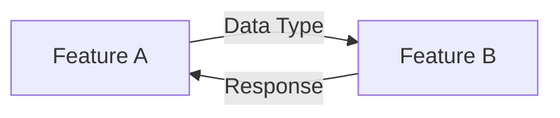
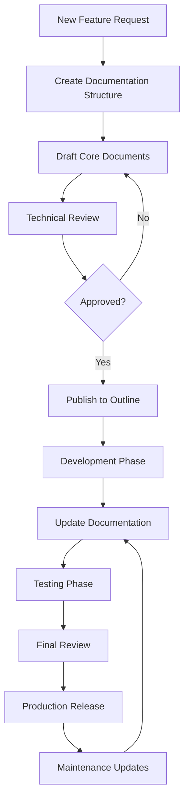

# Enterprise Documentation Hierarchy & Extensibility Guidelines
## For Self-Hosted Outline Knowledge Management System

### Document Information
| **Attribute** | **Details** |
|--------------|-------------|
| **Document ID** | DOC-GUIDE-001 |
| **Version** | 1.0 |
| **Purpose** | Establish documentation standards and hierarchy for enterprise platform |
| **Target Audience** | Technical Writers, Developers, Product Managers, Architects |
| **Last Updated** | January 2025 |

---

## Table of Contents
1. [Overview](#1-overview)
2. [Documentation Hierarchy Structure](#2-documentation-hierarchy-structure)
3. [Document Types & Templates](#3-document-types--templates)
4. [Extensibility Framework](#4-extensibility-framework)
5. [Cross-Feature Integration](#5-cross-feature-integration)
6. [Outline-Specific Implementation](#6-outline-specific-implementation)
7. [Documentation Lifecycle](#7-documentation-lifecycle)
8. [Best Practices & Standards](#8-best-practices--standards)
9. [Automation & Tools](#9-automation--tools)
10. [Governance & Maintenance](#10-governance--maintenance)

---

## 1. Overview

### 1.1 Purpose
This guide establishes a scalable documentation framework that:
- Supports multiple features and products on the same platform
- Enables efficient knowledge discovery and correlation
- Maintains consistency across all documentation
- Facilitates automated documentation generation
- Ensures compliance with international standards (BABOK, PMBOK, IEEE)

### 1.2 Core Principles
1. **Modular Architecture**: Each feature/component has independent documentation that integrates into the whole
2. **Inheritance Model**: Common elements are defined once and inherited
3. **Cross-referencing**: Automated linking between related documents
4. **Version Control**: Every document is versioned and tracked
5. **Living Documentation**: All documents are regularly updated and reviewed

---

## 2. Documentation Hierarchy Structure

### 2.1 Master Hierarchy for Outline

```
📁 Platform Documentation Root
├── 📁 000-Platform-Overview
│   ├── 📄 Platform-Vision-Strategy
│   ├── 📄 Architecture-Overview
│   ├── 📄 Technology-Stack
│   └── 📄 Integration-Patterns
│
├── 📁 100-Standards-Templates
│   ├── 📁 Document-Templates
│   │   ├── 📄 Feature-Documentation-Template
│   │   ├── 📄 API-Documentation-Template
│   │   ├── 📄 User-Guide-Template
│   │   └── 📄 Technical-Specification-Template
│   ├── 📁 Coding-Standards
│   ├── 📁 Design-Patterns
│   └── 📁 Security-Guidelines
│
├── 📁 200-Core-Services
│   ├── 📁 Authentication-Service
│   ├── 📁 Authorization-Service
│   ├── 📁 Logging-Service
│   └── 📁 Notification-Service
│
├── 📁 300-Features
│   ├── 📁 301-Arbitration-File-Mapper
│   │   ├── 📄 Feature-Overview
│   │   ├── 📄 Business-Requirements
│   │   ├── 📄 Technical-Specification
│   │   ├── 📄 API-Documentation
│   │   ├── 📄 User-Guide
│   │   ├── 📄 Deployment-Guide
│   │   └── 📁 Supporting-Documents
│   │
│   ├── 📁 302-[Next-Feature]
│   └── 📁 303-[Another-Feature]
│
├── 📁 400-Infrastructure
│   ├── 📄 Deployment-Architecture
│   ├── 📄 CI-CD-Pipeline
│   ├── 📄 Monitoring-Strategy
│   └── 📄 Disaster-Recovery
│
├── 📁 500-Operations
│   ├── 📁 Runbooks
│   ├── 📁 Troubleshooting-Guides
│   ├── 📁 Maintenance-Procedures
│   └── 📁 Support-Documentation
│
└── 📁 900-Archive
    └── 📁 Deprecated-Features
```

### 2.2 Numbering Convention

| **Range** | **Category** | **Purpose** |
|-----------|-------------|------------|
| 000-099 | Platform Overview | High-level platform documentation |
| 100-199 | Standards & Templates | Reusable templates and guidelines |
| 200-299 | Core Services | Shared services documentation |
| 300-399 | Features | Individual feature documentation |
| 400-499 | Infrastructure | Technical infrastructure docs |
| 500-599 | Operations | Operational procedures |
| 600-699 | Security & Compliance | Security documentation |
| 700-799 | Analytics & Reporting | Analytics documentation |
| 800-899 | External Integrations | Third-party integrations |
| 900-999 | Archive | Deprecated documentation |

### 2.3 Document Naming Convention

```
[Category-Number]-[Document-Type]-[Feature-Name]-[Version]

Examples:
301-TECH-SPEC-Arbitration-File-Mapper-v3.0
301-USER-GUIDE-Arbitration-File-Mapper-v2.1
302-API-DOC-Document-Classifier-v1.0
```

---

## 3. Document Types & Templates

### 3.1 Standard Document Types

#### 3.1.1 Feature Documentation Set
Every feature MUST have these core documents:

| **Document Type** | **Template ID** | **Purpose** | **Audience** |
|------------------|----------------|-------------|--------------|
| Feature Overview | TMPL-001 | High-level description | All stakeholders |
| Business Requirements | TMPL-002 | Business needs & ROI | Business users |
| Technical Specification | TMPL-003 | Detailed technical design | Developers |
| API Documentation | TMPL-004 | API endpoints & usage | Developers |
| User Guide | TMPL-005 | End-user instructions | End users |
| Deployment Guide | TMPL-006 | Installation & config | DevOps |
| Test Documentation | TMPL-007 | Test cases & results | QA Team |

#### 3.1.2 Feature Overview Template (TMPL-001)
```markdown
# [Feature Name] - Feature Overview

## Document Control
| **Attribute** | **Details** |
|--------------|-------------|
| **Document ID** | [XXX-FEAT-OVW-FeatureName-vX.X] |
| **Feature ID** | [XXX] |
| **Version** | [X.X] |
| **Status** | [Draft|Review|Approved|Active] |
| **Owner** | [Product Owner Name] |

## Executive Summary
[2-3 paragraph overview of the feature]

## Business Value
- **Problem Solved**: [Description]
- **Target Users**: [User personas]
- **Expected ROI**: [Metrics]

## Feature Capabilities
1. [Capability 1]
2. [Capability 2]
3. [Capability 3]

## Integration Points
- **Depends On**: [List of dependencies]
- **Integrates With**: [List of integrations]
- **Extended By**: [List of extensions]

## Related Documentation
- Business Requirements: [[Link]]
- Technical Specification: [[Link]]
- API Documentation: [[Link]]
- User Guide: [[Link]]

## Revision History
| Version | Date | Author | Changes |
|---------|------|--------|---------|
| 1.0 | [Date] | [Name] | Initial version |
```

### 3.2 Cross-Feature Templates

#### 3.2.1 Integration Specification Template
```markdown
# Integration Specification: [Feature A] ↔ [Feature B]

## Integration Overview
- **Integration Type**: [API|Event|Database|File]
- **Direction**: [Unidirectional|Bidirectional]
- **Criticality**: [High|Medium|Low]

## Data Flow


## Interface Specification
[Detailed interface documentation]

## Error Handling
[Error scenarios and handling]

## Testing Strategy
[Integration test approach]
```

---

## 4. Extensibility Framework

### 4.1 Adding New Features

#### 4.1.1 Documentation Checklist for New Features
```yaml
new_feature_checklist:
  pre_development:
    - [ ] Create feature folder in 300-Features
    - [ ] Copy all template documents
    - [ ] Assign document IDs
    - [ ] Create initial Feature Overview
    - [ ] Link to platform architecture
    
  during_development:
    - [ ] Update Technical Specification
    - [ ] Document API changes
    - [ ] Create integration specifications
    - [ ] Update deployment guides
    
  post_development:
    - [ ] Complete User Guide
    - [ ] Add troubleshooting section
    - [ ] Create runbooks
    - [ ] Update platform overview
```

#### 4.1.2 Feature Documentation Structure
```
📁 3XX-[Feature-Name]
├── 📄 README.md (Feature hub page)
├── 📁 01-Requirements
│   ├── 📄 Business-Requirements.md
│   ├── 📄 Functional-Requirements.md
│   └── 📄 Non-Functional-Requirements.md
├── 📁 02-Design
│   ├── 📄 Technical-Architecture.md
│   ├── 📄 Data-Model.md
│   ├── 📄 UI-UX-Design.md
│   └── 📄 Integration-Design.md
├── 📁 03-Implementation
│   ├── 📄 Development-Guide.md
│   ├── 📄 API-Reference.md
│   ├── 📄 Configuration-Guide.md
│   └── 📄 Database-Schema.md
├── 📁 04-Testing
│   ├── 📄 Test-Strategy.md
│   ├── 📄 Test-Cases.md
│   └── 📄 Performance-Benchmarks.md
├── 📁 05-Deployment
│   ├── 📄 Deployment-Guide.md
│   ├── 📄 Migration-Guide.md
│   └── 📄 Rollback-Procedures.md
├── 📁 06-Operations
│   ├── 📄 User-Guide.md
│   ├── 📄 Admin-Guide.md
│   ├── 📄 Troubleshooting.md
│   └── 📄 Runbooks.md
└── 📁 07-Maintenance
    ├── 📄 Known-Issues.md
    ├── 📄 Enhancement-Roadmap.md
    └── 📄 Deprecation-Plan.md
```

### 4.2 Inheritance Model

#### 4.2.1 Common Components Documentation
```yaml
common_components:
  authentication:
    location: "200-Core-Services/Authentication"
    inherited_by:
      - "301-Arbitration-File-Mapper"
      - "302-Document-Classifier"
    
  ui_components:
    location: "100-Standards/UI-Component-Library"
    components:
      - search_bar
      - data_grid
      - export_manager
```

#### 4.2.2 Inheritance Specification
```markdown
# Component Inheritance Specification

## Inherited From Platform
This feature inherits the following platform components:

| Component | Version | Documentation | Customizations |
|-----------|---------|---------------|----------------|
| Auth Service | 2.0 | [Link] | Custom roles added |
| UI Grid | 1.5 | [Link] | Virtual scrolling enabled |
| Export Manager | 1.2 | [Link] | CSV format extended |

## Extensions Made
This feature extends platform capabilities:

| Extension | Base Component | Changes | Documentation |
|-----------|---------------|---------|---------------|
| Fuzzy Search | Search Service | Custom algorithm | [Link] |
| Bulk Operations | Grid Component | Multi-select added | [Link] |
```

---

## 5. Cross-Feature Integration

### 5.1 Integration Documentation Pattern

#### 5.1.1 Integration Matrix
```markdown
# Platform Integration Matrix

| Feature | File Mapper | Classifier | Analytics | Workflow |
|---------|------------|------------|-----------|----------|
| **File Mapper** | - | Export → Import | Usage data | Trigger next |
| **Classifier** | Import ← Export | - | Classification metrics | Auto-classify |
| **Analytics** | Track usage | Track accuracy | - | Process metrics |
| **Workflow** | Step 1 | Step 2 | Monitor | - |

## Integration Details
- **File Mapper → Classifier**: Mapped files are sent for classification
- **Classifier → Analytics**: Classification results feed analytics
- **Analytics → Workflow**: Metrics trigger workflow rules
```

#### 5.1.2 Integration Documentation Structure
```
📁 800-Integrations
├── 📁 Internal-Integrations
│   ├── 📄 Integration-Overview.md
│   ├── 📄 FileMapper-to-Classifier.md
│   ├── 📄 Classifier-to-Analytics.md
│   └── 📄 Common-Data-Formats.md
└── 📁 External-Integrations
    ├── 📄 DMS-Integration.md
    ├── 📄 CRM-Integration.md
    └── 📄 Email-Integration.md
```

### 5.2 Shared Documentation Elements

#### 5.2.1 Common Definitions
```yaml
# _shared/definitions.yaml
common_terms:
  mapping:
    definition: "Process of correlating references to file paths"
    used_in:
      - "301-File-Mapper"
      - "304-Auto-Mapper"
  
  confidence_score:
    definition: "Percentage (0-100) indicating match quality"
    formula: "(word_match * 0.7) + (char_match * 0.3)"
    used_in:
      - "301-File-Mapper"
      - "302-Classifier"
      - "305-ML-Matcher"
```

#### 5.2.2 Shared Schemas
```json
// _shared/schemas/mapping.schema.json
{
  "$schema": "http://json-schema.org/draft-07/schema#",
  "title": "Mapping Result",
  "type": "object",
  "properties": {
    "referenceId": { "type": "string" },
    "pathId": { "type": "string" },
    "confidence": { "type": "number", "minimum": 0, "maximum": 1 },
    "method": { "enum": ["manual", "auto", "ml"] },
    "timestamp": { "type": "string", "format": "date-time" }
  },
  "required": ["referenceId", "pathId", "confidence", "method"]
}
```

---

## 6. Outline-Specific Implementation

### 6.1 Outline Structure Mapping

#### 6.1.1 Collection Hierarchy
```yaml
outline_structure:
  collections:
    - name: "Platform Documentation"
      icon: "📚"
      sub_collections:
        - name: "Standards & Guidelines"
          documents:
            - "Documentation Standards"
            - "Coding Guidelines"
            - "Security Policies"
        
        - name: "Features"
          sub_collections:
            - name: "Arbitration File Mapper"
              documents:
                - "Overview"
                - "Technical Specification"
                - "User Guide"
                - "API Reference"
```

#### 6.1.2 Outline Document Template
```markdown
# [Document Title]

<aside>
💡 **Quick Links**
- [Related Feature](#)
- [API Docs](#)
- [User Guide](#)
- [Source Code](#)
</aside>

## Overview
[Document content following standard template]

## See Also
- [[Related Document 1]]
- [[Related Document 2]]
- [[Parent Collection]]

---
*Last Updated: {{date}}*
*Version: {{version}}*
*Owner: {{owner}}*
```

### 6.2 Outline Features Utilization

#### 6.2.1 Leveraging Outline Capabilities
| **Feature** | **Usage** | **Benefit** |
|------------|-----------|------------|
| **Collections** | Organize by feature/domain | Clear navigation |
| **Cross-linking** | [[Document]] syntax | Easy navigation |
| **Search** | Full-text search | Quick discovery |
| **Templates** | Consistent formatting | Standardization |
| **Permissions** | Role-based access | Security |
| **API** | Automated updates | Living docs |
| **Webhooks** | Change notifications | Stay updated |

#### 6.2.2 Outline API Integration
```javascript
// Example: Auto-update documentation from code
class OutlineDocUpdater {
  constructor(apiKey, baseUrl) {
    this.apiKey = apiKey;
    this.baseUrl = baseUrl;
  }
  
  async updateFeatureDoc(featureId, updates) {
    const docId = await this.findDocument(featureId);
    
    const sections = {
      'Technical Specification': updates.technical,
      'API Reference': updates.api,
      'Configuration': updates.config
    };
    
    for (const [section, content] of Object.entries(sections)) {
      await this.updateSection(docId, section, content);
    }
  }
  
  async createFeatureStructure(featureName, featureId) {
    const collectionId = await this.createCollection({
      name: `${featureId}-${featureName}`,
      parent: 'Features'
    });
    
    const templates = [
      'Feature-Overview',
      'Technical-Specification',
      'API-Documentation',
      'User-Guide'
    ];
    
    for (const template of templates) {
      await this.createDocument({
        title: `${featureName} - ${template}`,
        collection: collectionId,
        template: template
      });
    }
  }
}
```

---

## 7. Documentation Lifecycle

### 7.1 Documentation Workflow



### 7.2 Version Control Strategy

#### 7.2.1 Documentation Versioning
```yaml
versioning_rules:
  major_version:
    trigger:
      - "Breaking changes"
      - "Major feature additions"
      - "Architecture changes"
    example: "1.0 → 2.0"
  
  minor_version:
    trigger:
      - "New functionality"
      - "Significant updates"
      - "API additions"
    example: "1.0 → 1.1"
  
  patch_version:
    trigger:
      - "Bug fixes"
      - "Clarifications"
      - "Minor corrections"
    example: "1.0.0 → 1.0.1"
```

#### 7.2.2 Change Tracking
```markdown
## Change Log Template

### Version X.X.X - YYYY-MM-DD

#### Added
- New section on [topic]
- Additional examples for [feature]

#### Changed
- Updated [section] to reflect new behavior
- Clarified [concept] description

#### Deprecated
- [Feature] will be removed in version X.X

#### Removed
- Outdated section on [topic]

#### Fixed
- Corrected typo in [section]
- Fixed broken link to [resource]
```

---

## 8. Best Practices & Standards

### 8.1 Writing Guidelines

#### 8.1.1 Documentation Standards
1. **Clarity**: Write for your audience's knowledge level
2. **Consistency**: Use standard terminology and formatting
3. **Completeness**: Cover all aspects without redundancy
4. **Currency**: Keep documentation up-to-date
5. **Accessibility**: Use clear headings and structure

#### 8.1.2 Style Guide
```yaml
style_guide:
  language:
    - Use active voice
    - Present tense for current state
    - Future tense for roadmap
    - Imperative for instructions
  
  formatting:
    - Headers: Title Case
    - Code: `monospace`
    - Emphasis: **bold** for important
    - Lists: Numbered for sequences, bullets for items
  
  structure:
    - Start with overview
    - Progress from simple to complex
    - Include examples
    - End with next steps
```

### 8.2 Review Process

#### 8.2.1 Documentation Review Checklist
```markdown
## Documentation Review Checklist

### Content Review
- [ ] Accuracy: All information is correct
- [ ] Completeness: No missing sections
- [ ] Clarity: Easy to understand
- [ ] Relevance: Appropriate for audience

### Technical Review
- [ ] Code examples work
- [ ] API endpoints are correct
- [ ] Configuration is valid
- [ ] Commands are tested

### Style Review
- [ ] Follows style guide
- [ ] Consistent formatting
- [ ] Proper grammar/spelling
- [ ] Clear structure

### Cross-Reference Review
- [ ] Links work
- [ ] References are correct
- [ ] Related docs listed
- [ ] Navigation is clear
```

---

## 9. Automation & Tools

### 9.1 Documentation Generation

#### 9.1.1 Auto-Documentation Pipeline
```javascript
// doc-generator.js
class DocumentationGenerator {
  async generateFromCode(sourceDir) {
    const components = await this.scanComponents(sourceDir);
    
    for (const component of components) {
      const docs = {
        api: this.generateApiDocs(component),
        config: this.generateConfigDocs(component),
        types: this.generateTypeDocs(component)
      };
      
      await this.updateOutline(component.id, docs);
    }
  }
  
  generateApiDocs(component) {
    // Extract JSDoc comments
    // Parse function signatures
    // Generate markdown
    return `
# ${component.name} API Reference

${component.methods.map(m => `
## ${m.name}

${m.description}

### Parameters
${m.params.map(p => `- **${p.name}**: ${p.type} - ${p.description}`).join('\n')}

### Returns
${m.returns.type} - ${m.returns.description}

### Example
\`\`\`javascript
${m.example}
\`\`\`
`).join('\n')}
    `;
  }
}
```

#### 9.1.2 Documentation CI/CD
```yaml
# .gitlab-ci.yml
documentation:
  stage: documentation
  script:
    - npm run generate-docs
    - npm run validate-docs
    - npm run update-outline
  only:
    changes:
      - src/**/*
      - docs/**/*
  artifacts:
    paths:
      - generated-docs/
```

### 9.2 Documentation Tools

#### 9.2.1 Recommended Toolchain
| **Tool** | **Purpose** | **Integration** |
|---------|-----------|----------------|
| **JSDoc** | Code documentation | Auto-generate API docs |
| **Swagger/OpenAPI** | API specification | Generate API reference |
| **Mermaid** | Diagrams | Visual documentation |
| **PlantUML** | Architecture diagrams | Technical diagrams |
| **Markdown Lint** | Quality checks | CI/CD validation |
| **Broken Link Checker** | Link validation | Automated testing |

#### 9.2.2 Documentation Validation
```javascript
// doc-validator.js
class DocumentationValidator {
  async validateAll() {
    const validations = [
      this.checkRequiredSections(),
      this.validateLinks(),
      this.checkFormatting(),
      this.validateMetadata(),
      this.crossReferenceCheck()
    ];
    
    const results = await Promise.all(validations);
    return this.generateReport(results);
  }
  
  async checkRequiredSections() {
    const required = [
      'Overview',
      'Requirements',
      'Technical Specification',
      'API Documentation',
      'User Guide'
    ];
    
    // Check each feature has required docs
  }
}
```

---

## 10. Governance & Maintenance

### 10.1 Documentation Governance

#### 10.1.1 Responsibility Matrix
| **Role** | **Responsibilities** | **Documents Owned** |
|---------|---------------------|-------------------|
| **Product Owner** | Business requirements, feature overview | Requirements docs |
| **Tech Lead** | Technical specs, architecture | Technical docs |
| **Developer** | API docs, implementation details | Code documentation |
| **QA Lead** | Test documentation, quality metrics | Test docs |
| **DevOps** | Deployment, operations | Operational docs |
| **Tech Writer** | User guides, formatting | End-user docs |

#### 10.1.2 Review Schedule
```yaml
review_schedule:
  weekly:
    - Active feature documentation
    - Deployment guides for upcoming releases
  
  monthly:
    - API documentation accuracy
    - User guide relevance
    - Broken link check
  
  quarterly:
    - Architecture documentation
    - Standards and guidelines
    - Template updates
  
  annually:
    - Complete documentation audit
    - Deprecation review
    - Archive old documents
```

### 10.2 Quality Metrics

#### 10.2.1 Documentation KPIs
```javascript
const documentationKPIs = {
  coverage: {
    metric: "Percentage of features with complete documentation",
    target: 100,
    measurement: "Automated scan"
  },
  
  accuracy: {
    metric: "Documentation accuracy score",
    target: 95,
    measurement: "Review feedback"
  },
  
  timeliness: {
    metric: "Average days between code and doc updates",
    target: 2,
    measurement: "Git history analysis"
  },
  
  usage: {
    metric: "Documentation page views per feature",
    target: 100,
    measurement: "Analytics"
  },
  
  feedback: {
    metric: "User satisfaction score",
    target: 4.5,
    measurement: "Feedback surveys"
  }
};
```

#### 10.2.2 Continuous Improvement
```markdown
## Documentation Improvement Process

1. **Collect Feedback**
   - User surveys
   - Support ticket analysis
   - Developer feedback
   - Analytics data

2. **Analyze Gaps**
   - Missing documentation
   - Unclear sections
   - Outdated content
   - Broken processes

3. **Prioritize Updates**
   - High-traffic pages first
   - Critical features
   - Common pain points
   - New feature docs

4. **Implement Changes**
   - Update documentation
   - Review and approve
   - Publish to Outline
   - Notify stakeholders

5. **Measure Impact**
   - Track metrics
   - Gather feedback
   - Iterate process
```

### 10.3 Migration & Evolution

#### 10.3.1 Platform Evolution Strategy
```yaml
evolution_strategy:
  phase_1:
    name: "Foundation"
    focus: "Core documentation structure"
    deliverables:
      - Documentation templates
      - Initial feature docs
      - Basic automation
  
  phase_2:
    name: "Integration"
    focus: "Cross-feature documentation"
    deliverables:
      - Integration specifications
      - Shared components docs
      - API gateway docs
  
  phase_3:
    name: "Intelligence"
    focus: "Smart documentation"
    deliverables:
      - AI-powered search
      - Auto-generated docs
      - Predictive updates
  
  phase_4:
    name: "Ecosystem"
    focus: "Complete platform docs"
    deliverables:
      - Partner documentation
      - Marketplace docs
      - Community contributions
```

---

## Summary

This documentation framework provides:

1. **Scalability**: Supports unlimited features with consistent structure
2. **Discoverability**: Clear hierarchy and cross-referencing
3. **Maintainability**: Automated updates and validation
4. **Compliance**: Meets international documentation standards
5. **Integration**: Seamlessly works with Outline knowledge base

### Next Steps

1. **Import this guide** into your Outline instance
2. **Create the folder structure** as defined
3. **Set up templates** for each document type
4. **Configure automation** for document generation
5. **Train team members** on documentation standards
6. **Begin migrating** existing documentation

### Success Metrics

- 100% feature documentation coverage
- <2 day lag between code and documentation updates
- >90% documentation accuracy score
- >4.5/5 user satisfaction rating
- Zero broken links or outdated references

This framework ensures your platform documentation remains comprehensive, current, and valuable as your platform grows and evolves.